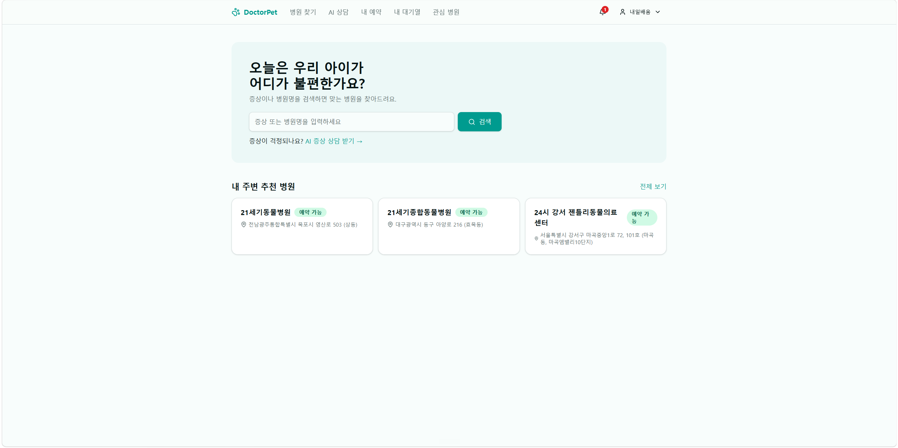
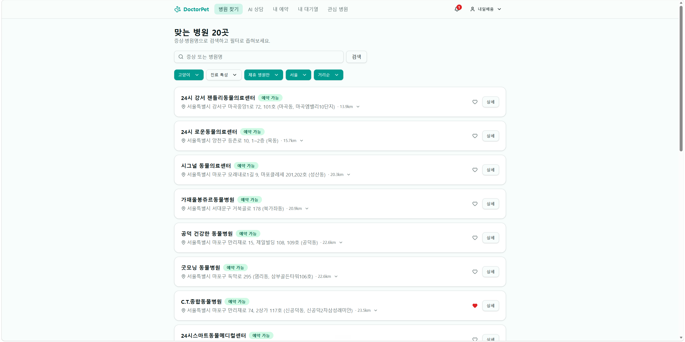
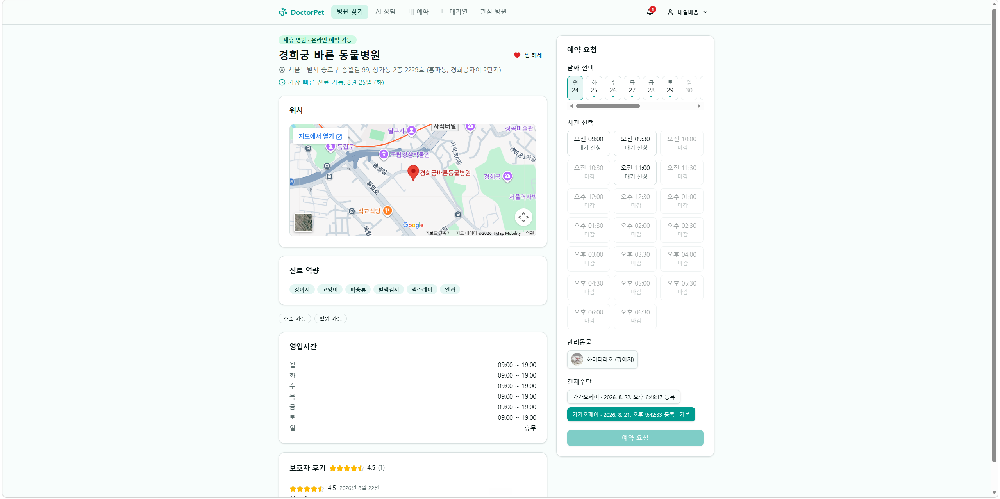
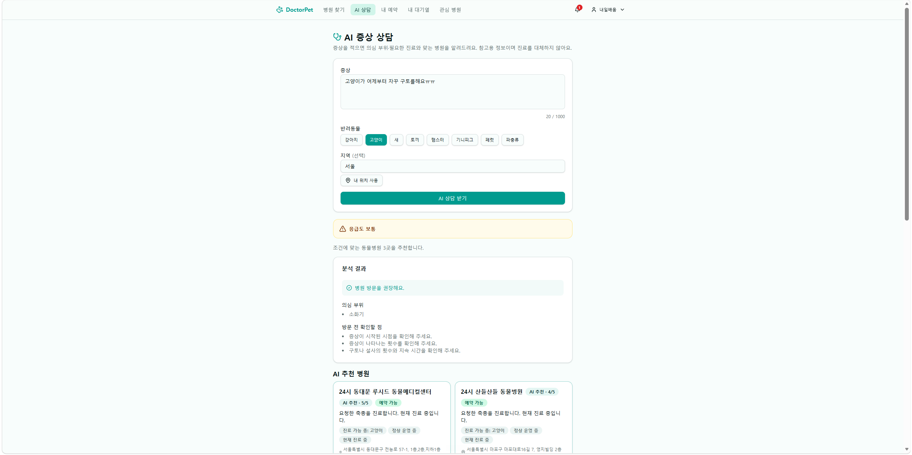
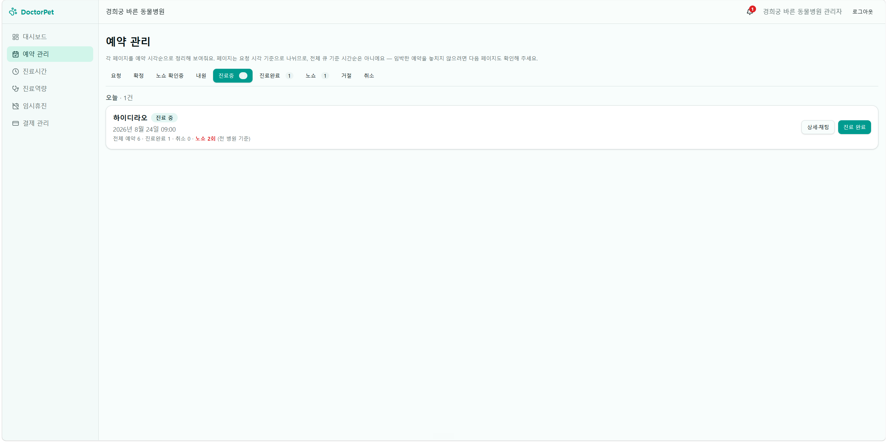
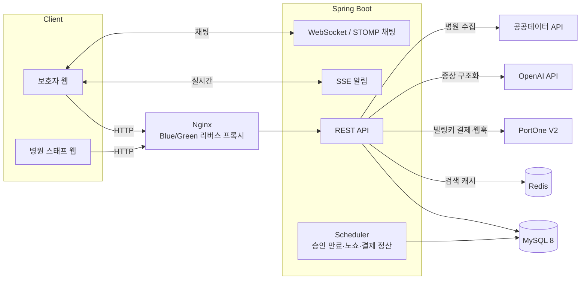

<div align="center">

# 🐾 DoctorPet

**반려동물 증상 기반 병원 검색 · 승인형 예약 · 후불 결제 백엔드**

[](https://doctor-pet-tsbd.vercel.app/)


</div>

보호자는 AI 증상 상담과 조건 기반 병원 검색으로 예약을 요청하고, 병원 스태프는 예약을 승인·진료하고 진료 완료 후 청구 항목을 작성해 후불 결제를 처리합니다. 예약 알림은 SSE, 예약별 상담은 WebSocket STOMP로 제공합니다.

- **개발 기간**: 2026.07.21 ~ 2026.08.24 (약 5주)
- **팀 구성**: 백엔드 중심 4인 팀 (프론트엔드 포함)
- **저장소**: https://github.com/yyb0702-spec/DoctorPet
- **배포**: 프론트엔드 [doctor-pet-tsbd.vercel.app](https://doctor-pet-tsbd.vercel.app/) (Vercel) · 백엔드 AWS EC2 (Docker Compose Blue/Green, GitHub Actions 자동 배포)

> ⚠️ 프로젝트 기간 중 운영되는 데모용 인스턴스입니다. 링크가 닫혀 있으면 [실행 방법](#실행-방법)을 참고해 로컬에서 그대로 재현할 수 있습니다.

## 목차

- [팀 구성](#팀-구성)
- [프로젝트 소개](#프로젝트-소개)
- [핵심 플로우](#핵심-플로우)
- [시스템 아키텍처](#시스템-아키텍처)
- [핵심 기술 챌린지](#핵심-기술-챌린지)
- [기술 스택](#기술-스택)
- [프로젝트 구조](#프로젝트-구조)
- [배포 · 운영](#배포--운영)
- [실행 방법](#실행-방법)
- [검증](#검증)
- [AI 활용](#ai-활용)
- [프로젝트 문서](#프로젝트-문서)

## 팀 구성

| 이름 | GitHub | 담당 |
| --- | --- | --- |
| 윤영범 | [yyb0702-spec](https://github.com/yyb0702-spec) | 인증/회원, 반려동물 프로필, 공통 설정, 배포 |
| 김준형 | [maschemy](https://github.com/maschemy) | 결제, 알림, 채팅, 프론트엔드 |
| 박송이 | [springday3355-tech](https://github.com/springday3355-tech) | 예약, 스케줄러 |
| 라예실 | [sirisiyesiri](https://github.com/sirisiyesiri) | 병원·검색, AI 증상 상담, 리뷰 |

## 프로젝트 소개

증상만 있고 어느 병원을 가야 할지 모르는 상황에서, **증상 → 진료역량 매칭 → 병원 검색 → 승인형 예약 → 진료 후 후불 결제**까지를 하나의 흐름으로 연결하는 서비스입니다. 결제는 진료가 끝난 뒤 병원이 청구하고 빌링키로 자동 결제하는 후불 구조라, **예약·결제 상태 머신과 동시성·멱등 제어**가 설계의 중심입니다.

| 도메인 | 주요 기능 |
| --- | --- |
| 인증/회원 | 역할 기반 JWT + Refresh Token 재발급, 이메일 인증, 비밀번호 재설정, 로그인 실패 계정 잠금, 탈퇴 회원 익명화 |
| 반려동물 | 프로필 CRUD, S3 presigned URL 이미지 업로드 |
| 병원 탐색 | 공공데이터·자체 DB 병원 검색, QueryDSL 동적 조건 검색, Redis 검색 캐시, 찜·리뷰·평점 집계 |
| AI 증상 상담 | 증상 텍스트 → 진료역량 코드 구조화(OpenAI Structured Outputs), Rate Limit·Circuit Breaker, 민감 원문 보존 제한 |
| 예약 | 승인형 예약, 상태 전이(체크인·진료·취소·노쇼), 낙관적 락 슬롯 중복 방지, 대기열, 승인 만료·노쇼 스케줄러 |
| 결제 | PortOne V2 빌링키 후불 자동결제, 서버 산출 항목 청구, 웹훅 검증, 정산 스케줄러, 전액 환불, 셀프 재청구, 정정 재청구, JSON 영수증 |
| 알림/채팅 | 수신자별 알림 저장·읽음, 티켓 기반 SSE 실시간 알림, 예약 참여자 전용 WebSocket STOMP 채팅 |
| 배포/운영 | AWS EC2 · Docker Compose Blue/Green(app-blue/app-green), Nginx가 헬스체크 통과 후 트래픽 전환·실패 시 롤백, MySQL(RDS)·캐시(ElastiCache/Valkey) 관리형 이관, GitHub Actions 자동 CD(GHCR 이미지 pull → EC2 SSH 컷오버), HTTPS(Let's Encrypt 자동 갱신), Prometheus·Grafana 모니터링 |

> AI 상담은 의료 진단을 대신하지 않으며, 응급 징후가 있으면 즉시 가까운 동물병원에 연락해야 합니다.

## 핵심 플로우

보호자가 증상 검색부터 예약·상담까지 이용하고, 병원 스태프가 예약을 운영하는 실제 화면입니다. → **[라이브 데모](https://doctor-pet-tsbd.vercel.app/)**

| 보호자 · 메인 | 보호자 · 병원 검색 |
| :---: | :---: |
|  |  |
| 증상·병원명으로 검색하고 추천 병원을 확인 | 지역·진료특성·제휴·거리 필터로 전국 병원을 좁힘 |

| 보호자 · 병원 상세와 예약 요청 | 보호자 · AI 증상 상담 |
| :---: | :---: |
|  |  |
| 진료역량·슬롯·펫·결제수단을 골라 승인형 예약 요청 | 증상을 의심 부위·확인사항으로 구조화하고 병원 추천 |

**병원 스태프 · 예약 관리**



요청·확정·진료중·완료·노쇼 상태로 예약을 운영합니다.

## 시스템 아키텍처



도메인 간 직접 Repository 참조를 피하고 서비스·Port로 협력하며, 외부 연동은 Gateway 인터페이스 뒤에 격리해 로컬·테스트에서는 Fake 구현으로 대체합니다.

## 핵심 기술 챌린지

### 1. 알림 저장 직전 전체 회원 조회 병목 — 복합 인덱스로 1,200배

예약 요청 시 `예약 요청 → 병원 스태프 조회 → 알림 저장 → 응답` 흐름에서, 알림 대상 스태프 조회가 `members` **전체(약 20만 행)를 풀스캔**하고 있었습니다. `EXPLAIN ANALYZE`로 원인을 `(hospital_id, role)` 조건을 지원하는 인덱스 부재로 확정하고, 복합 인덱스 + 조건 정렬로 대상 병원 스태프만 직접 조회하도록 바꿨습니다.

| 지표 | before (인덱스 없음) | after (복합 인덱스) |
| --- | --- | --- |
| 조회 방식 | 전체 회원 탐색 | 대상 병원 스태프 직접 |
| 스캔 행 수 | 약 200,000행 | 10행 |
| 실행 계획 (type) | `ALL` (풀스캔) | `ref` (인덱스 탐색) |
| 평균 조회 시간 | 20.9ms | **0.017ms (약 1,200배)** |

- 측정 환경: 로컬 MySQL 8.0.46, `members` 202,000행 · 병원당 스태프 10명, 인덱스 OFF/ON · 워밍업 후 2,000회 평균.
- 트레이드오프: 인덱스 저장·쓰기 비용 증가를 읽기 성능과 교환.

### 2. 전국 병원 데이터 확장 후 검색 병목 — 실행 계획으로 정렬 병목 규명

병원 데이터를 121건 → **10,671건**으로 확장하자 검색 P95가 273 → 713ms, 처리량이 506 → 74 RPS로 악화됐습니다. 첫 가설(`business_status` 단일 인덱스)은 **선택도가 낮고 페이지 쿼리가 인덱스를 타지 못해** 실패했습니다. `EXPLAIN ANALYZE`로 실제 병목이 필터가 아니라 **전체 조회 + 이름·ID 정렬 비용**임을 재확인하고, `(name, id, business_status)` 복합 인덱스로 정렬을 인덱스에 흡수시키고 count 쿼리의 불필요한 JOIN을 제거했습니다.

| 지표 | 병목 상태 | 개선 후 |
| --- | --- | --- |
| P95 응답 | 713ms | **116ms (약 84%↓)** |
| 처리량 | 74 RPS | **481 RPS (약 6.5배)** |
| count 쿼리 P95 | 17.5ms | 4.3ms |
| 실행 계획 | 전체 조회 + sort | 복합 인덱스 111행 스캔 → 50건 반환 |

- 측정 환경: Windows 11 · Java 17 · 로컬 MySQL 8.x, 병원 약 10,600건, `page=1·size=50·sort=name`, 32스레드 · 회차별 500요청, 인덱스 OFF/ON 교차 측정.
- 배운 점: 필터 조건만 보지 않고 **선택도 · 정렬 · 조인 · 실행 계획을 함께** 확인해야 진짜 병목이 보입니다.

### 3. 후불 결제 이중 수납 방지 — 상태가 아니라 DB 불변식으로

자동결제(빌링키)와 현장 수납, 보호자 셀프 재청구와 정산 스케줄러가 **같은 예약에 동시에 성립하면 이중 수납**이 발생합니다. 이를 상태 플래그가 아니라 DB 제약으로 막았습니다.

- **활성 결제 = `superseded_at IS NULL`** 로 판정하고, 대체(supersede)는 `superseded_at IS NULL`을 전제로 한 **조건부 UPDATE로만** 성립 → 먼저 커밋한 쪽이 이기고 늦은 쪽은 `409`.
- **예약당 활성 결제 1건**은 생성 컬럼 `active_reservation_id` + `UNIQUE`로 DB가 강제.
- 금액 정정은 항목 수정이 아니라 **전액 환불 후 새 `payments` 행 + `correction_of` 연결**로만 처리해 이력을 보존.

검증은 다중 스레드 통합 테스트로 **"동시 요청에서 활성 결제 항상 1건 · 이중 수납 0건"** 불변식을 확인했습니다(Level 3). 성능 수치가 아니라 **정합성**을 근거로 삼은 챌린지입니다.

## 기술 스택

| 구분 | 기술 |
| --- | --- |
| Backend | Java 17, Spring Boot, Spring MVC, Spring Security |
| Data | Spring Data JPA, QueryDSL, MySQL 8, Redis(Lettuce) |
| Auth | JWT Access/Refresh Token |
| Realtime | SSE, native WebSocket, STOMP, Spring SimpleBroker |
| External | OpenAI API, PortOne V2, 공공데이터 API, SMTP, AWS S3 |
| Test | JUnit 5, Mockito, Spring Boot Test |
| Frontend | React 19, TypeScript, Vite, TanStack Query, Tailwind CSS |
| Infra | AWS EC2 · RDS · ElastiCache(Valkey) · S3, Docker Compose, Nginx, GitHub Actions(CD), Let's Encrypt, Prometheus·Grafana |

## 프로젝트 구조

```text
DoctorPet
├── src/main/java/com/doctorpet
│   ├── domain
│   │   ├── ai              AI 증상 상담
│   │   ├── chat            예약별 채팅
│   │   ├── hospital        병원·검색·운영시간·찜
│   │   ├── member          인증·회원
│   │   ├── notification    알림·SSE
│   │   ├── payment         결제수단·청구·정산·환불·영수증
│   │   ├── pet             반려동물 프로필
│   │   ├── reservation     예약·슬롯·대기열·상태 머신
│   │   └── review          병원 리뷰
│   └── global              공통 설정·보안·예외·외부 Gateway
├── src/test                단위·슬라이스·통합 테스트
├── frontend                React 기반 보호자·병원 스태프 웹
├── docs                    제품·아키텍처·정책·검증 문서
├── nginx                   Blue/Green 리버스 프록시 설정
└── .github/workflows       CI/CD와 문서 하네스 검증
```

## 배포 · 운영

AWS EC2 단일 호스트에 Docker Compose로 구성하고, **무중단 Blue/Green 배포**를 GitHub Actions로 자동화했습니다.

- **무중단 배포**: `app-blue`·`app-green` 두 색을 두고, 배포 시 비활성 색에 새 이미지를 띄워 컨테이너 HEALTHCHECK가 healthy가 될 때까지 폴링(10초 간격 최대 18회)한 뒤에만 Nginx를 `reload`해 트래픽을 넘깁니다. 새 색이 기한 내 healthy가 아니면 활성 색을 그대로 두고 중단합니다(자동 롤백).
- **CI → CD**: CI(`./gradlew clean build`)가 성공한 커밋만 배포됩니다. GitHub Actions가 이미지를 빌드해 **GHCR에 커밋 SHA 태그로 push**하고, EC2는 빌드 없이 그 이미지를 `pull`만 해 컷오버합니다. 배포 구간에만 러너 IP를 보안 그룹에 임시 허용하고 종료 후 회수합니다.
- **관리형 인프라**: MySQL은 **AWS RDS**, 캐시는 **AWS ElastiCache(Valkey)**, 업로드 이미지는 **AWS S3**를 사용합니다(로컬은 `Fake`/디스크로 대체).
- **HTTPS · 모니터링**: `doctorpet.click`에 Let's Encrypt 인증서를 적용(certbot 자동 갱신)하고, Prometheus·Grafana로 지표를 수집합니다.

설계 상세는 [무중단 배포 문서](docs/architecture/DoctorPet-무중단배포.md)에, 로컬 재현은 아래 [실행 방법](#실행-방법)에 정리돼 있습니다.

## 실행 방법

### 준비물

- JDK 17, Docker · Docker Compose
- Node.js 24+ · npm (프론트엔드 실행 시)

### Docker Compose로 백엔드 실행

```bash
cp .env.example .env
cp nginx/conf.d/upstream-active.conf.example nginx/conf.d/upstream-active.conf
# .env의 비밀값을 로컬 값으로 교체한 뒤
docker compose up -d --build mysql redis app-blue nginx
```

API는 `http://localhost:8080`에서 제공됩니다. 외부 서비스를 호출하지 않으려면 `.env`에서 `PAYMENT_GATEWAY=fake`, `AI_GATEWAY=fake`, `MAIL_PROVIDER=fake`, `IMAGE_STORAGE_PROVIDER=fake`를 유지합니다.

<details>
<summary>교체가 필요한 최소 비밀값 · 종료 명령</summary>

```dotenv
JWT_SECRET=<256-bit 이상의 임의 문자열>
PAYMENT_BILLING_KEY_ENC_KEY=<Base64로 인코딩한 256-bit AES 키>
MYSQL_ROOT_PASSWORD=<로컬 MySQL 비밀번호>
SPRING_DATASOURCE_PASSWORD=<위 MySQL 비밀번호>
```

`.env`에는 비밀값이 포함되므로 커밋하지 않습니다. 종료는 `docker compose down`. 운영에서는 수동 기동 대신 Blue/Green 배포 워크플로를 사용하며, `prod` 프로파일은 PortOne·SMTP·S3 실연동 설정이 없으면 안전장치로 부팅되지 않습니다.

</details>

### 프론트엔드 실행

```bash
cd frontend
npm ci
npm run dev        # http://localhost:5173 (백엔드로 /api·/ws/chat 프록시)
# npm run dev:mock # 백엔드 없이 UI만 확인
```

## 검증

```bash
./gradlew test             # 전체 백엔드 테스트
./gradlew unitTest         # MySQL·Redis 불필요한 단위·슬라이스 테스트
./gradlew integrationTest  # 실제 MySQL·Redis 사용하는 통합 테스트
./gradlew build            # 빌드 + 실행 JAR 생성
```

검증 Level과 실행 조건은 [검증 가이드](docs/testing/verification-guide.md)를 따릅니다. 공통 응답은 `ApiResponse { code, message, data }` 형식이며, `local` 프로파일에서 Swagger UI(`/swagger-ui/index.html`)를 활성화할 수 있습니다.

## AI 활용

AI를 코드 생성기가 아니라 **규칙을 공유하는 팀 동료**로 운영했습니다. 문서를 정본으로 두고, 정책은 사람이 정하며, 모든 산출물을 테스트·PR로 검증했습니다.

| 원칙 | 적용 |
| --- | --- |
| 문서 먼저 | [`AGENTS.md`](AGENTS.md)(작업 규칙 정본)와 [`docs/ai/`](docs/ai/context-router.md)(context-router·rule-source-map·agent-mistakes)를 먼저 읽혀 맥락 없는 코드 생성을 막음 |
| 정책은 사람이 | SA 부록 A의 `[결정 필요]`·빈 정책은 임의 구현하지 않고 질문으로 남김 |
| STRICT 게이트 | 락·멱등·상태 머신·스키마 변경은 동시성·통합 테스트를 필수로 강제 |
| 근거로만 완료 | 실행하지 않은 검증을 완료라 하지 않고, 판정은 `PASS/FAIL/PARTIAL/BLOCKED`만 사용 |
| 리뷰 기반 개선 | 배포 파이프라인 등은 P0~P2 리뷰 지적을 반영해 반복 개선(예: `deploy.yml`의 이력 주석) |

`develop`/`main` 병합은 사람이 수행하며, AI로 작성한 코드도 각자 동작을 설명할 수 있는 상태를 유지했습니다.

## 프로젝트 문서

| 문서 | 내용 |
| --- | --- |
| [제품 요구사항 (PRD)](docs/product/DoctorPet-PRD.md) | 사용자 요구사항과 제품 범위 |
| [소프트웨어 아키텍처 (SA)](docs/architecture/DoctorPet-SA.md) | ERD, API, 상태 머신, 핵심 설계 |
| [코드 컨벤션](docs/architecture/DoctorPet-코드컨벤션.md) | 패키지·클래스·코드 작성 규칙 |
| [도메인 정책](docs/domain/반려동물병원예약-정책정리본.md) | 예약·결제 상세 정책 |
| [고도화 현황](docs/enhancement/README.md) | MVP 이후 기능의 구현 범위와 상태 |
| [병원 검색 성능 측정](docs/testing/hospital-search-index-performance.md) | 데이터 확장 전후 실행 계획·P95·처리량 측정 결과 |
| [검증 가이드](docs/testing/verification-guide.md) | 테스트 Level, 판정 기준, 검증 기록 양식 |
| [무중단 배포 설계](docs/architecture/DoctorPet-무중단배포.md) | Blue/Green 컷오버·헬스체크·롤백 |
| [협업 규칙](docs/collaboration/github-rules.md) | 브랜치·커밋·PR 규칙 |
