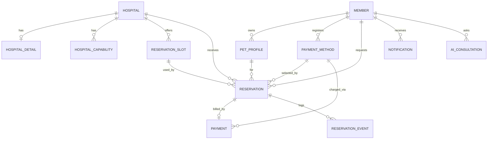
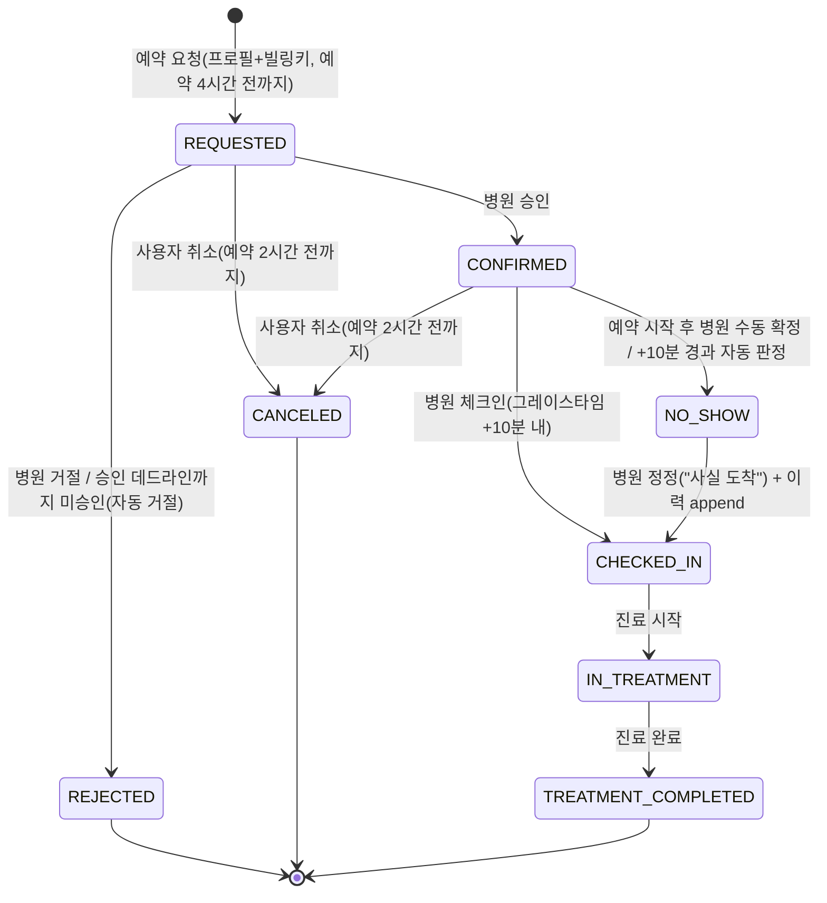
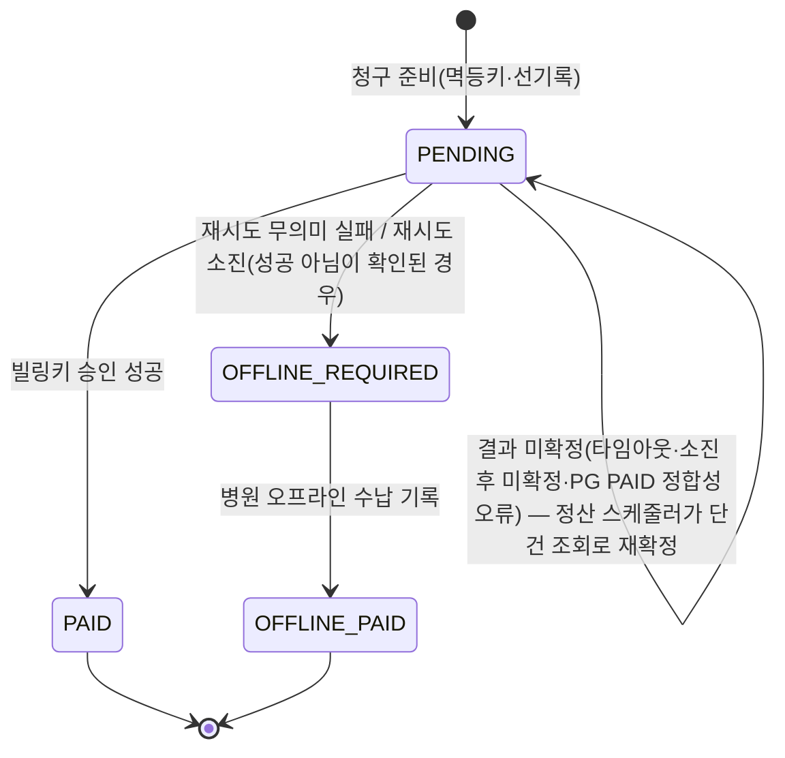
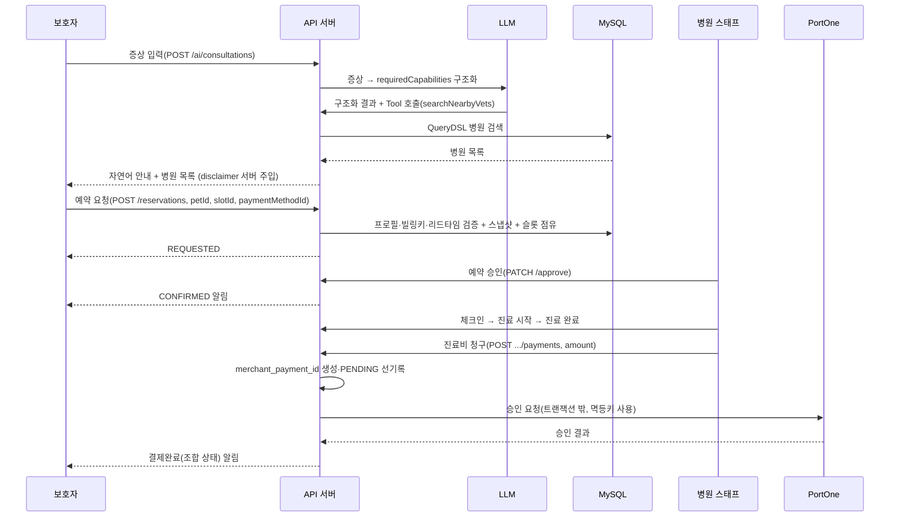
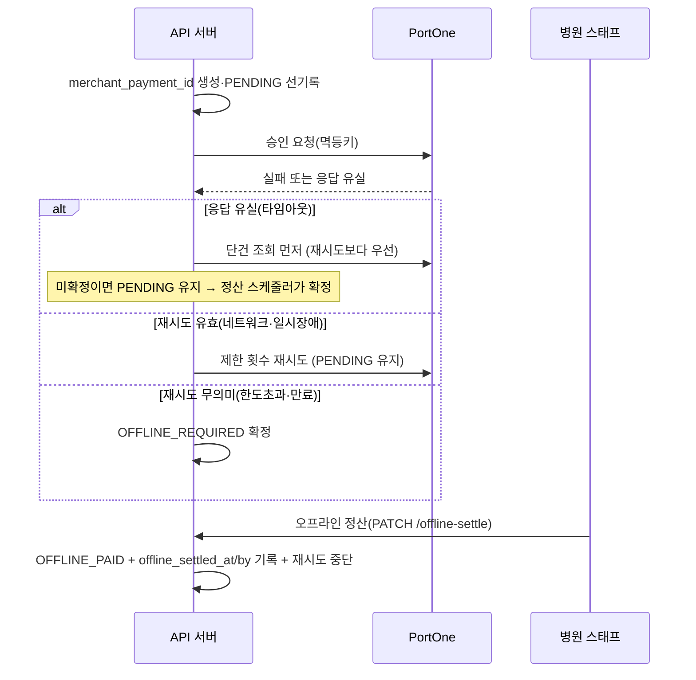
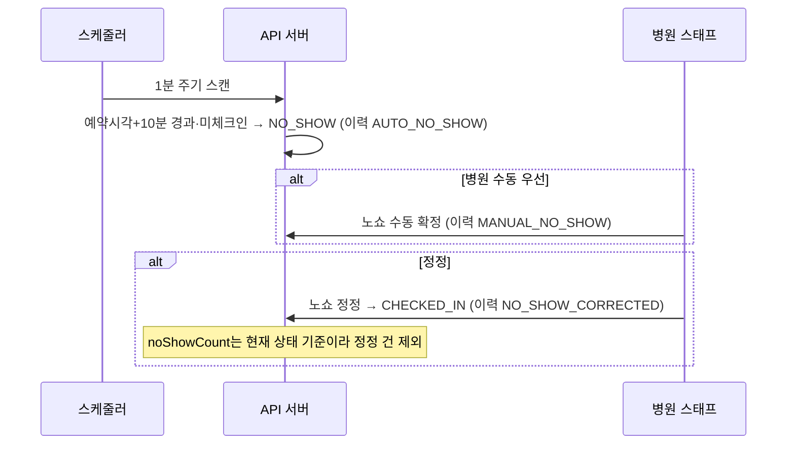

# DoctorPet 시스템 아키텍처 문서 (SA)

| 항목 | 내용 |
| --- | --- |
| 제품명 | DoctorPet |
| 문서 버전 | v1.39 |
| 작성 기준일 | 2026-08-07 |
| 상위 근거 | PRD, 정책 정리본, 코드 컨벤션 (버전은 각 문서 헤더 참조) |

PRD가 정의한 요구사항을 구현 가능한 설계로 확정한다(ERD·API·상태 머신·핵심 기능·인프라). PRD와 충돌하면 PRD를 따른다. 코드 스타일·클래스 규약은 코드 컨벤션 문서를 따른다. 아직 안 정한 선택지는 본문에 `[결정 필요]`로 표기하고 부록 A에 모은다.

> 변경 이력 — v1.4~v1.29: 각 도메인 구현과 리뷰 결과를 순차 반영했다. v1.30: 전국 공공데이터 주 1회 갱신, 다중 인스턴스 잠금, 19개 진료역량 화이트리스트와 특수동물 축종을 확정했다. v1.31: 예약 승인 마감 백필·재시도, 결제 웹훅 멱등 처리, Redis 토큰 해시 저장과 로그아웃 Access Token 무효화 설계를 병합 반영했다. v1.32: 공공데이터 적재 주기를 매주 월요일 03:00 갱신으로 일치시켰다. v1.33: 재발급 락 TTL 레이스(이슈 #100) 대응으로 `refresh-lock:{memberId}` 직렬화 락과 `refresh-fence:{memberId}` 펜싱 토큰 설계를 §6-1에 반영하고, 저장된 값의 펜싱 토큰뿐 아니라 펜싱 카운터의 현재 값까지 비교해야 함을 2차 리뷰 반영으로 보강. 경량본(§4)에 동일 계약 요약 추가(리뷰 지적, PR #101). v1.34: 관측성·API 문서 노출 범위(이슈 #105)를 §12에 확정 — 액추에이터를 `management.server.port=8081`로 앱 포트와 분리하고 전용 `SecurityFilterChain`으로 명시적 permitAll, Swagger는 `local` 프로파일에서만 노출, 관리 포트만의 헬스체크 사각지대를 막기 위해 헬스 그룹 `additional-path`로 앱 포트에도 `/healthz`를 노출(2차 리뷰 반영, PR #104). 슬라이스 테스트가 401/403만 확인해 404를 걸러내지 못한다는 지적에 실기동 검증(Level 6)을 진행하던 중 `NoResourceFoundException`이 전역 500으로 새는 버그를 발견해 함께 수정. v1.35: 관리 포트(8081) permitAll이 실제로 적용되는지에 대한 3차 리뷰 지적에 Level 6 실기동 검증 결과(Spring Security 표준 헤더 확인, spring-boot#50355 근거)를 §12에 보강. v1.36: 전국 병원 검색 성능 검증 결과에 따라 기본 이름순 `(name, id, business_status)`, 제휴 병원 이름순 `(partnership_status, name, id, business_status)`, 좌표 바운딩박스 `(coord_x, coord_y)` 인덱스를 확정하고, 효과가 미미한 진료역량 검색용 보조 인덱스는 도입하지 않기로 결정했다. v1.37(MVP2 고도화): 실시간 알림 push를 **단방향 SSE로 확정**하고 티켓 인증·커밋 이후 전송·회원당 연결 상한을 §9-8에 반영했다(양방향 WebSocket+STOMP는 채팅 도입 시 재논의, #40). 예약 `CONFIRMED`/`REJECTED`와 노쇼 `NO_SHOW` 이벤트의 알림 저장 연동도 #88(PR #107)에서 병합했다. 스키마 변경은 없으며 알림은 기존 `notifications` 테이블, 구독 티켓은 Redis를 사용한다. v1.38: 기능 구멍 점검(회원-병원 연락 수단 부재) 대응으로 `members.phone` 컬럼과 회원가입 필수 입력을 §4·§6-6·§8-1에, 병원 예약 목록 응답의 `guardianPhone` 노출을 §8-6에 추가. v1.39: 기능 구멍 점검(비밀번호 재설정 후 세션 미무효화 — 계정 탈취 복구 시나리오 결함) 대응으로 재설정 성공 시 `RefreshTokenRepository.deleteByMemberId()`를 호출하도록 §6-4에 반영.

---

# 1. 아키텍처 개요

구성 요소는 다섯이다.

- **API 서버** — Spring Boot. 도메인 로직·API 제공.
- **MySQL** — 회원·병원·예약·결제 트랜잭션 데이터.
- **Redis** — Refresh Token 저장, 검색 원격 캐시(§9-2). 동시성은 낙관적 락이라 Redis 분산 락은 안 쓴다.
- **LLM** — 증상 → 진료역량 구조화, 검색 Tool 호출. 외부 서비스.
- **PortOne V2** — 빌링키 발급·후불 결제 승인·단건 조회.

병원 공공데이터 API는 배치 수집원으로만 쓰고 런타임 검색 경로에는 개입하지 않는다. 검색은 항상 자체 DB를 대상으로 한다.

```
[클라이언트]
     │  HTTPS
     ▼
[DoctorPet API 서버] ──▶ [MySQL]
     │   │   │
     │   │   └────────▶ [Redis]  (RefreshToken / 검색 캐시)
     │   └────────────▶ [LLM]    (증상→역량, Tool Calling)
     └────────────────▶ [PortOne](빌링키·결제·단건조회)

[스케줄러] ──▶ [공공데이터 API] ──▶ [MySQL]   (배치 적재, 런타임과 분리)
```

---

# 2. 기술 스택

- Java 17, Spring Boot, Spring Data JPA, Spring Security
- QueryDSL(동적 쿼리), MySQL 8.x, Redis(Lettuce)
- JWT(Access/Refresh), PortOne V2(빌링키), Spring Scheduler
- Gradle, JUnit5, Mockito, @SpringBootTest
- 인프라(도전): Docker, AWS(EC2·RDS·ElastiCache), GitHub Actions, k6

확정 사항: 병원 검색 최초 진입 기본 첫 페이지의 정적 조회 결과만 Redis 원격 캐시에 저장한다(TTL·키 prefix는 구현 시 조정, §9-2). AI는 `AiGateway` 추상화를 유지하면서 OpenAI `gpt-4.1-mini`의 Structured Outputs로 연동한다(§9-5). 실시간 알림은 MVP는 폴링이고, MVP2에서 단방향 SSE push를 확정해 추가했다(양방향 WebSocket+STOMP는 채팅 도입 시에만 재논의, §9-8).

시간 정책: 애플리케이션의 업무 시각은 `TimePolicy.SEOUL_ZONE_ID`를 적용한 공통 `Clock`을 사용한다. JPA `@CreatedDate`·`@LastModifiedDate`와 시간 기반 배치는 같은 Clock으로 `LocalDateTime`을 생성해 JVM 기본 시간대가 UTC인 환경에서도 저장 시각과 비교 기준이 어긋나지 않게 한다.

---

# 3. 패키지 구조

```
com.doctorpet
├── global
│   ├── config          보안·JPA·스케줄러·캐시·QueryDSL 설정
│   ├── security        JWT 필터, 인증 주체(Principal) 해석
│   ├── exception       ErrorCode, CommonErrorCode, ServiceException, GlobalExceptionHandler
│   ├── response        ApiResponse
│   └── gateway         외부 연동 추상화 (PaymentGateway, AiGateway, PublicDataGateway)
│
└── domain
    ├── member          회원·인증·역할(보호자/병원 스태프)
    ├── pet             반려동물 프로필(PetProfile)
    ├── hospital        병원 마스터·진료역량·예약 슬롯
    ├── search          병원 검색(QueryDSL)
    ├── reservation     예약 요청·승인/거절·상태 전이·노쇼·이력
    ├── payment         결제수단(빌링키)·후불 결제·오프라인 정산
    ├── ai              증상 → 진료역량 추천·Tool Calling
    ├── notification    알림
    └── publicdata      공공데이터 배치 적재
```

다른 도메인의 Repository를 직접 호출하지 않고 Service를 경유한다. 여러 도메인 흐름은 `XxxApplicationService`로 분리한다. `global.gateway`는 모든 도메인이 참조 가능하나 역은 안 된다.

---

# 4. 도메인 모델 (ERD)



모듈 경계를 넘는 `@ManyToOne`은 두지 않고 FK 값(Long)으로 참조한다. 따라서 아래 표의 `FK` 표기는 논리적 참조 관계를 뜻한다 — **같은 도메인 내부** 참조(예: `hospital_details.hospital_id`)는 JPA 연관관계로 매핑해 DB 외래 키 제약을 두지만, **도메인 경계를 넘는 참조**(예: `payment_methods.member_id`, `reservations`의 `member_id`·`hospital_id`)는 DB 외래 키 제약 없이 `Long` 값으로 두고 무결성은 애플리케이션 계층(인증 주체 기반 식별·소유권 검증)에서 보장한다. 이는 구현 가드레일의 모듈 경계 원칙에 따른 것이며, `ddl-auto=update`를 마이그레이션 도구로 전환하는 시점에 크로스도메인 FK 제약 추가 여부를 재검토한다. `deleted_at`을 가진 테이블(`members`, `pet_profiles`)은 조회 시 기본적으로 `deleted_at IS NULL` 행만 노출한다(`@SQLRestriction` 등). 삭제된 행은 이력 참조용으로만 남긴다.

### members

| 컬럼 | 타입 | 설명 |
| --- | --- | --- |
| id | BIGINT PK | |
| email | VARCHAR | 로그인 식별자. 활성 회원 기준 중복 검사(§6-3) |
| password | VARCHAR | 해시 |
| nickname | VARCHAR | |
| phone | VARCHAR NULL | 연락처. 신규 가입은 필수이지만 컬럼 자체는 NULL 허용 — 기존 회원은 별도 백필 없이 NULL로 남는다(기능 구멍 점검 대응, §6-6) |
| role | VARCHAR | GUARDIAN / HOSPITAL_STAFF |
| hospital_id | BIGINT NULL | 스태프 소속 병원(보호자는 NULL) |
| email_verified | BOOLEAN NOT NULL DEFAULT FALSE | 이메일 인증 여부. false인 동안 로그인 차단(§6-4) |
| failed_login_attempts | INT NOT NULL DEFAULT 0 | 로그인 연속 실패 횟수(A 도메인 결정 #1) |
| locked_until | DATETIME NULL | 잠금 해제 시각. NULL이면 잠금 상태 아님 |
| created_at | DATETIME | |
| deleted_at | DATETIME NULL | Soft Delete |

탈퇴 시 이메일을 익명화한다(예: `withdrawn_{memberId}@deleted.doctorpet`). `email UNIQUE`를 그대로 유지하면서 원 이메일의 재가입을 허용하기 위함이다. 로그인·중복검사는 `deleted_at IS NULL`만 대상으로 한다.

로그인 실패 5회 누적 시 30분간 계정을 잠근다(`locked_until`을 현재 시각+30분으로 설정). 잠금 시간이 지나면 다음 로그인 시도에서 자동 해제되며 `failed_login_attempts`도 0으로 초기화된다. 비밀번호 재설정에 성공해도 즉시 잠금이 해제된다(A 도메인 결정 #1, GitHub Wiki [[A 도메인 - 인증·회원·프로필·공통설정]] 참고).

### pet_profiles

| 컬럼 | 타입 | 설명 |
| --- | --- | --- |
| id | BIGINT PK | |
| member_id | BIGINT FK | 소유 보호자 |
| name | VARCHAR | |
| species | VARCHAR | DOG / CAT / BIRD / RABBIT / HAMSTER / GUINEA_PIG / FERRET / REPTILE |
| age | INT | |
| weight | DECIMAL | |
| neutered | BOOLEAN | |
| created_at | DATETIME | |
| deleted_at | DATETIME NULL | Soft Delete(예약이 pet_id 참조) |

프로필을 Soft Delete하면 기본 조회에서 빠진다. 과거 예약 상세가 깨지지 않도록 예약 생성 시 반려동물 이름·종을 `reservations`에 스냅샷으로 보존하고, 예약 상세는 스냅샷을 우선 쓴다.

### hospitals (공공데이터 기반)

| 컬럼 | 타입 | 설명 |
| --- | --- | --- |
| id | BIGINT PK | |
| mgmt_no | VARCHAR | 관리번호(공공데이터 조인 키) |
| local_gov_code | VARCHAR | 지자체 코드 |
| name | VARCHAR | 병원명 |
| phone | VARCHAR | 전화번호 |
| address_jibun | VARCHAR | 지번주소 |
| address_road | VARCHAR | 도로명주소 |
| zipcode | VARCHAR | 우편번호 |
| coord_x | DECIMAL | 좌표 X |
| coord_y | DECIMAL | 좌표 Y |
| license_date | DATE | 인허가일자 |
| business_status | VARCHAR | OPEN / CLOSED_TEMP / CLOSED |
| close_date | DATE NULL | 휴·폐업일 |
| area | DECIMAL NULL | 사업장 면적 |
| source_modified_at | DATETIME | 공공데이터 최종 수정일 |
| partnership_status | VARCHAR | PARTNER / NON_PARTNER |

전국 데이터 검색 성능 측정 후 기본 이름순 목록에 `(name, id, business_status)`, 제휴 병원 이름순 목록에 `(partnership_status, name, id, business_status)`, 좌표 바운딩박스에 `(coord_x, coord_y)` 인덱스를 적용한다. `(business_status)` 단일 인덱스는 낮은 선택도와 `name, id` 정렬 미지원으로 제외하고, 이름순 스캔 중 영업상태를 확인할 수 있는 복합 인덱스로 교체한다.
제약: `UNIQUE(local_gov_code, mgmt_no)` — 지자체 범위의 관리번호를 공공데이터·제휴 데이터 복합 매핑 키로 사용한다.

### hospital_details (제휴 병원만, 자체 보강)

| 컬럼 | 타입 | 설명 |
| --- | --- | --- |
| id | BIGINT PK | |
| hospital_id | BIGINT FK UNIQUE | |
| open_hours | VARCHAR/JSON | 요일별 영업시간 |
| surgery_available | BOOLEAN | 수술 가능 |
| hospitalization_available | BOOLEAN | 입원 가능 |
| night_care | BOOLEAN | 야간 진료 |
| emergency | BOOLEAN | 응급 진료 |

### hospital_capabilities (제휴 병원 진료역량, 1:N)

| 컬럼 | 타입 | 설명 |
| --- | --- | --- |
| id | BIGINT PK | |
| hospital_id | BIGINT FK | |
| capability_type | VARCHAR | SPECIES / EXAM / TREATMENT / EQUIPMENT |
| capability_value | VARCHAR | 아래 확정 화이트리스트 값 |

역량 AND 매칭 쿼리는 `capability_value IN (...)`으로 후보를 고른 뒤 `hospital_id`로 그룹화한다. 전국 데이터 기준 OFF/ON 비교에서 `(capability_value, hospital_id)` 후보의 전체 쿼리 개선이 중앙값 0.775ms, P95 0.661ms에 그쳐 검색 전용 인덱스는 적용하지 않는다. 현재 규모에서는 기존 UNIQUE 인덱스 스캔을 사용하고, 진료 역량 데이터 규모나 검색 부하가 증가하면 같은 조건으로 다시 검증한다.

진료역량 화이트리스트는 병원 시드 작성 시 아래 19개 값으로 확정했다.

| 분류 | 허용 값 |
| --- | --- |
| SPECIES | `DOG`, `CAT`, `BIRD`, `RABBIT`, `HAMSTER`, `GUINEA_PIG`, `FERRET`, `REPTILE` |
| EXAM | `BLOOD_TEST`, `XRAY`, `ULTRASOUND` |
| TREATMENT | `ORTHOPEDIC_CARE`, `DENTAL_CARE`, `OPHTHALMIC_CARE`, `REHABILITATION`, `ONCOLOGY_CARE` |
| EQUIPMENT | `CT`, `MRI`, `ENDOSCOPE` |

병원 시드, QueryDSL 검색 조건, AI의 `requiredCapabilities` 구조화 출력은 모두 이 목록을 단일 계약으로 공유한다. 새로운 값을 추가하거나 이름을 바꾸려면 병원 데이터·검색 조건·AI 프롬프트를 함께 변경한다.

### reservation_slots (제휴 병원, 사전 생성)

| 컬럼 | 타입 | 설명 |
| --- | --- | --- |
| id | BIGINT PK | |
| hospital_id | BIGINT FK | |
| start_at | DATETIME | 예약 시각 |
| end_at | DATETIME | |
| status | VARCHAR | OPEN / RESERVED |
| version | BIGINT | 낙관적 락 버전 컬럼(§9-3). `@Version`으로 동시 점유 충돌 감지 |

제약: `UNIQUE(hospital_id, start_at)` — 중복 슬롯 방지, 배치 재실행 시 멱등(§9-9). 인덱스: `(hospital_id, status, start_at)`.

### reservations

| 컬럼 | 타입 | 설명 |
| --- | --- | --- |
| id | BIGINT PK | |
| member_id | BIGINT FK | 요청 보호자 |
| pet_id | BIGINT FK | 대상 반려동물 |
| pet_name_snapshot | VARCHAR | 예약 시점 이름(프로필 삭제 대비) |
| pet_species_snapshot | VARCHAR | 예약 시점 종 |
| hospital_id | BIGINT FK | |
| slot_id | BIGINT FK | 점유 슬롯 |
| payment_method_id | BIGINT FK | 예약 요청 시 확정한 결제수단 |
| status | VARCHAR | ReservationStatus(§5-1). `PAYMENT_COMPLETED` 없음 — `TREATMENT_COMPLETED`가 종착 |
| reject_reason | VARCHAR NULL | 거절 사유 |
| requested_at | DATETIME | |
| approval_deadline_at | DATETIME NOT NULL | 생성 시 계산한 병원 승인 마감 시각 |
| approval_timeout_next_retry_at | DATETIME NULL | 타임아웃 처리 실패 시 다음 재시도 시각 |
| confirmed_at | DATETIME NULL | |
| canceled_at | DATETIME NULL | |
| no_show_at | DATETIME NULL | |

인덱스: `(slot_id)`, `(member_id, status)`, `(hospital_id, status)`, `(status, approval_deadline_at)`, `(status, slot_id)`.

기존 예약이 있는 환경에서는 먼저 `approval_deadline_at`을 nullable로 추가하고, 각 `REQUESTED` 예약을 `min(requested_at + 1시간, slot.start_at - 2시간)`으로 백필한다. 검증이 끝난 뒤 `NOT NULL`과 `(status, approval_deadline_at)` 인덱스를 적용한다. `ReservationApprovalDeadlineMigrationRunner`는 MySQL `GET_LOCK`으로 다중 인스턴스 실행을 직렬화하고 `schema_migrations`의 `reservation_approval_deadline_v1` 마커로 일회성 실행을 보장한다. 마커와 실제 스키마가 다르면 부팅을 중단한다.

하나의 슬롯은 거절·취소·승인 타임아웃으로 반환된 뒤 다시 예약될 수 있으므로 예약 이력과는 1:N 관계다. 단, 같은 시점에 활성 예약은 1건만 허용한다. 예약 요청 트랜잭션에서 `reservation_slots.version` 낙관적 락으로 `OPEN → RESERVED` 점유를 원자적으로 처리하며, 충돌한 요청은 실패시킨다(§9-3).

### reservation_events (append-only, 방식 B)

| 컬럼 | 타입 | 설명 |
| --- | --- | --- |
| id | BIGINT PK | |
| reservation_id | BIGINT FK | |
| event_type | VARCHAR | AUTO_NO_SHOW / MANUAL_NO_SHOW / NO_SHOW_CORRECTED / TIMEOUT_REJECTED |
| memo | VARCHAR NULL | |
| processed_by | BIGINT NULL | 수동 처리자 회원 ID. 자동 처리면 NULL |
| occurred_at | DATETIME | |

UNIQUE: `(reservation_id, event_type)`. 같은 사건의 재요청·경쟁 실행에도 이력은 한 번만 추가한다. 자동 판정 뒤 수동 확인은 event type이 달라 두 이력을 모두 보존한다.

기존 테이블에 중복 이력이 있으면 `ddl-auto=update`가 UNIQUE 추가에 실패하고도 애플리케이션이 부팅될 수 있다. 이를 막기 위해 `ReservationEventUniqueMigrationRunner`가 최초 배포 시 같은 `(reservation_id, event_type)` 중 가장 작은 `id`의 최초 이력만 남기고 중복을 정리한 뒤 UNIQUE를 명시적으로 추가·검증한다. 다중 인스턴스 최초 기동은 MySQL `GET_LOCK` advisory lock으로 직렬화한다. 성공 여부는 `schema_migrations`의 `reservation_event_unique_v1` 마커로 기록하며, 마커가 있는데 제약이 없으면 부팅을 실패시켜 스키마 불일치를 드러낸다.

예약 도메인의 예외·비가역 사건만 기록한다(방식 B). 정상 전이(요청·승인·체크인·진료·완료·취소)는 `reservations`의 상태·시각 컬럼으로 표현하고 이 테이블에 남기지 않는다. 노쇼 자동/수동 판정, 노쇼 정정, 승인 타임아웃 자동거절처럼 상태만으로는 흔적이 사라지는 사건만 추가한다. 수동 사건은 `memo`에 필수 사유, `processed_by`에 인증된 병원 직원 ID를 기록한다. 결제 사건(오프라인 정산 등)은 여기가 아니라 `payments` 쪽에 기록한다. 추가만 하고 수정·삭제하지 않는다.

### payment_methods (빌링키)

| 컬럼 | 타입 | 설명 |
| --- | --- | --- |
| id | BIGINT PK | |
| member_id | BIGINT FK | |
| billing_key_enc | VARBINARY/VARCHAR | 암호화 저장 |
| card_brand | VARCHAR NULL | 표시용 |
| card_last4 | VARCHAR NULL | 표시용 뒷 4자리 |
| status | VARCHAR | ACTIVE / EXPIRED / DELETED |
| created_at | DATETIME | |

카드번호·유효기간·CVC 원본은 저장하지 않는다. 결제수단이 삭제·만료돼도 예약/결제는 청구 시점 스냅샷(`payments.card_*_snapshot`)으로 이력을 유지한다.

진행 중 예약이 참조하는 결제수단이라도 삭제는 제한 없이 허용한다(카드 관리·보안 사유로 언제든 지울 수 있어야 한다). 대신 청구 시점에 `status == ACTIVE`인지 재확인하고, 삭제·만료됐으면 자동 청구를 시도하지 않고 곧바로 `OFFLINE_REQUIRED`로 확정한다(§9-4의 "재시도 무의미" 분기와 같은 경로). 청구는 대부분 병원 스태프가 진료 완료 직후 현장에서 트리거하므로, 실패해도 그 자리에서 다른 결제수단으로 대체 수납하면 된다.

### payments

| 컬럼 | 타입 | 설명 |
| --- | --- | --- |
| id | BIGINT PK | |
| reservation_id | BIGINT FK UNIQUE | 예약당 결제 1건(이중 청구 방지) |
| merchant_payment_id | VARCHAR UNIQUE | 외부 요청 전 서버가 생성하는 멱등키. PortOne 요청·조회·재시도에 동일 사용(§9-4) |
| payment_method_id | BIGINT FK | 청구에 쓴 결제수단 |
| card_brand_snapshot | VARCHAR NULL | 청구 시점 카드 브랜드 |
| card_last4_snapshot | VARCHAR NULL | 청구 시점 카드 뒷자리 |
| amount | INT | 최종 진료비. 0 초과 & 절대 상한(300만원) 이하만 허용 |
| status | VARCHAR | PENDING / PAID / OFFLINE_REQUIRED / OFFLINE_PAID |
| payment_channel | VARCHAR | BILLING_KEY / OFFLINE |
| retry_count | INT | 재시도 횟수 |
| failure_reason | VARCHAR NULL | 실패 사유 |
| pg_payment_id | VARCHAR NULL | PortOne 결제 식별자(단건조회용) |
| offline_required_at | DATETIME NULL | 자동 청구 실패로 `OFFLINE_REQUIRED` 전환된 시각(감사) |
| offline_settled_at | DATETIME NULL | 오프라인 수납 시각(감사) |
| offline_settled_by | BIGINT NULL | 오프라인 수납 스태프 member_id(감사) |
| created_at | DATETIME | |
| paid_at | DATETIME NULL | |

환불(REFUNDED)은 MVP 제외(부분 환불은 확장). 결제가 단선 흐름(`PENDING→PAID` 또는 `PENDING→OFFLINE_REQUIRED→OFFLINE_PAID`)이라 행이 덮어써지지 않아 단일 행으로 이력이 보존된다. 환불·재청구를 확장으로 도입할 때 결제 이력 테이블(또는 Payment 1:N)을 추가한다.

### ai_consultations (상담 로그 + 운영·비용 측정)

| 컬럼 | 타입 | 설명 |
| --- | --- | --- |
| id | BIGINT PK | |
| member_id | BIGINT FK NULL | 비로그인 임시 상담 시 NULL |
| symptom_text | TEXT | 개인정보 패턴을 마스킹한 입력 증상만 저장. 30일 경과 후 증상 텍스트 삭제 |
| structured_result | JSON | AI 구조화 출력 5필드(`possibleFocusAreas`, `requiredCapabilities`, `urgencyLevel`, `preVisitCheckpoints`, `recommendVetVisit`) 전체 |
| required_capabilities | JSON | AI 도출 역량. 검색·조회 편의를 위해 `structured_result`와 중복 저장 |
| urgency_level | VARCHAR | LOW / MODERATE / HIGH. 조회·집계 편의를 위해 `structured_result`와 중복 저장 |
| model | VARCHAR NULL | 사용 모델. 응급 키워드 선분기 등 LLM 미호출은 NULL |
| prompt_version | VARCHAR NULL | 실제 LLM 호출에 사용한 프롬프트 버전. Fake·LLM 미호출은 NULL |
| prompt_tokens | INT NULL | 입력 토큰. LLM 미호출은 NULL |
| completion_tokens | INT NULL | 출력 토큰. LLM 미호출은 NULL |
| latency_ms | INT | 응답 지연 |
| status | VARCHAR | SUCCESS / FAILED |
| error_type | VARCHAR NULL | AI Gateway 실패 원인(`TIMEOUT` / `TEMPORARY_UNAVAILABLE` / `INVALID_RESPONSE`). 성공·LLM 미호출은 NULL |
| fallback_used | BOOLEAN | 규칙기반 대체 여부 |
| tool_call_status | VARCHAR | 검색 Tool 호출 성공/실패 |
| schema_parse_success | BOOLEAN | 구조화 출력 파싱 성공 |
| created_at | DATETIME | |

`structured_result`에는 AI 구조화 출력 5필드 원본을 그대로 저장한다. `required_capabilities`와 `urgency_level`은 검색·조회·집계 편의를 위한 중복 저장 컬럼이며 같은 트랜잭션에서 일관되게 기록한다. 이 필드들로 AI 필수 요건(구조화 출력·Tool Calling·장애 격리)과 비용·품질을 수치로 검증한다. `symptom_text`에는 원본이 아니라 전화번호·이메일·주민번호 등 개인정보 패턴을 마스킹한 텍스트만 저장하고 30일 후 증상 텍스트를 삭제한다. 나머지 구조화 지표 필드는 개인정보가 아니므로 프로젝트 기간 내 보관해 분석에 쓴다.

### notifications

| 컬럼 | 타입 | 설명 |
| --- | --- | --- |
| id | BIGINT PK | |
| member_id | BIGINT FK | 수신자(논리 FK — §4 크로스도메인 표기 규약) |
| type | VARCHAR | RESERVATION_CONFIRMED / RESERVATION_REJECTED / PAYMENT_RESULT / NO_SHOW |
| content | VARCHAR | 알림 문구 스냅샷 |
| resource_type | VARCHAR NULL | 연결 리소스 종류(RESERVATION / PAYMENT) — generic 참조 |
| resource_id | BIGINT NULL | 연결 리소스 id(논리 참조) |
| read_at | DATETIME NULL | 읽은 시각(NULL=미읽음). `is_read`는 이 값의 파생(`read_at IS NOT NULL`) |
| created_at | DATETIME | |

읽음 상태는 `read_at`을 정본으로 저장하고 응답의 `isRead`는 파생값이다(언제 읽었는지까지 보존하기 위함, #39 확정). 읽음 처리는 `read_at`이 NULL일 때만 기록해 반복 요청이 멱등하다. 연결 리소스는 유형별 컬럼 대신 `resource_type`+`resource_id` generic 참조로 두어 유형이 늘어도 스키마 변경이 없게 한다. 알림은 독립 스냅샷이므로 목록 조회 시 서버가 연결 리소스를 조인·확장하지 않는다 — 리소스가 삭제·접근 불가여도 목록 조회는 실패하지 않고 저장된 type·id·content를 그대로 반환한다(요청값 신뢰 금지). #39는 알림 **저장 메커니즘**(엔티티·조회·읽음 처리)과 결제 결과(`PAYMENT_RESULT`) **발행**을 제공한다. 예약(`RESERVATION_CONFIRMED`/`RESERVATION_REJECTED`)·노쇼(`NO_SHOW`) 이벤트의 저장 연동은 **#88(PR #107)에서 다룬다** — 승인(CONFIRMED)·수동 거절(REJECTED)·승인 타임아웃 자동 거절(REJECTED)·노쇼(NO_SHOW) 전이를 상태 전이 트랜잭션 안에서 이 저장 메커니즘에 연결한다(사용자 취소 CANCELED는 본인이 한 행위라 알리지 않는다). 이 문서(#40)는 SSE 전송 계층까지를 범위로 하며, 발행처 연동은 companion PR에서 병합된다. push는 MVP2에서 단방향 SSE로 확정됐다(§9-8, #40).

### payment_webhooks (확장)

| 컬럼 | 타입 | 설명 |
| --- | --- | --- |
| id | BIGINT PK | |
| webhook_id | VARCHAR NOT NULL | PortOne이 부여한 이벤트 식별자(Standard Webhooks webhook-id). 멱등키 |
| payment_id | BIGINT FK | |
| event_type | VARCHAR | 감사·처리 분기용(멱등키는 webhook_id) |
| received_at | DATETIME | 수신 시각 |
| processed_at | DATETIME NULL | 재조회까지 끝난 시각. null이면 미처리(재전송 시 재구동 대상) |
| reconcile_started_at | DATETIME NULL | 재조회 선점 시각. non-null이면 진행 중(동시 재수신은 재조회 생략) |

제약: `UNIQUE(webhook_id)` — 같은 이벤트의 재전송만 1회로 흡수한다. 같은 결제에서 같은 `event_type`이 정상적으로 다시 발생해도 서로 다른 이벤트는 `webhook_id`가 달라 각각 처리된다(기존 `UNIQUE(payment_id, event_type)`가 독립 이벤트를 오탐 제거하던 문제 해소). `processed_at`은 재조회까지 끝난 시각으로, 수신만 기록되고 처리 전 실패한 웹훅은 같은 `webhook_id` 재전송 때 재구동해 조정 실패 웹훅이 영구 유실되지 않게 한다. `reconcile_started_at`은 재조회 선점 표시로, "미처리이고 미선점"일 때만 성공하는 조건부 UPDATE로 재조회를 정확히 1회로 막는다 — 첫 수신이 재조회하는 동안 같은 `webhook_id`가 다시 들어와도 중복 재조회(단건조회·retry_count 경쟁)를 하지 않는다. 재조회 실패 시 선점을 풀어 재구동을 허용한다. 지원하지 않는 `event_type`은 감사 기록만 남기고 재조회하지 않는다.

### schema_migrations (스키마 마이그레이션 마커)

| 컬럼 | 타입 | 설명 |
| --- | --- | --- |
| migration_key | VARCHAR PK | 마이그레이션 식별자(예: `email_verified_backfill_v1`, `reservation_approval_deadline_v1`) |
| applied_at | DATETIME NOT NULL | 실행 시각 |

Flyway/Liquibase 없이 `ddl-auto=update`로만 스키마를 관리하는 이 프로젝트에서, "배포 시 한 번만" 실행돼야 하는 일회성 데이터 백필·제약 보정(예: `email_verified` 기존 회원 백필, `reservation_events` 중복 정리와 UNIQUE 추가, `approval_deadline_at` 백필과 NOT NULL·인덱스 적용)의 실행 여부를 기록하는 범용 마커 테이블이다. 도메인 데이터가 아니라 마이그레이션 인프라이므로 다른 테이블과 관계를 맺지 않는다.

---

# 5. 상태 머신

예약과 결제 상태는 분리해서 관리한다. 어느 한쪽에 다른 쪽 상태를 넣지 않는다(동기화 부담·불일치 방지). 전체 진행 상태는 §5-4처럼 두 상태를 조합해 계산한다.

**상태 전이의 동시성 보호**: 예약 상태 전이는 조건부 UPDATE(`WHERE status = 기대 상태`)로 보호한다. 갱신 행 수가 0이면 다른 전이가 먼저 일어난 것이므로 덮어쓰지 않는다. 특히 스케줄러의 자동 전이(노쇼 판정·승인 타임아웃)는 0행이면 조용히 건너뛴다 — 이것이 "수동 판정 우선"의 구현 방식이다. 슬롯 점유 동시성(§9-3 낙관적 락)과는 별개의 보호 장치다.

## 5-1. 예약 상태 (ReservationStatus, 병원 승인형)



전이 규칙:

- REQUESTED 진입 전제: 프로필 + 빌링키 등록, 예약시각 4시간 전까지.
- REJECTED: 병원 거절, 또는 승인 데드라인 경과 시 스케줄러 자동 거절(이력 `TIMEOUT_REJECTED`). 슬롯 반환, 후불이라 환불 불필요. 데드라인 = `min(요청시각+1시간, 예약시각−2시간)`.
- CANCELED: 사용자 취소. REQUESTED·CONFIRMED 두 상태 모두 예약시각 2시간 전까지. 슬롯 반환.
- NO_SHOW: 병원은 예약 시작 시각부터 수동 확정할 수 있고, 예약시각 +10분 경과 시 스케줄러가 자동 판정한다(수동 판단 우선). 정정 시 CHECKED_IN 재전이.
- `PAYMENT_COMPLETED`는 예약 상태에 두지 않는다. 진료 종료가 종착이고, 결제 완료 여부는 Payment 상태로 표현한다.

노쇼 집계: `reservationHistory.noShowCount`는 현재 상태가 `NO_SHOW`인 예약만 센다(전 병원 통합). 정정으로 CHECKED_IN이 된 건은 세지 않는다(정정 = 오판정 취소). 자동판정·정정 흔적은 감사용으로 `reservation_events`에만 남는다.

## 5-2. 결제 상태 (PaymentStatus)



- `payment_channel`: 자동 결제 성공은 `BILLING_KEY`, 오프라인 수납은 `OFFLINE`.
- 멱등: 청구 시작 시 `merchant_payment_id`를 생성·저장(UNIQUE)하고 PortOne 요청·재시도·조회에 동일하게 쓴다. `reservation_id` UNIQUE(행 중복 방지)와 `merchant_payment_id`(외부 중복 승인 방지)가 함께 이중 청구를 막는다.
- 타임아웃: 응답이 유실되면 별도 상태 없이 `PENDING`에 머문다. 무조건 재시도 금지(이미 승인됐을 수 있음). 정산 스케줄러가 일정 시간 이상 `PENDING`인 건을 단건 조회로 `PAID`/`OFFLINE_REQUIRED` 확정(§9-7).
- 재시도 유효 원인은 `PENDING` 내에서 제한 횟수 재시도. 소진 시 마지막으로 단건 조회를 한 번 더 하고, `PAID`면 금액 대조 후 확정, 성공하지 않았음이 확인되면(`FAILED`/미승인) `OFFLINE_REQUIRED`. 마지막 결과가 여전히 미확정(UNKNOWN·조회 실패)이면 `OFFLINE_REQUIRED`로 보내지 않고 `PENDING` 유지 — 이미 승인됐을 수 있어 오프라인 이중수납을 금지하고 정산 스케줄러가 확정한다.
- **원칙**: `OFFLINE_REQUIRED`(현장 수납을 여는 상태)는 자동결제가 성공하지 않았음이 확인된 경우에만 확정한다. 승인 성공 가능성이 남은 상태는 `PENDING`으로 둔다.
- PG 정합성 오류: PG가 `PAID`를 반환했더라도 승인 금액이 요청 금액과 다르거나 `pgPaymentId`가 비어 있으면 `PAID`로 확정하지 않는다. 이미 승인돼 돈이 이동했을 수 있으므로 `OFFLINE_REQUIRED`가 아니라 사유(`AMOUNT_MISMATCH`/`INVALID_PG_RESULT`)를 기록한 `PENDING`으로 두고, 정산 스케줄러·운영 확인으로 확정한다.
- 오프라인 정산(`OFFLINE_PAID`) 후 자동 재시도 파이프라인 중단. 처리 시각·처리자는 `offline_settled_at/by`에 남긴다.

## 5-3. 예약 슬롯 상태 (SlotStatus)

`OPEN → RESERVED`(예약 요청 성립) / `RESERVED → OPEN`(거절·취소 시 반환). NO_SHOW 시엔 슬롯을 반환하지 않는다 — 예약시각이 이미 지나 재판매 가치가 없으므로 `RESERVED`(소비)로 유지한다. 정정(NO_SHOW→CHECKED_IN) 때도 슬롯 상태는 그대로다.

## 5-4. 전체 진행 상태 (조합 계산)

예약·결제를 합치지 않으므로, 사용자·병원에 보여줄 전체 진행 상태는 응답 DTO에서 두 상태를 조합해 계산한다.

| 표시 상태 | 조합 |
| --- | --- |
| 결제완료 | `Reservation = TREATMENT_COMPLETED` AND `Payment ∈ {PAID, OFFLINE_PAID}` |
| 미수금(수납 필요) | `Reservation = TREATMENT_COMPLETED` AND `Payment = OFFLINE_REQUIRED` |
| 결제 진행중 | `Reservation = TREATMENT_COMPLETED` AND `Payment = PENDING` |
| 진료 완료(청구 전) | `Reservation = TREATMENT_COMPLETED` AND Payment 없음 |

이렇게 두면 "진료완료 + 결제실패(미수금)"가 자연히 표현되고 두 상태 머신을 동기화할 필요가 없다.

---

# 6. 인증·인가

## 6-1. JWT

Access Token은 30분~1시간, Refresh Token은 14일이며 Redis에 저장·회전한다. 폐기된 Refresh Token이 재사용되면 해당 사용자 전체 세션을 무효화한다. 미인증 401, 권한 없음 403. 저장 키는 `refresh:{memberId}` 단일(기기 1세션 기준). 회전 시 갱신하고, 재사용 감지를 위해 이전 토큰과 비교한다. 저장하는 **값**은 토큰 원문이 아니라 SHA-256 해시다(리뷰 지적) — Redis 값 자체가 그대로 재발급에 쓸 수 있는 자격증명이므로, 원문을 저장하면 Redis 노출 사고만으로 서명 검증 없이 세션을 탈취할 수 있다. 비교(CAS)도 제시된 토큰을 해시해서 수행한다.

로그아웃한 Access Token은 `at-blacklist:{jti}` 키로 개별 무효화한다(TTL=그 토큰의 남은 수명) — 탈퇴 무효화(`withdrawn:{memberId}`, 회원 단위)와 달리 로그아웃은 토큰 단위(jti)로만 막아, 로그아웃 직후 재로그인으로 받은 새 Access Token은 영향받지 않는다.

**재발급(reissue) 직렬화와 펜싱 토큰(이슈 #100)**: 같은 회원의 재발급 요청은 `refresh-lock:{memberId}` 락(SET NX PX, TTL 3초)으로 직렬화한다. 락 TTL이 처리 중 만료되면(GC 정지 등 드문 경우) 뒤이은 요청이 새 락을 얻어 먼저 회전할 수 있는데, 이때 뒤늦게 도착한 원래 요청의 CAS 시도를 무조건 재사용(탈취)으로 판단해 세션을 지우면 방금 성공한 요청의 새 세션까지 함께 지워지는 버그가 있었다. 지금은 락을 얻을 때마다 `refresh-fence:{memberId}`(INCR, TTL 없음)로 단조 증가하는 펜싱 토큰을 함께 발급하고, `refresh:{memberId}`에 저장하는 값도 `{펜싱 토큰}:{해시}` 형식으로 바꿔 마지막 회전의 펜싱 토큰을 함께 기록한다. 회전 시도의 펜싱 토큰이 다음 둘 중 더 큰 값보다 작으면(더 최신 요청이 이미 회전을 끝냈거나, 회전은 아직 안 했어도 더 최신 락을 이미 발급받음) STALE로 보고 값을 건드리지 않는다 — 저장된 값의 펜싱 토큰만 보면, 더 최신 락이 발급됐지만 그 소유자가 아직 회전을 실행하지 못한 사이 뒤늦게 도착한 예전 락 소유자의 회전이 통과해버리는 레이스가 남기 때문에(2차 리뷰 지적), `refresh-fence` 카운터의 현재 값까지 함께 비교한다. 펜싱 검사를 통과했는데도 값이 일치하지 않으면 그때만 진짜 재사용(REUSED)으로 판단해 세션을 삭제한다. 펜싱 토큰이 아직 한 번도 기록되지 않은 값(콜론 없음 — 로그인 직후 `save()`, 또는 #123 배포 전 원문/해시)은 0으로 간주해 항상 다음 단계로 통과시킨다.

## 6-2. 역할·인가

역할은 `GUARDIAN`(보호자), `HOSPITAL_STAFF`(병원 스태프). 사용자 식별은 `@AuthenticationPrincipal`로만 하고, 요청 body/query/path의 memberId·hospitalId는 신뢰하지 않는다. 병원 스태프의 예약·결제 접근은 로그인 계정 소속 병원 == 대상 건 병원을 검증한 뒤 허용한다. 병원 운영 API 경로는 PRD를 따라 `/api/hospital/**`로 두되, 경로와 별개로 소속 병원 일치를 서버에서 재검증한다. 스태프 계정은 회원가입이 아니라 제휴 병원 더미 데이터와 함께 시드로 생성한다(소속 `hospital_id` 포함). 병원 회원가입·직원 관리는 범위 밖이다.

## 6-3. 탈퇴와 재가입

탈퇴는 Soft Delete(`deleted_at`)다. 이메일 중복 검사·로그인은 활성 회원만 대상으로 하므로 탈퇴 후 동일 이메일 재가입이 가능하다. 탈퇴 시 `email`을 고유한 익명 값으로 치환하고 원 이메일을 반환한다(§4-2). `email UNIQUE`를 그대로 유지할 수 있어 부분 인덱스가 필요 없다.

활성 예약(`CONFIRMED`·`CHECKED_IN`) 또는 미수금(`Payment.status == OFFLINE_REQUIRED`)이 남아있는 회원은 탈퇴를 보류한다 — 요청 자체를 거부하고(409), 예약을 취소·완료하거나 미수금을 정산한 뒤 다시 탈퇴하도록 안내한다. 종결 후 익명화(서버가 예약을 강제 취소하고 즉시 탈퇴 처리하는 방식)는 채택하지 않는다(부록A #4 확정 — A/C/D 담당 합의, 근거: 미수금이 남은 상태로 결제 주체를 익명화하면 추후 청구·정산 추적이 어려워지고, 병원 입장에서도 예약이 임의로 취소되는 부작용이 있다).

## 6-4. 이메일 인증·비밀번호 재설정 (백로그 P2)

이메일 발송이 필요한 두 기능을 같은 인프라(`EmailGateway`)로 묶어 구현했다 — 결제(`PaymentGateway`)와 같은 패턴으로, `mail.provider` 설정에 따라 로컬/테스트는 `FakeEmailGateway`(발송 없이 로그만), 운영은 `SmtpEmailGateway`(`JavaMailSender`)가 등록된다. 미설정 시 어떤 발송기도 등록되지 않는다(fail-safe).

**이메일 인증(가입 시 필수)**: 가입 직후 `email_verified=false`로 생성되고 인증 메일이 발송된다. 인증 전에는 이메일·비밀번호가 맞아도 로그인이 403으로 차단된다(계정 존재 확인 이후에 체크하므로 계정 존재 여부를 추가로 노출하지 않는다). 인증 토큰은 Redis에 24시간 TTL로 저장되고(`email-verify:{hash(token)}` → memberId), 소비 시 원자적으로 삭제돼 1회용이다 — 만료와 "이미 사용됨"을 서버가 구분하지 않고 같은 오류로 응답한다. 메일을 못 받았으면 재발송 API로 새 토큰을 받을 수 있다. 메일 발송 자체가 실패해도(SMTP 장애 등) 회원가입은 실패하지 않는다. 키는 토큰 원문이 아니라 SHA-256 해시다(리뷰 지적) — 이 토큰은 그 자체로 "인증 완료" 권한을 행사할 수 있는 자격증명이라, Redis 노출 사고만으로 이메일 수신 없이 계정을 탈취할 수 있기 때문이다.

**비밀번호 재설정**: 로그인 상태가 아니어도(비밀번호를 잊었으므로 애초에 로그인 불가) 이메일 소유 확인만으로 재설정한다. 토큰은 Redis에 1시간 TTL로 저장되고(`pwd-reset:{hash(token)}` → memberId) 마찬가지로 1회용이며, 키가 해시인 이유는 이메일 인증 토큰과 같다. 재설정 성공 시 새 비밀번호로 교체함과 동시에 로그인 실패 기록·계정 잠금도 초기화된다(§4 members 테이블 설명과 동일 정책). 재설정 요청 API는 가입 여부와 무관하게 항상 200을 반환해 계정 존재 여부를 노출하지 않는다. 재설정 성공 시 기존 Refresh Token도 함께 삭제한다(기능 구멍 점검 대응) — 계정 탈취로 비밀번호를 재설정하는 복구 시나리오에서, 공격자가 쥐고 있던 세션이 새 비밀번호와 무관하게 재발급으로 계속 연장되는 것을 막는다(`MemberWithdrawalApplicationService`의 탈퇴 처리와 동일한 `RefreshTokenRepository.deleteByMemberId()` 패턴). 다만 무상태 JWT 특성상 이미 발급된 Access Token은 자연 만료 전까지 서명 검증만으로 유효하다는 한계는 탈퇴 때와 동일하게 남는다.

프론트엔드가 아직 없어 인증·재설정 메일의 링크는 임시 URL을 가리킨다(`global/gateway/mail/README.md` 참고) — 프론트 라우트가 확정되면 갱신이 필요하다.

**해시 전환 배포 마이그레이션(임시, 리뷰 지적)**: 원문 키·값을 해시로 바꾸는 배포 직전까지 발급된 Refresh Token·인증/재설정 토큰은 Redis에 원문으로 남아있다. `RefreshTokenRepository.rotateIfMatches()`와 `MemberTokenRepository`의 소비 메서드들은 해시로 못 찾으면 원문 키·값도 한 번 더 비교/조회하는 임시 호환 분기를 갖고 있다(성공하면 항상 해시로 재저장). Refresh Token은 최대 TTL 14일, 이메일 인증은 24시간, 비밀번호 재설정은 1시간이 지나면 원문 항목이 자연 소멸하므로, 배포 후 그 기간이 지나면 각 호환 분기는 제거해도 안전하다.

## 6-5. SNS 로그인 (확장 검토, 미착수) `[결정 필요]`

구글·카카오 계정으로 로그인하는 방식으로, §6-4(이메일 인증)와는 인증 주체가 다르다 — 이메일 인증은 우리 서버가 이메일 소유권을 직접 확인하지만, SNS 로그인은 구글/카카오가 이미 검증한 신원·이메일을 OAuth2 토큰으로 넘겨받아 신뢰한다. 비밀번호를 우리가 저장할 필요가 없고, 이 경로로 가입하는 사용자는 이메일 인증 절차 자체가 필요 없다.

기존 이메일·비밀번호 가입 방식을 대체하는 게 아니라 로그인 수단을 하나 추가하는 형태로 병행 가능하다. 다만 착수 전 정해야 할 것들이 있다:

- **계정 연동 정책** — 이미 이메일로 가입한 사용자가 나중에 같은 이메일의 구글 계정으로 로그인하면 같은 `Member`로 볼지, 별도 계정으로 둘지.
- **지원 프로바이더 범위** — 구글만 할지 카카오까지 할지. 카카오는 이메일 스코프(`account_email`)를 받으려면 비즈 앱 전환(사업자 등록 또는 개인 개발자 비즈 앱 전환 + 검수)이 필요해, 미전환 상태로는 닉네임·프로필 이미지만 받을 수 있다.
- **가입 스펙 변경 여부** — 현재 PRD·SA는 "이메일·비밀번호·닉네임" 가입만 정의한다(§8-1). SNS 로그인 추가는 코드 격리는 가능해도 PRD/SA 범위·일정에는 영향이 있으므로 팀 합의가 선행돼야 한다.

착수 시점에 인터페이스(예: `OAuth2Gateway` 등, §6-4 `EmailGateway`와 같은 프로바이더 추상화 패턴)부터 확정하고 세부 사항은 그때 결정한다.

## 6-6. 연락처(phone)

기능 구멍 점검(2026-08)에서 병원이 예약 확인·노쇼 직전 연락을 할 수단이 없다는 지적을 반영해 `members.phone`을 추가했다. 회원가입(`SignupRequest`)에서 필수 입력으로 받고(`010`/`011`/`016`~`019` 국내 휴대폰 형식, 하이픈 유무 모두 허용), 컬럼 자체는 NULL을 허용한다 — 이미 가입한 기존 회원은 `phone=null`로 남고, `email_verified`처럼 별도 백필 러너를 두지 않는다(외부에서 값을 채워줄 원천 데이터 자체가 없어 백필이 애초에 불가능하다). `Member.createGuardian(email, password, nickname)` 3-arg 팩토리는 계속 `phone=null`로 생성하며, 회원가입 API 전용 4-arg 오버로드만 phone을 받는다.

병원이 예약 목록을 조회할 때(`GET /api/hospital/reservations`, `HospitalReservationListItemResponse`) `guardianPhone` 필드로 함께 노출한다 — phone이 null인 기존 회원의 예약도 이 필드만 null이고 나머지 조회는 그대로 동작한다.

---

# 7. 공통 응답·예외

코드 컨벤션 문서를 따른다. 응답은 `ApiResponse<T>{ code, message, data }`이고 성공은 `code="SUCCESS"`, 실패 시 `data=null`. 예외는 `ServiceException(ErrorCode)`로 던지고 `GlobalExceptionHandler`가 일괄 처리한다. ErrorCode는 공통 `CommonErrorCode`와 도메인별 `{Domain}ErrorCode`로 나누고 코드값은 `{DOMAIN}_{3자리}`.

| 도메인 | 예시 코드 |
| --- | --- |
| ReservationErrorCode | RESERVATION_NOT_FOUND, PROFILE_REQUIRED, PAYMENT_METHOD_REQUIRED, LEAD_TIME_VIOLATION, CANCEL_DEADLINE_PASSED, INVALID_STATUS |
| SlotErrorCode | SLOT_NOT_FOUND, ALREADY_RESERVED |
| PaymentErrorCode | PAYMENT_NOT_FOUND, ALREADY_PAID, DUPLICATE_PAYMENT, INVALID_AMOUNT, OFFLINE_PRECONDITION_FAILED, PAYMENT_METHOD_UNAVAILABLE |
| HospitalErrorCode | HOSPITAL_NOT_FOUND, NOT_OWN_HOSPITAL, NOT_PARTNER |
| AiErrorCode | AI_UNAVAILABLE, SCHEMA_VALIDATION_FAILED |

---

# 8. API 명세

Base Path는 `/api`, 병원 운영 API는 `/api/hospital/**`. 모든 응답은 `ApiResponse`로 감싸고, 인증 필요 API는 Access Token 헤더가 필수다.

경로 변수는 의미 명시형(`{reservationId}`, `{paymentId}`, `{petId}`, `{hospitalId}`, `{notificationId}`)으로 쓴다. `/api/reservations/{reservationId}`와 `/api/hospital/reservations/{reservationId}`의 `{reservationId}`는 같은 예약 PK다 — 사용자용/병원용 id가 따로 있는 게 아니라 한 리소스를 두 경로에서 접근하며 인가 규칙만 다르다(사용자: 본인 `member_id` 검증 / 병원: 자병원 `hospital_id` 검증). 경로 변수에 `memberId`를 쓰는 API는 없다. 사용자 식별은 항상 토큰에서 온다.

### 8-1. 인증

| 명칭 | Method | Path | 권한 |
| --- | --- | --- | --- |
| 회원가입 | POST | /api/auth/signup | 비인증 |
| 로그인 | POST | /api/auth/login | 비인증 |
| 토큰 재발급 | POST | /api/auth/reissue | 비인증(Refresh) |
| 로그아웃 | POST | /api/auth/logout | 인증 |
| 내 정보 조회 | GET | /api/members/me | 인증 |
| 프로필 수정(닉네임) | PATCH | /api/members/me | 인증 |
| 회원 탈퇴 | DELETE | /api/members/me | 인증 |
| 이메일 인증 확인 | GET | /api/auth/verify-email | 비인증 |
| 인증 메일 재발송 | POST | /api/auth/verify-email/resend | 비인증 |
| 비밀번호 재설정 요청 | POST | /api/auth/password-reset/request | 비인증 |
| 비밀번호 재설정 확인 | POST | /api/auth/password-reset/confirm | 비인증 |

- 회원가입 `{ email, password, nickname, phone }` → 201 `{ memberId }`. 활성 회원 이메일 중복 시 409. phone은 국내 휴대폰 형식(010/011/016~019, 하이픈 유무 무관) 필수 입력이다(§6-6).
- 로그인 `{ email, password }` → 200 `{ accessToken, refreshToken }`. 실패 401, 이메일 미인증 403(§6-4).
- 재발급 `{ refreshToken }` → 200 새 토큰 쌍. 재사용 감지 시 전체 세션 무효화 + 401.
- 이메일 인증 확인 `?token=` → 200. 토큰이 없거나 만료·이미 사용됐으면 400(§6-4).
- 인증 메일 재발송·비밀번호 재설정 요청 `{ email }` → 항상 200(계정 존재 여부 비노출, §6-4).
- 비밀번호 재설정 확인 `{ token, newPassword }` → 200. 토큰이 없거나 만료·이미 사용됐으면 400.
- 프로필 수정 `{ nickname }` → 200 변경된 회원 정보. 수정 범위는 닉네임으로 한정한다 — email·password는 각각 재가입 정책(§6-3)·인증/재설정 흐름(§6-4)이 따로 있어 이 API의 대상이 아니다(A 도메인 결정).

### 8-2. 반려동물 프로필

| 명칭 | Method | Path | 권한 |
| --- | --- | --- | --- |
| 등록 | POST | /api/pets | 보호자 |
| 목록 조회 | GET | /api/pets | 보호자 |
| 상세 조회 | GET | /api/pets/{petId} | 보호자(본인) |
| 수정 | PATCH | /api/pets/{petId} | 보호자(본인) |
| 삭제 | DELETE | /api/pets/{petId} | 보호자(본인) |

목록·조회는 `deleted_at IS NULL`만. 삭제는 Soft Delete이고 과거 예약은 스냅샷으로 이력을 유지한다. 등록 `{ name, species, age, weight, neutered }` → 201.

### 8-3. 병원 검색

| 명칭 | Method | Path | 권한 |
| --- | --- | --- | --- |
| 병원 검색 | GET | /api/hospitals | 공개 |
| 병원 상세 | GET | /api/hospitals/{hospitalId} | 공개 |
| 병원 슬롯 조회 | GET | /api/hospitals/{hospitalId}/slots | 공개 |

검색은 조건 조합 동적 검색(QueryDSL)에 페이징이고 제휴/비제휴를 모두 반환한다. 쿼리 파라미터 예: `region`, `distance`, `requiredCapabilities`(복수), `supportedSpecies`(축종 화이트리스트, 복수), `surgery`, `hospitalization`, `nightCare`, `emergency`, `page`, `size`, `sort`. 응답에 `partnershipStatus`를 담고, 비제휴는 예약 버튼 비활성 플래그와 "제휴 전 병원" 배지 정보를 붙인다.

병원 검색 화면 최초 진입 시에는 별도 검색 조건이 없는 기본 페이지 크기 20의 목록에서 제휴 병원을 먼저 정렬하고, 제휴 병원이 페이지 크기보다 적으면 남은 슬롯을 비제휴 병원으로 채운다. 클라이언트는 `partnerOnly=false`, `page=1`, `size=20`, `sort=name`으로 요청하며, 동일한 기본 목록에서 페이지 번호만 변경한 경우에도 제휴 우선 정렬을 유지한다. 페이지 크기를 20이 아닌 값으로 변경하면 일반 이름순 정렬을 적용한다. `partnerOnly=true`는 제휴 병원만 조회하려는 명시적 필터로 유지한다. 이 우선 정렬은 사용자가 조건을 입력한 검색 결과를 변경하는 규칙이 아니라 초기 화면의 운영 정책이며, 조건 검색 이후에는 기존 2계층 노출 규칙을 그대로 적용한다.

요청한 `page`가 실제 `totalPages`보다 크면 `400` 예외 대신 `200 OK`와 빈 `content`를 반환한다. 응답에는 요청한 `page`와 실제 `totalElements`·`totalPages`를 그대로 담고 `last=true`로 표시한다.

#### 병원 슬롯 조회 계약

`GET /api/hospitals/{hospitalId}/slots?date=YYYY-MM-DD`는 `date`를 필수로 받는다. 프론트는 최초 진입 시 `Asia/Seoul`의 오늘 날짜를 전달하고 날짜 변경 시 같은 API를 다시 호출한다. 별도 날짜 활성 엔드포인트는 두지 않는다.

응답은 다음 구조다.

```json
{
  "selectedDate": "2026-08-01",
  "dateAvailabilities": [
    {
      "date": "2026-08-01",
      "reservationAvailable": true
    }
  ],
  "slots": [
    {
      "slotId": 1,
      "startAt": "2026-08-01T10:00:00",
      "endAt": "2026-08-01T10:30:00",
      "availabilityStatus": "LEAD_TIME_CLOSED"
    }
  ]
}
```

응답의 `selectedDate`, `dateAvailabilities[].date`, `slots[].startAt`, `slots[].endAt`에는 UTC 오프셋을 포함하지 않는다. 모든 날짜와 시각은 `Asia/Seoul` 기준으로 해석해야 하며, 프론트도 브라우저나 기기의 로컬 시간대로 변환하지 않고 서울 시간으로 표시한다.

`dateAvailabilities`는 `Asia/Seoul`의 오늘부터 오늘+13일까지 14개 날짜를 오름차순으로 반환한다. DB 상태가 `OPEN`이고 `startAt >= 현재 시각+4시간`인 슬롯이 하나라도 있으면 해당 날짜의 `reservationAvailable=true`다.

`slots`는 선택 날짜의 `startAt >= 당일 00:00`, `startAt < 다음 날 00:00`인 `OPEN`, `RESERVED` 슬롯을 `startAt ASC`, `id ASC`로 반환한다. 병원별 영업 마감 시각을 별도로 해석하지 않고 슬롯 시작 날짜를 기준으로 묶으므로 자정 이후 야간 슬롯은 다음 달력 날짜에 포함된다.

DB 상태는 `OPEN`, `RESERVED` 그대로 유지하고 응답의 `availabilityStatus`만 다음처럼 계산한다.

| 조회용 상태 | 조건 | 클릭 가능 |
| --- | --- | --- |
| `AVAILABLE` | `status=OPEN`이고 `startAt >= now+4시간` | 예 |
| `RESERVED` | `status=RESERVED` | 아니요 |
| `LEAD_TIME_CLOSED` | `status=OPEN`이고 `startAt < now+4시간` | 아니요 |

정확히 `now+4시간`인 슬롯은 `AVAILABLE`이다. 조회 결과는 예약 성공을 보장하지 않으며 예약 생성 트랜잭션에서 4시간 리드타임과 `OPEN → RESERVED` 낙관적 락 점유를 다시 검증한다.

유효한 날짜가 오늘 이전이거나 오늘+14일 이후이면 `200 OK`와 빈 `slots`를 반환한다. 날짜 형식 오류는 `400 VALIDATION_FAILED`다. 비제휴 병원 또는 영업상태가 `OPEN`이 아닌 병원은 `200 OK`와 빈 `dateAvailabilities`·`slots`를 반환한다. 병원이 없으면 `HOSPITAL_NOT_FOUND`다.

### 8-4. AI 상담

| 명칭 | Method | Path | 권한 |
| --- | --- | --- | --- |
| 증상 기반 진료역량 추천·검색 | POST | /api/ai/consultations | 공개(임시 정보 허용) |

- 요청 `{ symptomText, species, region?, latitude?, longitude? }`. 비로그인 상담은 `member_id`가 NULL이다. 위치 권한 요청과 좌표 조회는 프론트가 수행하고 사용자가 동의한 경우에만 전달한다.
- `symptomText`는 필수이며 공백만 입력할 수 없고 1자 이상 1,000자 이하이다. `species`는 필수이며 `DOG`, `CAT`, `BIRD`, `RABBIT`, `HAMSTER`, `GUINEA_PIG`, `FERRET`, `REPTILE`만 허용한다. `latitude`와 `longitude`는 함께 존재하거나 함께 없어야 하며 각각 `-90~90`, `-180~180` 범위여야 한다.
- 응답 `{ structured: { possibleFocusAreas, requiredCapabilities, urgencyLevel, preVisitCheckpoints, recommendVetVisit }, hospitals: [...], disclaimer, message, fallback, locationRequired, locationRecommended }`.
- `disclaimer`는 LLM 출력이 아니라 서버가 응답 조립 시 고정 문구로 주입한다(누락 불가).
- `locationRecommended`는 응급 상황인데 유효한 좌표가 없을 때 `true`다. 위치 제공은 선택 사항이며 이 값은 병원 안내나 응급 고정 안내를 보류하는 차단 조건으로 사용하지 않는다. 프론트는 `true`이면 응급 안내를 먼저 표시한 뒤 위치 권한을 요청하고, 좌표 획득 시 같은 상담 또는 병원 검색을 좌표와 함께 다시 요청한다.
- `locationRequired`는 일반 상담에서 모델이 병원 검색에 위치 또는 지역이 필요하다고 판단했지만 둘 다 없는 경우 `true`다. 프론트는 사용자에게 위치 제공 동의를 요청하고, 동의해 얻은 좌표 또는 사용자가 입력한 지역으로 새 상담 요청을 보낸다. 응급 위치 권장은 이 값이 아니라 `locationRecommended`로 구분한다.
- 로그인 사용자는 `memberId`당 1분 5회, 비로그인 사용자는 IP당 1분 3회와 `Asia/Seoul` 날짜당 30회로 제한하며 초과 시 `429 Too Many Requests`를 반환한다. 횟수·시간 구간은 설정값으로 관리하고 로그인 요청에는 IP 제한을 중복 적용하지 않는다.
- 비로그인 IP는 신뢰하도록 설정한 프록시가 전달한 주소 또는 직접 연결 주소만 사용하며 임의의 전달 헤더를 신뢰하지 않는다.
- 좌표는 검색 조건으로만 사용하고 저장·인증·인가 판단에는 사용하지 않는다. 좌표가 없을 때 AI나 서버가 위치를 추측해서는 안 된다.
- 검색 Tool 실패·timeout·LLM 장애 시 LLM을 재호출하지 않고 `structured` 없이 서버 고정 안내, `fallback=true`, 직접 검색 유도를 반환한다.

### 8-5. 예약 (보호자)

| 명칭 | Method | Path | 권한 |
| --- | --- | --- | --- |
| 예약 요청 | POST | /api/reservations | 보호자 |
| 내 예약 목록 | GET | /api/reservations | 보호자 |
| 예약 상세 | GET | /api/reservations/{reservationId} | 보호자(본인) |
| 예약 취소 | PATCH | /api/reservations/{reservationId}/cancel | 보호자(본인) |

예약 요청 `{ petId, slotId, paymentMethodId }`(memberId·hospitalId는 요청에 없음) → 201, 상태 REQUESTED. 요청 시 프로필·빌링키·리드타임을 검증하고 반려동물 스냅샷·결제수단을 확정하고 슬롯을 점유한다. 목록은 전체 진행상태 조합을 표시한다. 목록 응답의 `reservedAt`은 예약 요청 시각(`requestedAt`)이 아니라 진료 예약 슬롯의 시작 시각(`reservation_slots.start_at`)이며, `sort=reservedAt,desc`도 같은 값을 기준으로 정렬한다. 실패: 프로필 없음 400, 빌링키 없음 400, 리드타임 위반 400, 슬롯 점유됨 409.

예약 상세·취소에서 존재하는 타인 예약은 `403 FORBIDDEN`, 존재하지 않는 예약은 `404 RESERVATION_NOT_FOUND`로 통일한다. 예약 목록을 조립할 때 예약이 참조하는 슬롯 또는 병원이 누락되면 데이터 무결성 오류로 간주해 `SLOT_NOT_FOUND` 또는 `HOSPITAL_NOT_FOUND`를 반환한다. 이 fail-fast 정책을 유지하기 위해 예약이 참조하는 슬롯과 병원은 하드 삭제하지 않는다.

### 8-6. 예약·진료 운영 (병원 스태프)

| 명칭 | Method | Path | 상태 전이 |
| --- | --- | --- | --- |
| 예약 요청 목록 | GET | /api/hospital/reservations?status=REQUESTED | (자병원 요청 목록, 예약자 이력 포함) |
| 예약 승인 | PATCH | /api/hospital/reservations/{reservationId}/approve | REQUESTED → CONFIRMED |
| 예약 거절 | PATCH | /api/hospital/reservations/{reservationId}/reject | REQUESTED → REJECTED, 슬롯 반환 |
| 체크인 | PATCH | /api/hospital/reservations/{reservationId}/check-in | CONFIRMED → CHECKED_IN |
| 진료 시작 | PATCH | /api/hospital/reservations/{reservationId}/start | CHECKED_IN → IN_TREATMENT |
| 진료 완료 | PATCH | /api/hospital/reservations/{reservationId}/complete | IN_TREATMENT → TREATMENT_COMPLETED |
| 노쇼 수동 확정 | PATCH | /api/hospital/reservations/{reservationId}/no-show | CONFIRMED → NO_SHOW (자동보다 우선) |
| 노쇼 정정 | PATCH | /api/hospital/reservations/{reservationId}/restore | NO_SHOW → CHECKED_IN, 이력 append |

권한은 모두 병원 스태프(자병원). 요청 목록은 `status`를 생략하면 `REQUESTED`를 기본값으로 사용하며, 체크인·진료 운영 대상은 필요한 상태를 명시해 조회한다. 응답에 예약자 이력 `{ reservationHistory: { totalReservationCount, completedCount, cancelCount, noShowCount } }`과 보호자 연락처 `{ guardianPhone }`을 포함한다(§6-6, 기능 구멍 점검 대응 — 노쇼 직전 확인 전화 등 병원-보호자 연락 수단 확보). `guardianPhone`은 보호자가 `phone` 없이 가입했던 기존 회원이면 null일 수 있다. `noShowCount`는 현재 상태 `NO_SHOW`만 집계(전 병원 통합)하고 정정 건은 뺀다. 거절 요청은 `{ rejectReason }`(직원 부족/슬롯 등록 오류/진료 불가/기타). 노쇼 수동 확정·정정 요청은 각각 `{ reason }`이며 공백이 아닌 255자 이하 사유가 필수다. 수동 확정은 예약 시작 시각부터 허용하여 +10분 자동 판정 전에도 병원이 즉시 판단할 수 있다. 자동 판정이 먼저 끝났더라도 수동 이력을 멱등하게 추가하며, 정정은 현재 `NO_SHOW`일 때만 허용한다. 진료 완료와 진료비 청구는 별개 요청이다(한 트랜잭션에 묶지 않는다).

### 8-7. 결제

| 명칭 | Method | Path | 권한 |
| --- | --- | --- | --- |
| 결제수단 등록 | POST | /api/payment-methods | 보호자 |
| 결제수단 조회 | GET | /api/payment-methods | 보호자 |
| 결제수단 삭제 | DELETE | /api/payment-methods/{paymentMethodId} | 보호자(본인) |
| 진료비 청구 | POST | /api/hospital/reservations/{reservationId}/payments | 병원 스태프(자병원) |
| 결제 내역 조회 | GET | /api/reservations/{reservationId}/payments | 보호자(본인) |
| 결제 내역 조회(병원) | GET | /api/hospital/reservations/{reservationId}/payments | 병원 스태프(자병원) |
| 오프라인 정산 | PATCH | /api/hospital/payments/{paymentId}/offline-settle | 병원 스태프(자병원) |
| 결제 웹훅(확장) | POST | /api/payments/webhook | 서명 검증 |

결제수단 등록은 카드 인증 후 빌링키를 발급·암호화 저장한다(금액 이동 없음). 조회·삭제는 본인 소유만 대상이며, 삭제는 물리 삭제가 아니라 소프트 삭제(`status=DELETED`)로 처리해 청구 이력·FK를 보존한다(§4-2). MVP는 동일 회원의 결제수단 중복 등록을 허용하고(빌링키는 IV가 매번 다른 암호문으로 저장돼 값 비교가 무의미하며, 청구는 예약에 확정된 결제수단으로만 하므로 중복 자체가 청구를 왜곡하지 않는다), 기본 결제수단 개념(`is_default`)은 두지 않는다(청구 시점에 사용할 결제수단을 명시 선택하므로 불필요). 진료비 청구 `{ amount }`는 0 초과 & 절대 상한 이하만 허용하고(0·음수는 요청 DTO `@Positive` 검증으로 `VALIDATION_FAILED` 400, 상한 초과는 서버 검증으로 `INVALID_AMOUNT` 400 — 둘 다 400), 예약에 확정된 결제수단으로 청구하며 카드 스냅샷을 남긴다. 서버가 `merchant_payment_id`로 멱등 처리하고 단건 조회로 금액·상태를 검증한다. 실패 시 §9-4 원인별 분기. 오프라인 정산은 전제조건이 `Payment.status == OFFLINE_REQUIRED`(위반 시 409)이고, 처리 후 예약은 `TREATMENT_COMPLETED` 유지, 전체 결제완료는 조합으로 표현한다.

### 8-8. 알림

| 명칭 | Method | Path | 권한 |
| --- | --- | --- | --- |
| 목록 조회 | GET | /api/notifications | 인증 |
| 읽음 처리 | PATCH | /api/notifications/{notificationId}/read | 인증(본인) |
| 실시간 구독 티켓 발급(MVP2) | POST | /api/notifications/subscribe-ticket | 인증 |
| 실시간 구독(SSE, MVP2) | GET | /api/notifications/subscribe?ticket= | 티켓 검증 |

실시간 구독은 SSE다(§9-8, #40). `EventSource`가 JWT 헤더를 못 실으므로 인증된 요청으로 단기·1회성 티켓을 발급받아 쿼리로 제시한다(구독 경로만 비인증, 티켓으로 식별). 결제 결과·예약 승인/거절·노쇼 알림이 저장 즉시(커밋 이후) `notification` 이벤트로 전달되고, 재연결 시 저장분은 목록 조회(폴링)로 보정한다.

---

# 9. 핵심 기능 설계

## 9-1. QueryDSL 동적 검색

검색 대상은 자체 DB(`hospitals` + `hospital_details` + `hospital_capabilities`)이고 공공데이터 실시간 호출은 없다. 조건은 `BooleanBuilder`/동적 `where`로 조합하고 null 조건은 무시한다. `requiredCapabilities` 다중 매칭은 `hospital_capabilities`를 조인해 요청 역량을 전부 가진 병원만 남긴다(AND 매칭). 축종(`supportedSpecies`)은 `capability_type='SPECIES'`의 확정 화이트리스트를 사용하며 복수 요청은 AND 매칭한다. 페이징은 count 쿼리를 분리하고 결과 DTO는 `Projections`로 직접 조회한다.

거리 계산은 반경 사각박스(좌표 ± N도)로 후보를 좁힌 뒤 앱단에서 정밀 계산·정렬한다. `ST_Distance_Sphere` 같은 DB 정밀 계산은 안 쓰고, 전국 데이터 확장 단계에서 실행 계획과 응답시간을 측정한 뒤 좌표 인덱스 또는 공간 검색 방식으로 고도화한다. 영업상태는 폐업(`CLOSED`)을 기본 검색에서 제외하고 휴업(`CLOSED_TEMP`)은 포함하되 배지로 표시한다.

역량·축종·시설 필터는 제휴 병원만 대상이다. `hospital_capabilities`·`hospital_details`가 제휴 병원만 보강되므로, `requiredCapabilities`/`species`/야간·응급 조건이 걸리면 비제휴 병원은 결과에서 빠진다. 비제휴는 지역·거리 등 원본 필드 조건으로만 노출된다. 그래서 AI가 역량 조건으로 검색하면 사실상 제휴 병원이 추천되고 비제휴는 "인근 참고 병원"으로만 함께 보인다.

## 9-2. 캐싱

캐시는 모든 검색 조건 조합에 적용하지 않는다. 모든 사용자가 공통으로 조회하는 병원 검색 최초 진입 기본 첫 페이지(`partnerOnly=false`, 조건 없음, `page=1`, `size=20`, `sort=name`, `openNow=false`, 제휴 우선 정렬)에만 Redis 원격 캐시를 적용한다. 위치·반경·거리순·현재 영업·조건 검색과 뒤쪽 페이지는 캐시하지 않는다.

Redis에는 시간에 따라 변하는 최종 응답이 아니라 페이지 단위의 정적 `HospitalSearchCandidate` 목록과 `totalElements`를 저장한다. 캐시 HIT 후에도 `openNow` 등 동적 값은 서비스에서 현재 시각 기준으로 계산한다. 캐시는 MySQL의 파생 데이터이므로 MISS 또는 Redis 장애 시 동일 Repository 조회로 대체되어 검색 기능이 실패하지 않아야 한다. TTL과 키 세부는 구현 시 조정하며 로컬 Caffeine은 사용하지 않는다.

도입 전후 비교는 동일한 기본 첫 페이지 반복 요청을 기준으로 응답시간과 DB 조회 횟수를 측정한다. 이는 공통 진입 화면의 반복 조회 최적화 검증이며 실제 운영 트래픽의 HIT율을 입증한 것으로 해석하지 않는다. 인기 검색어와 임의 검색 조건 결과 캐시는 MVP에서 제외한다.

## 9-3. 동시성 제어 (필수 과제)

동일 슬롯 동시 예약은 1건만 성립해야 한다. **낙관적 락(`@Version`)을 실채택**하고, 조건부 UPDATE는 성능·정합성 비교용 베이스라인으로 함께 구현한다. Redis 분산 락은 안 쓴다 — 다중 인스턴스 확장이 당장 필요 없는데 인프라 의존·복잡도가 크다.

| 방식 | 개요 | 장점 | 단점 | 채택 |
| --- | --- | --- | --- | --- |
| 조건부 UPDATE | `UPDATE slot SET status='RESERVED' WHERE id=? AND status='OPEN'`, 반환값 검사 | 단순·락 불필요·원자적 | 슬롯 단일 자원 한정 | 베이스라인 |
| 낙관적 락 | version 컬럼, 충돌 시 예외 | JPA 표준, 구현 단순 | 충돌 잦으면 재시도 비용 | **실채택** |
| Redis 분산 락 | SETNX+TTL, UUID+Lua 해제 | 다중 인스턴스 확장 | 인프라 의존·복잡도 | 미채택 |

어느 방식이든 반환값 0 검사 또는 락 획득 실패를 반드시 처리해 중복 예약을 막는다. 낙관적 락 충돌 시 `OptimisticLockException`을 잡아 `SlotErrorCode.ALREADY_RESERVED`로 변환하고(베이스라인은 반환값 0 검사로 동일 처리), 사용자에겐 "다른 이용자가 방금 예약했습니다"로 안내한다. 예약 확정 로직은 동시성 전략을 `ReservationLockStrategy` 인터페이스로 추상화해 비즈니스 코드가 구현체에 직접 의존하지 않게 하고, 두 구현체를 이 인터페이스로 만들어 비교 테스트에서 교체한다. 검증은 `ExecutorService`+`CountDownLatch` 다중 스레드로 1건 성공/나머지 실패를 확인한다.

## 9-4. 결제 (후불·빌링키)

빌링키는 예약 요청 전 카드 인증 → PortOne 발급 → 암호화 저장한다(금액 이동 없음). 예약 요청 시 쓸 결제수단(`payment_method_id`)을 확정한다. 청구는 진료 완료 후 병원이 금액을 입력하면 서버가 PortOne 승인을 요청한다.

- **금액 검증**: `amount > 0`(요청 DTO `@Positive` → 위반 시 `VALIDATION_FAILED`) & 절대 상한(300만원) 이하(서버 검증 → 위반 시 `INVALID_AMOUNT`)를 강제. 상한값은 코드 상수가 아니라 설정값(config 또는 관리 테이블)으로 둬서 배포 없이 상향 가능하게 한다.
- **멱등**: 청구 시작 시 `merchant_payment_id`를 생성·저장(UNIQUE)하고 PortOne 승인 요청·재시도·조회에 동일하게 쓴다. `reservation_id` UNIQUE + `merchant_payment_id`로 외부 중복 승인까지 막는다.
- **검증**: 클라이언트 결과를 믿지 않고 서버가 단건 조회로 금액·상태를 확인한다.
- **타임아웃**: 응답 유실 시 재시도보다 단건 조회를 먼저 한다(이미 승인됐을 수 있음). 미확정이면 `PENDING` 유지 → 정산 스케줄러가 확정(§9-7).
- **이중 청구 방지**: `reservation_id` UNIQUE + 청구 전 PENDING 선기록(check-then-act 금지). 외부 호출은 트랜잭션 밖.
- **카드 스냅샷**: 청구 시점 카드 브랜드·뒷자리를 `payments`에 남겨 결제수단이 이후 삭제·만료돼도 이력이 유지되게 한다.

실패 원인별 분기:

- 재시도 유효(네트워크·타임아웃·일시 장애): 단건 조회 → 미처리 시 최대 3회 재시도(지수 백오프). 소진 시 마지막 단건 조회로 `PAID`(금액 대조 후 확정)/성공 아님 확인(`OFFLINE_REQUIRED`)/미확정(`PENDING` 유지, 스케줄러가 확정)으로 분기한다 — 미확정 건을 `OFFLINE_REQUIRED`로 보내면 이미 승인된 자동결제와 현장 수납이 중복될 수 있다(§5-2 원칙).
- 재시도 무의미(한도초과·정지·빌링키 만료·삭제된 결제수단): 즉시 `OFFLINE_REQUIRED`, 재시도 안 함.
- PG 정합성 오류(승인은 `PAID`지만 금액 불일치·`pgPaymentId` 누락): `PAID`로 확정하지 않되 `OFFLINE_REQUIRED`도 아니다. 사유(`AMOUNT_MISMATCH`/`INVALID_PG_RESULT`)를 남긴 `PENDING`으로 두고 정산 스케줄러·운영 확인으로 확정한다(이중결제 방지, §5-2).

결제수단 삭제·만료: 청구 직전 `payment_method.status`를 조회해 `ACTIVE`가 아니면 자동 청구를 시도하지 않고 곧바로 `OFFLINE_REQUIRED`로 확정한다. 결제수단 삭제는 예약이 물려 있어도 자유롭게 허용한다(§4-2).

오프라인 정산: `PATCH /api/hospital/payments/{paymentId}/offline-settle`, 전제 `status==OFFLINE_REQUIRED`, 처리 후 `OFFLINE_PAID`+`OFFLINE` 채널, `offline_settled_at/by` 감사 기록, 자동 재시도 파이프라인 중단. 환불은 MVP 제외이며 확장에서 결제 이력 테이블(또는 Payment 1:N)과 함께 도입한다.

## 9-5. AI 제한적 Tool Calling

`AiGateway`로 구현체를 격리한다. 공통 기능은 실제 LLM을 호출하지 않는 `FakeAiGateway`로 먼저 구현하며, 실제 연동 제공자는 OpenAI, 모델은 `gpt-4.1-mini`로 확정한다. 응답은 모델의 Structured Outputs와 서버의 스키마 후검증을 함께 적용한다.

현재 `FakeAiGateway` 단계의 `AiConsultationService`가 검색 의도를 규칙으로 추출해 병원 검색을 직접 호출하는 구조는 모델 미선정 기간에 만든 서버 오케스트레이션 임시 구현이다. 실제 OpenAI Gateway를 추가할 때는 `AiGateway` 계약과 상담 오케스트레이션을 제한적 Tool Calling 흐름에 맞게 함께 변경한다. 실제 Gateway를 설정으로 교체하기만 하면 상담 서비스가 전혀 바뀌지 않는다는 기존 전제는 폐기한다.

정상 연동은 3단계다 — 증상을 `requiredCapabilities`로 구조화하고, `searchNearbyVets(...)` Tool로 검색 API를 호출하고, 조회된 실데이터만 근거로 자연어 응답을 만든다. `requiredCapabilities`는 §4의 진료역량 화이트리스트 값만 허용하며 서버가 LLM 결과를 후검증한다.

1차 Tool Calling에서 모델에 공개하는 Tool은 `searchNearbyVets` 하나뿐이다. 모델은 Tool 호출 여부와 허용된 검색 의도·조건을 선택할 수 있지만, 서버는 다음 책임을 유지한다.

- 인증 주체 식별, Rate Limit, 개인정보 마스킹
- 응급 키워드 우회와 `urgencyLevel=HIGH` 강제 분기
- 축종·사용자 좌표처럼 요청에서 온 신뢰 가능한 값의 주입
- Tool 이름·호출 횟수·인자 타입·범위·enum·진료역량 화이트리스트 검증
- `Asia/Seoul` 기준 현재 영업 판정과 QueryDSL 검색 실행
- disclaimer, timeout, Circuit Breaker, 검색 실패 fallback, 조회되지 않은 병원 생성 차단

모델은 인증·소유권·예약 가능 여부를 판단하거나 병원·예약·결제 Repository에 접근하지 않는다. Tool 실행은 AI 도메인이 직접 도메인 규칙을 재구현하지 않고 기존 병원 검색 애플리케이션 서비스 또는 전용 port를 호출하는 얇은 어댑터로 구성한다.

위치가 필요한데 좌표와 지역이 없으면 모델은 Tool을 호출하지 않고 `locationRequired=true`인 구조화 신호를 반환할 수 있다. 이 신호를 받은 프론트가 사용자에게 위치 제공 동의를 요청하고, 동의 후 얻은 좌표를 새 상담 요청으로 전달한다. 모델과 백엔드는 기기 위치 권한을 직접 요청하거나 좌표를 생성하지 않는다. 위치 거부·조회 실패·응답 지연은 응급 고정 안내를 차단하지 않는다.

MVP의 `searchNearbyVets` 인자는 다음 화이트리스트로 제한한다. 사용하지 않는 선택 조건은 `null`로 두며 `false`를 명시적인 반대 조건으로 해석하지 않는다.

```text
region, latitude, longitude,
supportedSpecies, requiredCapabilities,
emergency, nightCare, openNow, sort
```

`supportedSpecies`는 요청의 `species`를 서버가 주입하고, 위치 좌표도 요청에 실제로 전달된 값만 사용한다. AI가 좌표나 축종을 새로 생성할 수 없다. Tool 인자는 서버가 타입·범위·enum·진료역량 화이트리스트를 검증한 뒤 기존 QueryDSL 병원 검색에 전달한다. 검색 기본값은 `page=1`, `size=20`, `partnerOnly=false`이며 거리 의도가 없으면 기존 기본 정렬을 사용한다.

자연어 검색 의도는 다음과 같이 매핑한다.

| 사용자 표현·상황 | Tool 조건 | 판정 책임 |
| --- | --- | --- |
| “지금”, “현재”, “바로”, “문 연”, “지금 진료 가능한” | `openNow=true` | 서버가 `Asia/Seoul` 현재 시각과 병원 운영시간으로 판정 |
| “야간 진료”, “밤늦게”, “새벽에도”, “24시간” | `nightCare=true` | AI는 의도만 구조화하고 병원 데이터는 서버가 검증 |
| “새벽인데 지금 진료 가능한” | `openNow=true` | 현재 방문 가능 여부가 목적이므로 야간 조건을 자동 중복 적용하지 않음 |
| 현재 영업과 야간 진료를 모두 명시 | `openNow=true`, `nightCare=true` | 두 조건을 AND로 검색 |
| “가까운”, “가장 가까운”, “근처”, “주변” + 유효 좌표 | `sort=distance` | 서버가 좌표 기반 거리 계산·정렬 |
| 거리 의도 + 좌표 없음 + 지역 있음 | 지역 검색, 기본 정렬 | 거리순이라고 표현하지 않음 |
| 거리 의도 + 좌표·지역 모두 없음 | Tool 미호출 | 서버 고정 안내로 위치 제공·직접 검색 유도 |
| 응급 + 유효 좌표 | `emergency=true`, `openNow=true`, `sort=distance` | 거리 표현 여부와 관계없이 서버가 거리순을 강제 |
| 응급 + 좌표 없음 + 지역 있음 | `emergency=true`, `openNow=true`, 지역 검색, `locationRecommended=true` | 응급 안내와 지역 검색을 먼저 제공하고 선택적 위치 제공을 권장 |
| 응급 + 좌표·지역 모두 없음 | Tool 미호출, `locationRecommended=true` | 전국 이름순 결과를 응급 추천으로 제공하지 않고 응급 안내와 위치 제공·직접 검색을 안내 |

응급 키워드가 감지되거나 LLM 결과가 `urgencyLevel=HIGH`이면 즉시 방문 안내와 함께 `emergency=true`, `openNow=true`로 실제 병원을 검색한다. 유효 좌표가 있으면 사용자의 거리 의도와 무관하게 전체 일치 후보를 거리순으로 정렬한 뒤 페이징한다. 좌표가 없으면 거리순을 적용하지 않으며 위치 제공을 기다리느라 응급 안내나 가능한 지역 검색을 지연하지 않는다. 조회 결과가 없더라도 응급 안내는 유지하고 존재하지 않는 병원을 생성하지 않는다.

MVP에서는 축종·진료역량·응급·야간·현재 영업·거리 의도까지만 AI가 자동 구조화한다. 병원 검색 API가 이미 지원하는 수술·입원 조건은 사용자가 검색 화면에서 직접 선택할 수 있으나, 해당 표현의 AI 자동 해석은 복합 조건 우선순위·자동 완화·미래 방문 시각·대화형 추가 질문·개인화·고급 랭킹·자유 형식 또는 다중 Tool Calling과 함께 확장 범위로 둔다.

예약 Tool은 검색 Tool 안정화 이후의 2차 확장으로 둔다. 도입 시 사용자가 특정 병원·슬롯에 대한 예약 의사를 명시적으로 확인한 경우에만 호출할 수 있다. AI 측 예약 Tool은 인증된 `memberId`와 사용자가 선택한 `hospitalId`·`slotId`·`petId` 등 필요한 입력을 기존 예약 애플리케이션 서비스에 전달하는 얇은 어댑터다. 보호자 소유권, 반려동물·빌링키 전제, 병원·슬롯 예약 가능 상태, 리드타임, 동시성 제어, 예약 생성과 상태 전이는 예약 도메인이 최종 검증한다. AI는 예약 Entity·Repository를 직접 다루지 않으며 결제 실행과 결제 상태 전이는 Tool 범위에서 제외한다.

환각 방어는 2단계다. 서버가 별도 리소스 파일의 응급 키워드를 먼저 검사하고 감지 시 LLM 호출 없이 즉시 병원 방문 고정 안내를 반환한다. 키워드에 걸리지 않아 LLM을 호출한 경우에도 `urgencyLevel=HIGH`이면 처치성 문구를 차단하고 즉시 병원 방문·연결 안내로 강제 분기한다. 그 밖에도 disclaimer 서버 주입, 화이트리스트 후검증, 질환명·처치 생성 차단, 조회 안 된 병원·데이터 생성 차단을 적용한다.

`possibleFocusAreas`는 질환명이 아닌 증상 관찰 범위 enum, `preVisitCheckpoints`는 약물·처치 지시가 아닌 보호자 관찰 항목 enum으로 제한한다. OpenAI JSON Schema와 서버 후검증에서 허용값 밖의 문자열을 차단하고, API 응답·상담 저장 시 서버가 정한 한국어 문구로 변환한다. 최종 `message`는 모델 자유 문자열을 사용하지 않고 검색 결과 건수와 위치·응급 분기로 서버가 생성한다.

장애 격리는 timeout·5xx·Rate Limit·검색 Tool 실패 시 LLM 재호출 없이 Circuit Breaker와 서버 고정 fallback으로 사용자 직접 검색을 유도하고 예약·결제에 영향을 주지 않는다. MVP Circuit Breaker의 상태는 애플리케이션 인스턴스 메모리에만 보관하며, 다중 인스턴스 배포에서는 노드별로 실패를 독립 집계하고 차단·복구한다. 클러스터 전역 차단과 Redis 같은 공유 저장소 기반 회로 상태는 운영상 필요성이 확인된 뒤 별도 아키텍처 변경으로 검토한다. 기본 장애 차단·복구는 MVP에 포함하지만 세밀한 임계값 튜닝, 운영 대시보드, 고도화된 모니터링은 확장 범위다. `FakeAiGateway` 단계에서는 timeout·fallback 계약을 테스트하고 실제 Circuit Breaker 차단·복구 통합 검증은 외부 호출 Gateway 추가 시 수행한다.

운영·비용 측정은 매 상담을 `ai_consultations`에 model·프롬프트 버전·토큰·지연·status·errorType·fallback·toolCall·스키마 파싱 성공으로 기록한다. `errorType`은 `AiGatewayFailureReason`과 같은 `TIMEOUT`·`TEMPORARY_UNAVAILABLE`·`INVALID_RESPONSE`를 저장하고, 성공하거나 LLM을 호출하지 않은 경우에는 NULL로 둔다. 요청 검증 직후 전화번호·이메일·주민번호 등 개인정보 패턴을 마스킹하고, 이후 응급 키워드·검색 의도 판정, 외부 `AiGateway` 전달, DB 저장에는 모두 마스킹된 증상 텍스트만 사용한다. 30일 경과 시 저장된 증상 텍스트를 삭제하는 배치를 실행한다(§4).

OpenAI Responses API 요청은 `store=false`로 전송한다. Tool 결과를 이어서 전달할 때는 공급자 저장 상태를 참조하지 않고 최초 입력·모델의 `function_call`·서버의 `function_call_output`을 후속 요청에 명시적으로 포함한다.

`FakeAiGateway` 단계에는 프롬프트 파일을 만들지 않는다. 실제 LLM 평가·연동 시 `src/main/resources/prompts`에 종별 파일을 두고 파일명 또는 설정값으로 버전을 구분한다. 별도 버전 매니페스트는 MVP에서 제외하며 실제 호출에 사용한 버전은 `prompt_version`에 기록한다.

## 9-6. 공공데이터 배치 적재·2계층 매핑

스케줄러가 전국 공공데이터를 수집해 `hospitals`에 적재·갱신한다. 조인 키는 `local_gov_code + mgmt_no`. 제휴 매핑은 운영 제휴 데이터를 같은 복합 키로 조인해 `partnership_status=PARTNER`로 표시하고 `hospital_details`·`hospital_capabilities`를 보강한다. 비제휴는 원본만 유지(`NON_PARTNER`)해 참고용으로 노출하고 예약은 막는다. 매주 월요일 03:00(`Asia/Seoul`)에 갱신하며, 여러 인스턴스의 중복 실행은 MySQL `GET_LOCK`으로 막는다. 외부 제휴 시스템이 생기기 전에는 저장소의 제휴 JSON을 재적용하고 임의의 제휴 API 계약은 만들지 않는다. 갱신 완료 후 기본 첫 페이지 Redis 캐시를 삭제하며, 캐시 삭제 실패는 원천 데이터 갱신을 실패시키지 않는다.

## 9-7. 스케줄러

| 스케줄러 | 주기 | 처리 |
| --- | --- | --- |
| 노쇼 자동 판정 | 1분 | CONFIRMED 중 예약시각+10분 경과·미체크인 → NO_SHOW(수동 판정 우선) |
| 예약 요청 타임아웃 | 1분 | REQUESTED 중 승인 데드라인(`min(요청+1h, 예약−2h)`) 경과·미승인 → 자동 REJECTED, 슬롯 반환 |
| 결제 정산(reconcile) | 5분 | 일정 시간 이상 `PENDING`인 결제를 단건 조회로 `PAID`/`OFFLINE_REQUIRED` 확정. 단, 사유가 `AMOUNT_MISMATCH`/`INVALID_PG_RESULT`인 `PENDING`은 자동 확정하지 않고 운영자 수동 확인 대상으로 분류(금액·식별자 정합성이 깨져 자동 확정 시 잘못된 금액 확정 위험) |
| 공공데이터 적재 | 매주 월요일 03:00(`Asia/Seoul`) | 전국 공공데이터 갱신 후 제휴 데이터를 재적용하고 검색 캐시를 삭제한다 (§9-6) |
| 슬롯 생성 | 배치(일) | 향후 14일치 유지 (§9-9) |

## 9-8. 실시간 알림 (도전)

병원 승인형 예약은 상태가 병원 액션에 따라 비동기로 바뀌므로 폴링 없이 즉시 받는 실시간 채널이 자연스럽다. 대상 이벤트는 예약 `CONFIRMED`/`REJECTED`, 결제 `PAID`/`OFFLINE_REQUIRED`, 노쇼 판정. 상태 전이 시 `notifications`에 저장한다.

push 방식은 **단방향 SSE로 확정한다**(MVP2 고도화, #40). MVP는 폴링으로 완성했고, 예약·결제 알림은 서버→클라이언트 단방향이라 SSE가 자연스럽다. 수의사·보호자 1:1 채팅 같은 양방향이 실제로 필요해지면 그 범위에 한해 WebSocket+STOMP를 추가로 검토하되, 현재는 도입하지 않는다.

구현 계약:
- 발신은 `NotificationPusher` 인터페이스로 추상화하고 SSE 구현체(`SseNotificationPusher`)가 수신자별 `SseEmitter` 레지스트리로 전달한다. 연결 레지스트리는 **단일 인스턴스 인메모리**이며, 수평 확장 시 Redis pub/sub 팬아웃을 후속으로 둔다. 리소스 소진 방지를 위해 **회원당 동시 연결 상한(5)**을 두고 초과 구독은 429로 거절한다(죽은 연결은 heartbeat 주기에 정리되어 자가 회복되는 soft cap).
- **커밋 이후 전송 불변식**: 알림 저장이 원본이고 push는 부가 전달이다. 저장은 상태 전이 트랜잭션 안에서 이뤄지고(전이가 롤백되면 알림도 없음), 전송은 `@TransactionalEventListener(AFTER_COMMIT)`로 커밋 이후에만 실행된다. 전송 실패는 삼켜서 예약·결제 트랜잭션에 영향을 주지 않으며, 보호자는 폴링으로 알림을 받을 수 있다.
- **인증**: `EventSource`가 커스텀 헤더(JWT)를 못 실으므로, 인증된 요청으로 단기(30초)·1회성 티켓을 발급받아(`POST /api/notifications/subscribe-ticket`) 구독 시 쿼리로 제시한다(`GET /api/notifications/subscribe?ticket=`). 티켓 값은 memberId를 담지 않는 난수(UUID)이고 매핑은 Redis에만 두며 소비 즉시 삭제(GET+DEL 원자 연산)해 재사용을 막는다.
- 프록시가 유휴 연결을 끊지 않도록 주기적 heartbeat comment를 보낸다(전용 executor로 격리해 결제·예약 배치 스케줄러와 스레드를 공유하지 않는다).
- **재연결 계약(프론트 필수)**: 티켓이 1회성이라 브라우저 `EventSource`의 자동 재연결은 이미 소비된 티켓으로 401을 받아 실패한다. 따라서 프론트는 `onerror`에서 자동 재연결에 의존하지 말고 **새 티켓을 발급받아 다시 구독**해야 한다(끊긴 동안의 유실 알림은 목록 조회 폴링으로 보정). emitter 타임아웃(30분) 만료 시에도 동일하게 새 티켓으로 재구독한다.

## 9-9. 예약 슬롯 생성·운영

슬롯은 시스템 배치로 생성한다(병원 직접 편성 UI는 범위 밖). 향후 14일치를 유지한다 — 7일이면 채점 시점에 슬롯이 모자랄 수 있고, 30일이면 더미 병원 수 대비 불필요하게 row가 많다. `hospital_details.open_hours` 기준으로 슬롯을 만들고 휴무일은 제외하며, 반영 세부는 구현 시 조정한다. `UNIQUE(hospital_id, start_at)`로 배치 재실행 시 멱등을 보장한다. 예약된(`RESERVED`) 슬롯은 삭제할 수 없고, 미예약(`OPEN`) 슬롯은 운영시간 변경 등으로 마감(상태에서 제외 또는 삭제)할 수 있다.

---

# 10. 핵심 시퀀스

## 10-1. AI 검색 → 예약 요청 → 승인 → 진료 → 후불 결제



## 10-2. 결제 실패 → 원인별 분기 → 오프라인 정산



## 10-3. 노쇼 자동/수동 판정·정정



---

# 11. 보안

- 빌링키는 암호화 저장하고 카드번호·유효기간·CVC 원본은 저장하지 않는다.
- PortOne 인증정보는 서버 환경변수로만 쓰고 클라이언트에 노출하지 않으며 코드·설정에 커밋하지 않는다.
- 결제는 클라이언트 결과를 믿지 않고 서버 단건 조회로 검증하며 `merchant_payment_id`로 멱등 처리한다.
- 요청의 memberId·hospitalId를 믿지 않고 `@AuthenticationPrincipal`과 소속 병원 일치를 재검증한다.
- 회원·거래 데이터는 물리 삭제하지 않고(Soft Delete) 활성 기준으로 조회한다.
- AI 증상 원문은 저장하지 않고 마스킹된 텍스트만 30일 보존한 뒤 삭제.
- 데모 고지: 실제 병원명·주소가 노출되므로 학습용 데모임을 상단 고정 배너와 예약/접수 실행 직전 확인 단계 두 곳에서 고지한다.
- (확장) 웹훅은 서명 검증 + `(payment_id, event_type)` 멱등.

---

# 12. 인프라·배포 (도전)

- Docker 이미지화, docker-compose로 로컬(app+MySQL+Redis) 구성.
- AWS EC2(앱), RDS(MySQL), ElastiCache(Redis).
- GitHub Actions로 빌드·테스트 자동 실행, 이미지 빌드·배포.
- k6로 검색·예약 처리량·응답시간을 비교한다. 검색 캐시는 최초 진입 기본 첫 페이지의 적용 전후만 비교한다.
- 관찰성은 Spring Actuator + Micrometer(Prometheus 레지스트리) + 로그(MVP 수준, 이슈 #105). Grafana 등 시각화는 여력에 따라 확장.
- 단방향 실시간 알림은 SSE로 확정·구현했다(§9-8). 양방향 실시간 메시징은 채팅 도입 여부에 따라 추후 재논의.

**관측성 지표·API 문서 노출 범위(이슈 #105)**: 액추에이터(health·prometheus)는 `management.server.port=8081`로 앱 포트(8080)와 분리하고, docker-compose가 8081을 호스트에 게시하지 않는다(mysql·redis와 동일 패턴) — 인터넷에서 지표·헬스체크가 직접 보이지 않는다. 다만 별도 포트라고 해서 Spring Security가 자동으로 인증을 면제해주지는 않으므로, `SecurityConfig`에 `securityMatcher("/actuator/**")`로 범위를 좁힌 전용 `SecurityFilterChain`을 두어 명시적으로 permitAll한다(그렇지 않으면 Dockerfile의 HEALTHCHECK가 401을 받아 배포 파이프라인이 정상 배포를 계속 롤백시킨다). Swagger UI/OpenAPI 문서(`springdoc-openapi`)는 기본값을 꺼둔 채(`springdoc.api-docs.enabled=false`, `springdoc.swagger-ui.enabled=false`), `local` 프로파일에서만 다시 켠다 — 지금 docker 프로파일로 배포되는 서버는 인터넷에 노출돼 있어, 기본으로 켜두면 병원 스태프 운영 API를 포함한 전체 API 스펙이 누구에게나 공개된다.

관리 포트(8081)만 헬스체크하면 관리 컨텍스트는 살아있지만 정작 앱 포트(8080)가 새 연결을 못 받는 상태를 놓칠 수 있다(2차 리뷰 지적, Spring Boot 공식 문서도 별도 관리 포트의 이 위험을 명시한다). Spring Boot 4.1의 헬스 그룹 `additional-path` 기능으로 readiness 헬스 그룹(기본 자동 활성화)을 앱 포트에 `/healthz`로도 노출해(`management.endpoint.health.group.readiness.additional-path=server:/healthz`), Dockerfile HEALTHCHECK가 8081 `/actuator/health`와 8080 `/healthz` 둘 다 확인하도록 바꿨다. `/healthz`도 `SecurityConfig` 메인 체인에서 permitAll한다.

**Level 6 실기동 검증(2차 리뷰 지적, docker compose)**: `actuatorSecurityFilterChain`의 permitAll이 관리 포트(8081) 요청에도 실제로 적용되는지가 문서만으로는 불명확하다는 지적에 실제로 컨테이너를 띄워 확인했다. `docker compose exec app curl 8081/actuator/health`·`/actuator/prometheus`는 인증 헤더 없이 200을 반환했고, 응답에 Spring Security의 `HeaderWriterFilter`가 남기는 표준 헤더(`X-Frame-Options` 등)가 그대로 포함돼 이 체인이 실제로 관리 포트 요청에도 적용됨을 확인했다 — `securityMatcher`는 포트가 아니라 경로로 매칭되고 `FilterChainProxy`가 포트별로 분리돼 있지 않기 때문이다(관리 포트 전용 DispatcherServlet은 별도 자식 컨텍스트라 실제 라우팅만 분리된다, spring-projects/spring-boot#50355). 즉 permitAll은 의도 표시용이 아니라 실제로 유효한 인가 규칙이고, docker-compose가 8081을 호스트에 게시하지 않는 것은 그 위에 얹는 추가 방어선이다. 같은 검증 과정에서 `/v3/api-docs`가 (springdoc이 꺼진 프로파일에서) 기대한 404 대신 500을 반환하는 버그도 발견해 `GlobalExceptionHandler`에 `NoResourceFoundException` 전용 핸들러를 추가해 함께 수정했다 — `Exception.class` catch-all이 원래 자동 404여야 할 이 예외까지 가로채고 있었다.

성능 목표는 검색 응답시간 P95 300ms 이하, 처리량 100 RPS, 오류율 1% 이하(PRD §9 성과지표와 동일 수치). 도전 과제는 MVP 완성 이후 진행하며, 미완 시 문서·부분 구성으로 대체한다.

---

# 부록 A. 미확정 결정 사항

확정된 결정은 각 본문 절을 정본으로 따른다. 현재 진료역량 화이트리스트는 19개, AI 입력 축종은 8개이며 공공데이터는 전국 단위로 주 1회 갱신한다. 낙관적 락, Redis 검색 캐시, 실시간 알림=MVP 폴링·MVP2 단방향 SSE(§9-8·#40), 결제 재시도·상한·안전 분기, 슬롯 14일치, OpenAI `gpt-4.1-mini`, AI 안전·보존·Rate Limit, 회원 인증·탈퇴 정책도 본문 기준으로 확정되어 있다.

남은 것:

| # | 항목 | 위치 |
| --- | --- | --- |
| 1 | 양방향 실시간 채널(WebSocket+STOMP) 도입 여부 — 단방향 예약·결제 알림은 SSE로 확정(MVP2, §9-8·#40). 수의사·보호자 1:1 채팅 같은 양방향이 필요해질 때만 재논의 | §2, §9-8 |
| 2 | 이메일 인증 링크를 끝까지 클릭하지 않는 미인증 계정 처리 — 무기한 방치 vs 가입 후 N일 경과 시 자동 삭제(배치 필요) | §6-4 |
| 3 | SNS 로그인(구글·카카오) 도입 여부·지원 프로바이더 범위·기존 이메일 계정과의 연동 정책 — 착수 전 팀 합의 필요(PRD·SA 가입 스펙 변경 수반) | §6-5 |
| 4 | 이메일 인증·비밀번호 재설정 토큰 소비 순서 개선(리뷰 지적 P2, non-blocking) — 상세 설계는 아래 참고 | §6-4 |
| 5 | 탈퇴 시 Redis 부수효과가 DB 커밋 전에 실행되는 문제(리뷰 지적 P2, non-blocking) — 현재는 fail-closed 방향으로 수용하며, `AFTER_COMMIT` 전환 시 생기는 짧은 인증 허용 창과 비교해 후속 결정 | §6-3 |

---

## 부록 A-1. 이메일 인증·비밀번호 재설정 토큰 소비 순서 개선 (남은 것 #4 상세 설계)

**현재 동작과 문제.** `EmailVerificationService.verifyEmail()`·`PasswordResetService.confirmPasswordReset()`은
다음 순서로 처리한다: (1) Redis에서 토큰을 GET+DEL로 원자적으로 소비, (2) 반환된 memberId로 회원 조회,
(3) 도메인 상태 변경(`verifyEmail()`/`resetPassword()`) 후 DB 트랜잭션 커밋. 1)과 2)~3) 사이에 회원 조회가
실패하거나(레이스 컨디션 — 드묾) DB 트랜잭션 커밋 자체가 실패하면(커넥션 장애 등 — 더 드묾), 토큰은 이미
Redis에서 사라진 뒤라 사용자는 같은 링크로 재시도할 수 없다. 1회용 토큰이 링크 하나당 하나뿐이므로, 사용자는
재발송(`resendVerificationEmail`)·재요청(`requestPasswordReset`)으로 새 링크를 다시 받아야 한다 — 보안
구멍이나 데이터 손상은 아니지만 불필요한 재시도를 강제하는 복구성 문제다(리뷰 지적, 2026-07-30).

**왜 단순히 순서만 바꾸면 안 되는가.** "DB 처리 후에 토큰 삭제"로 순서를 뒤집으면 복구성은 좋아지지만, 토큰을
삭제하지 않은 채로 DB 처리를 하는 동안 같은 토큰으로 동시에 들어온 두 번째 요청이 아직 유효한 토큰을 보고
동시에 처리를 시작할 수 있다 — 원래 GET+DEL 원자 연산이 막던 "동시 재사용"이 다시 열린다. 즉 "먼저 지우고
처리"(보안: 동시성 차단, 복구성 없음) vs "처리 후 지우기"(복구성, 동시성 취약)는 서로 트레이드오프 관계라
단순 순서 교체로는 둘 다 가질 수 없다.

**제안 설계 — 3단계 상태(claim 패턴).**
토큰의 실제 데이터(`pwd-reset:{hash(token)}` 등, 키는 §6-4에 따라 원문이 아니라 SHA-256 해시)는 그대로
두고, 별도의 짧은 TTL을 가진 "처리 중" 표시(claim)만 추가한다.

1. **Claim 시도**: `SET pwd-reset-claim:{hash(token)} 1 NX PX <짧은 TTL, 예: 10~30초>`로 클레임 키를
   원자적으로 선점한다(클레임 키도 실제 토큰 키와 같은 이유로 해시 기준). 실패하면(이미 다른 요청이 처리
   중) 기존과 같은 `INVALID_OR_EXPIRED_TOKEN`으로 응답한다 — 동시 재사용은 이 단계에서 막힌다(원래 GET+DEL이
   하던 역할을 claim이 대신함).
2. **DB 처리**: 클레임에 성공한 요청만 토큰 값(memberId)을 조회(GET, 아직 DEL 안 함)해 회원을 찾고, 도메인
   상태를 변경한 뒤 트랜잭션을 커밋한다.
3. **최종 확정**:
   - DB 처리가 **성공**하면 그때 비로소 실제 토큰 키(`pwd-reset:{hash(token)}`)와 클레임 키를 함께
     삭제한다 — 이 시점에야 "진짜 소비 완료"가 된다.
   - DB 처리가 **실패**하면 실제 토큰 키는 그대로 둔 채 클레임 키만 즉시 삭제(또는 그냥 두고 TTL 만료를
     기다림)해, 사용자가 같은 링크로 재시도할 수 있게 한다.

이러면 동시 재사용은 클레임 단계에서 차단되고(보안 유지), DB 처리가 일시적으로 실패해도 실제 토큰은 살아있어
재시도가 가능하다(복구성 확보). 클레임 TTL을 짧게(수십 초) 잡아, 처리 도중 서버가 죽어 클레임 해제 로직 자체가
못 불려도 오래 막히지 않게 한다.

**영향 범위.** `MemberTokenRepository`의 `consumeEmailVerificationToken()`/`consumePasswordResetToken()`을
"클레임 획득 → (호출부가 DB 처리) → 커밋 결과에 따라 확정/롤백"의 2~3단계 API로 바꿔야 해서, 지금의 단순한
"소비 후 Optional 반환" 시그니처보다 호출부(`EmailVerificationService`/`PasswordResetService`) 쪽 트랜잭션
경계와 더 얽힌다 — 이번 PR에서 정리한 `MemberTokenRepository`의 비밀번호 재설정 단일 활성 토큰 로직
(`pwd-reset-active:{memberId}`)과도 상호작용을 고려해 함께 설계해야 한다. 착수 시 새 Mockito 단위 테스트뿐
아니라 동시 요청·DB 실패 시나리오를 검증하는 Level 3(실제 Redis) 테스트도 필요하다.

---

# 부록 B. 필수 테스트 대상

| 대상 | 근거 |
| --- | --- |
| 동일 슬롯 동시 예약 → 1건만 성립 (낙관적 락, 조건부 UPDATE 기준선 대조) | 동시성 필수 과제 |
| 결제 멱등키 중복 요청 차단 + 타임아웃 시 단건조회 우선 | 결제 정합성 |
| 중복 청구 차단(reservation_id·merchant_payment_id UNIQUE) | 결제 정합성 |
| 결제 실패 원인별 분기·오프라인 정산 후 재시도 중단 | 결제 정합성 |
| 진료 완료와 청구 분리(외부 호출 트랜잭션 밖) | 가용성 |
| 노쇼 자동 판정·수동 우선·정정, 정정 건 noShowCount 제외 | 노쇼 정책 |
| 예약 요청 타임아웃 자동 거절 | 승인형 예약 |
| AI 장애 시 검색·예약·결제 정상 동작(Fallback) + 운영지표 기록 | 장애 격리·측정 |
| 리드타임·취소 시한·프로필/빌링키 전제 검증 | 예약 규칙 |
| 진료비 금액 검증(0 이하·상한 초과 거부) | 오청구 방어 |
| 반려동물 Soft Delete 후 예약 상세(스냅샷) 정상 조회 | 이력 보존 |
| 탈퇴 후 동일 이메일 재가입(이메일 익명화) | Soft Delete 정합 |
| 진행 중 예약 결제수단 삭제 허용 + 청구 시 재확인 후 OFFLINE_REQUIRED | 결제 정합성·UX |
| 실시간 채널 장애 시 예약·결제 정상 + 알림 저장 복구 | 실시간 장애 격리 |
