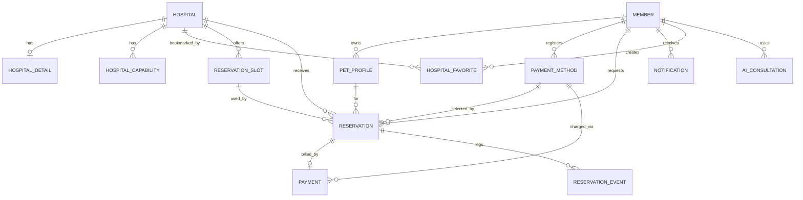
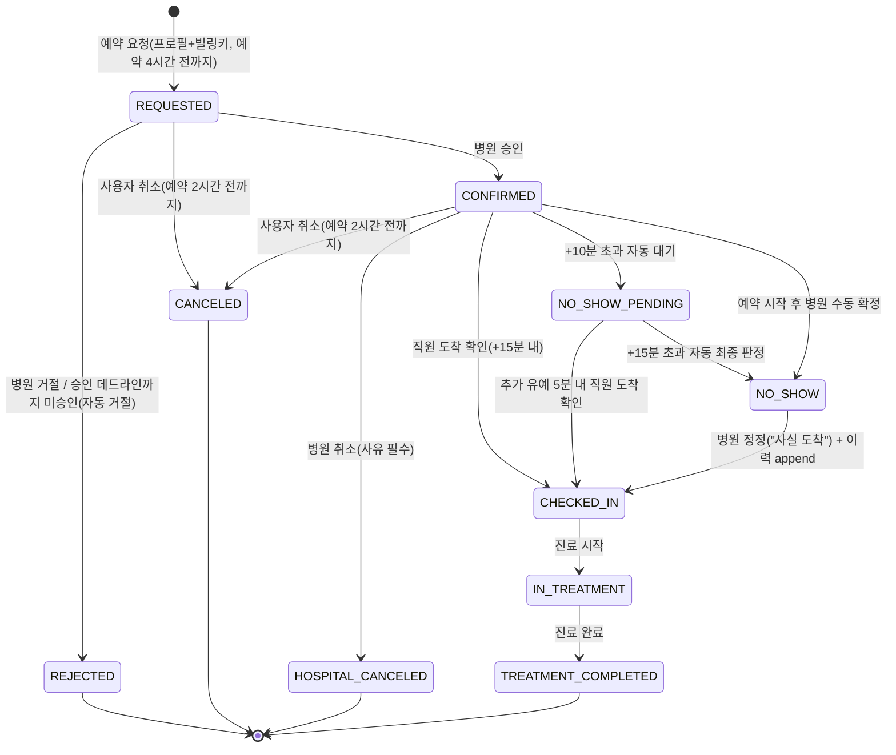
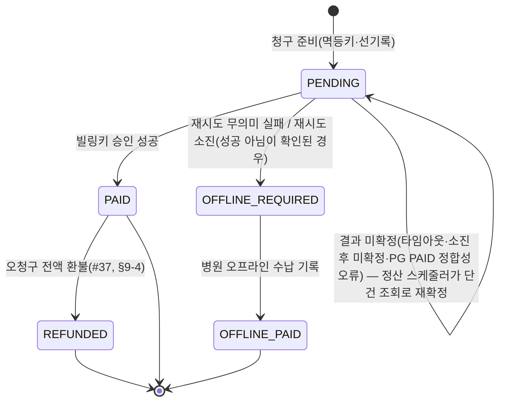
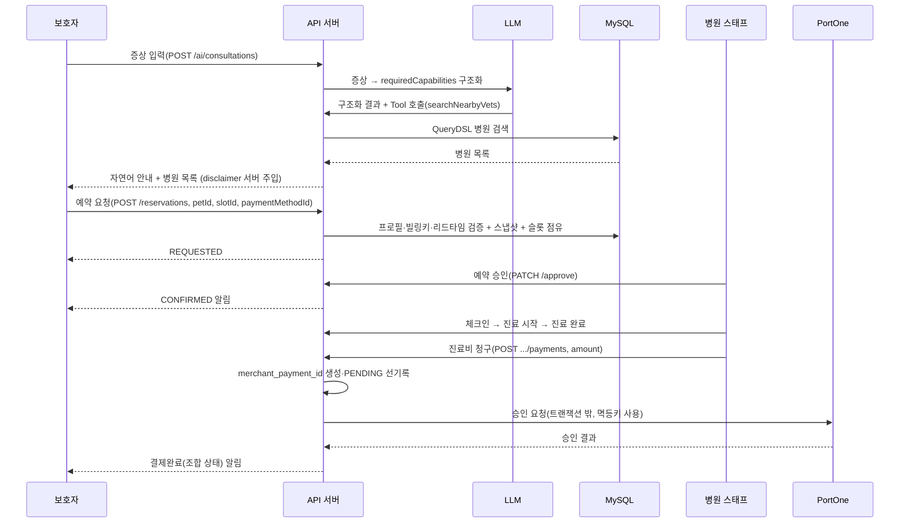
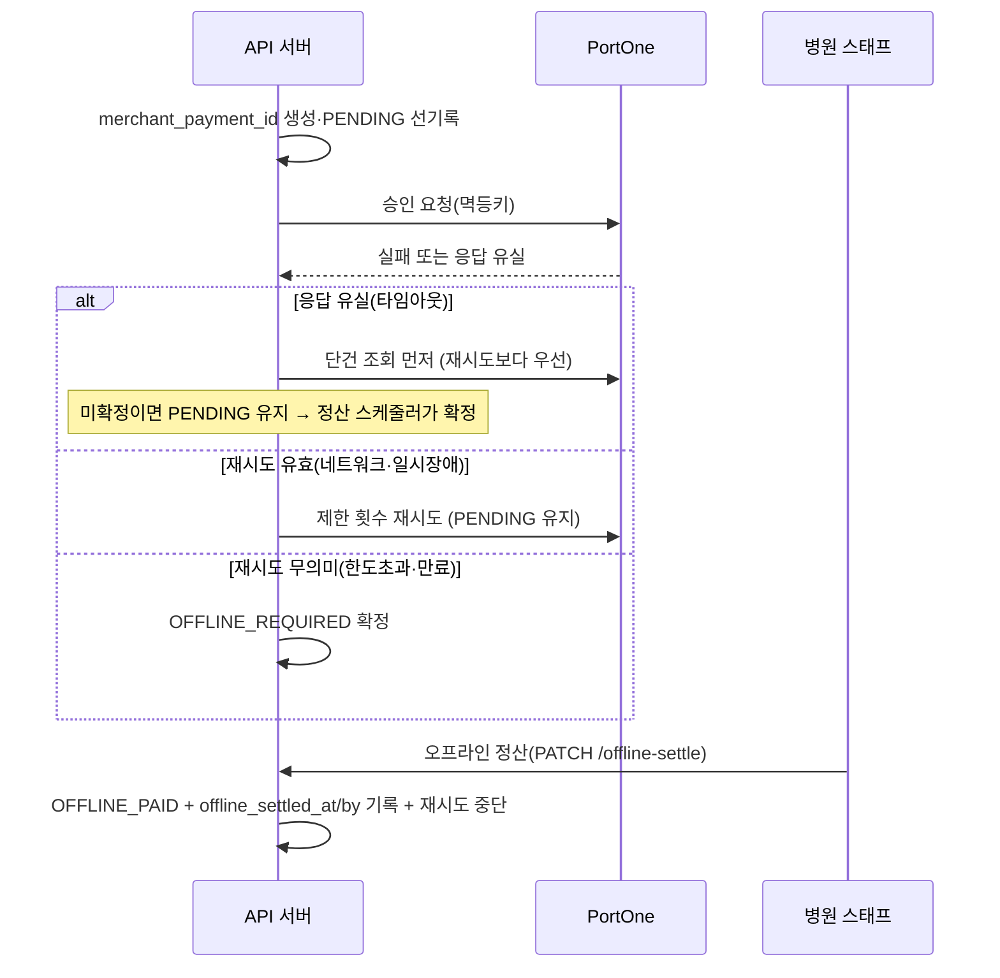
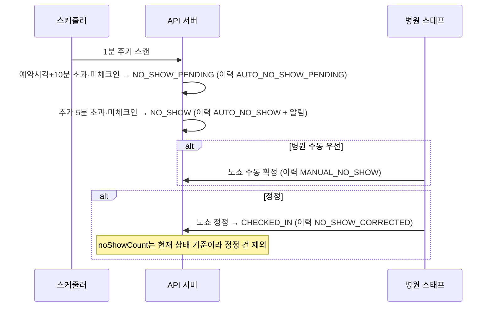

# DoctorPet 시스템 아키텍처 문서 (SA)

| 항목 | 내용 |
| --- | --- |
| 제품명 | DoctorPet |
| 문서 버전 | v1.62 |
| 작성 기준일 | 2026-08-18 |
| 상위 근거 | PRD, 정책 정리본, 코드 컨벤션 (버전은 각 문서 헤더 참조) |

PRD가 정의한 요구사항을 구현 가능한 설계로 확정한다(ERD·API·상태 머신·핵심 기능·인프라). PRD와 충돌하면 PRD를 따른다. 코드 스타일·클래스 규약은 코드 컨벤션 문서를 따른다. 아직 안 정한 선택지는 본문에 `[결정 필요]`로 표기하고 부록 A에 모은다.

> 변경 이력 — v1.4~v1.29: 각 도메인 구현과 리뷰 결과를 순차 반영했다. v1.30: 전국 공공데이터 주 1회 갱신, 다중 인스턴스 잠금, 19개 진료역량 화이트리스트와 특수동물 축종을 확정했다. v1.31: 예약 승인 마감 백필·재시도, 결제 웹훅 멱등 처리, Redis 토큰 해시 저장과 로그아웃 Access Token 무효화 설계를 병합 반영했다. v1.32: 공공데이터 적재 주기를 매주 월요일 03:00 갱신으로 일치시켰다. v1.33: 재발급 락 TTL 레이스(이슈 #100) 대응으로 `refresh-lock:{memberId}` 직렬화 락과 `refresh-fence:{memberId}` 펜싱 토큰 설계를 §6-1에 반영하고, 저장된 값의 펜싱 토큰뿐 아니라 펜싱 카운터의 현재 값까지 비교해야 함을 2차 리뷰 반영으로 보강. 경량본(§4)에 동일 계약 요약 추가(리뷰 지적, PR #101). v1.34: 관측성·API 문서 노출 범위(이슈 #105)를 §12에 확정 — 액추에이터를 `management.server.port=8081`로 앱 포트와 분리하고 전용 `SecurityFilterChain`으로 명시적 permitAll, Swagger는 `local` 프로파일에서만 노출, 관리 포트만의 헬스체크 사각지대를 막기 위해 헬스 그룹 `additional-path`로 앱 포트에도 `/healthz`를 노출(2차 리뷰 반영, PR #104). 슬라이스 테스트가 401/403만 확인해 404를 걸러내지 못한다는 지적에 실기동 검증(Level 6)을 진행하던 중 `NoResourceFoundException`이 전역 500으로 새는 버그를 발견해 함께 수정. v1.35: 관리 포트(8081) permitAll이 실제로 적용되는지에 대한 3차 리뷰 지적에 Level 6 실기동 검증 결과(Spring Security 표준 헤더 확인, spring-boot#50355 근거)를 §12에 보강. v1.36: 전국 병원 검색 인덱스 성능 검증과 직원 도착 확인 API·`NO_SHOW_PENDING` 기본 5분 추가 유예를 반영했다. v1.37: 예약 알림 저장 연동을 반영하고 실시간 알림 push를 단방향 SSE로 확정했으며, 티켓 인증·커밋 이후 전송·회원당 연결 상한을 §9-8에 반영했다(양방향 WebSocket+STOMP는 채팅 도입 시 재논의, #40). v1.38: 이번 병합에서 병원 검색 인덱스·SSE 설계와 직원 도착 확인·노쇼 유예 정책을 하나의 정본으로 통합했다. v1.39: SSE 확정 정책과 `processed` 처리 건수 정의를 본문·경량본에 일치시켰다. v1.40: MVP+ 고도화로 진료비 **전액 환불**(이슈 #37)을 도입해 §5-2 스키마(`payments.status`에 `REFUNDED`, `refunded_at`, 신규 `payment_refunds` 이력 테이블)와 §9-4 계약을 확정했다. 선점은 `payment_refunds.UNIQUE(payment_id)`와 소유권 펜스(`claim_token`)가 담당하고 결제 상태에 환불 진행 중 중간 단계를 두지 않는다. 재시도는 `merchant_refund_id`를 재사용하며, 확정 전이 불일치는 이력까지 롤백한다. 현장 현금 수납(`OFFLINE_PAID`) 환불과 부분 환불·정정 재청구는 확장으로 유지한다. v1.41: 전국 병원 검색의 무반경 거리순 요청을 MySQL `ST_Distance_Sphere` 정렬·DB 페이징으로 전환하고, 현재 영업 필터는 정렬된 후보를 200건 단위로 읽어 애플리케이션의 최대 메모리 적재량을 제한했다. 정확한 전체 일치 건수 계산을 위해 후보 전체 스캔은 유지되며 DB 왕복이 증가할 수 있는 트레이드오프를 명시했다(이슈 #69). v1.42: 보호자 병원 찜을 위한 `hospital_favorites` 스키마, 멱등 등록·해제·내 목록 API, 검색·상세의 회원별 `favorite` 결합과 공유 캐시 분리 원칙을 확정했다. v1.43: 병원 리뷰 CRUD·평점 집계(이슈 #114)를 확정했다. 결제 완료 자격과 예약당 최초 1회 작성권, 0.5 단위 평점, Hard Delete, 환불 시 리뷰 삭제·작성권 초기화, 동시 작성·환불 경합 불변식을 §4·§8-3·§9-10에 반영했다. v1.44: 별도 리뷰 상세 조회를 제거하고 병원별 공개 목록 응답에서 내부 ID를 제외했으며, 병원 찜과 리뷰 계약을 하나의 정본으로 통합했다. v1.45: 기능 구멍 점검(회원-병원 연락 수단 부재) 대응으로 `members.phone` 컬럼과 회원가입 필수 입력을 §4·§6-6·§8-1에, 병원 예약 목록 응답의 `guardianPhone` 노출을 §8-6에 추가(이슈 #120). v1.46: 기능 구멍 점검(비밀번호 재설정 후 세션 미무효화 — 계정 탈취 복구 시나리오 결함) 대응으로 재설정 성공 시 `RefreshTokenRepository.deleteByMemberId()`를 호출하도록 §6-4에 반영(이슈 #121). v1.47: 리뷰 지적 — 비밀번호 재설정이 회원 행을 잠그지 않아 로그인과 경합하면 v1.46의 세션 무효화가 무력화될 수 있는 문제를 `findByIdForUpdate()`로 `login()`과 같은 행 락을 공유하도록 §6-4에 반영(이 락은 이후 회원 탈퇴·병원 찜 등록 경합 직렬화에도 재사용된다, v1.42). 같은 리뷰에서 전화번호 정규식의 두 하이픈 자리가 서로 독립적이라 부분 하이픈 입력도 통과하던 버그를 §6-6에 반영해 수정. v1.48: phone 필수화가 PRD와 충돌한다는 같은 리뷰 지적에 대해 PRD를 갱신하는 쪽으로 결정해(사용자 확인), PRD `docs/product/DoctorPet-PRD.md` v3.23에서 가입 계약을 "이메일·휴대폰·비밀번호·닉네임 모두 필수"로 확정하고 §6-6의 `[결정 필요]` 표기를 해소했다. v1.49: PR #122 리뷰 지적 2건 대응 — (P1) `Member.withdraw()`가 email만 익명화하고 phone은 그대로 남겨두던 문제를 §6-3에 반영해 phone도 함께 null로 지우도록 수정하고, 실제 MySQL로 두 변경을 함께 검증하는 Level 3 테스트를 추가했다. (P2) 병원 예약 목록의 `guardianPhone`이 REJECTED·CANCELED·TREATMENT_COMPLETED·NO_SHOW 같은 종료된 예약에도 노출되던 문제를 §6-6·§8-6에 반영해, 예약 확인·노쇼 직전 연락이라는 기능 목적에 맞게 REQUESTED·CONFIRMED·NO_SHOW_PENDING·CHECKED_IN·IN_TREATMENT로만 노출 범위를 제한했다. v1.50: 반려동물 프로필 이미지 업로드를 도입했다 — `pet_profiles.image_url` 컬럼과 `POST /api/pets/{petId}/image/upload-url`(§8-2)을 추가하고, `PaymentGateway`/`EmailGateway`와 동일한 패턴의 `ImageStorageGateway`(Fake/S3, presigned URL 방식)를 §9-11에 신설했다. `ProductionSafetyGuard`의 fail-fast 검사에 `image.storage.provider`를 포함했다. v1.51: 리뷰 지적 2건 대응 — (P1) `imageUrl`이 인증된 클라이언트가 보내는 요청 값이라 신뢰 경계 밖에 있는데도 길이만 검사해, 업로드 절차를 거치지 않은 임의 외부 URL이나 다른 반려동물의 오브젝트 URL을 그대로 저장·노출할 수 있던 문제를 §9-11에 반영해 수정했다. `ImageStorageGateway`에 `isManagedFileUrl(fileUrl, keyPrefix)` 계약을 추가해 PATCH 저장 직전 스킴·호스트·petId 네임스페이스(`pets/{petId}/`)를 검증하고, 불일치하면 `PET_002 INVALID_IMAGE_URL`(400)을 반환한다. (P2) `image_url VARCHAR(2048)` 컬럼 추가 시 Mockito/MockMvc 테스트만 있고 실제 MySQL 저장·조회를 검증하는 Level 3 근거가 없던 문제를 `PetProfileDdlIntegrationTest`에 등록 시 null·update 이후 2048자 경계값 왕복 테스트를 추가해 해소했다. v1.52: PR #134 리뷰 지적 2건 대응 — (P2 API 계약) 알림 배지·모두 읽음 API(`GET /api/notifications/unread-count`, `PATCH /api/notifications/read-all`)가 §8-8 API 표에 빠져 있던 것을 반영해 두 엔드포인트와 응답 필드(`unreadCount`/`updatedCount`)를 정본에 기록했다. (P2 인덱스) 두 API가 매 요청 쓰는 `member_id = ? AND read_at IS NULL` 조회·일괄 갱신 성능을 위해 `idx_notifications_member_read(member_id, read_at)` 복합 인덱스를 추가하고 §4 notifications 스키마에 명시했다 — 테이블·컬럼은 그대로지만 인덱스는 명백한 DDL 변경이므로 초기 기록의 '스키마 변경 없음'을 '인덱스 추가'로 정정했다. v1.53: PR #139 리뷰 지적 대응 — 결제 알림 고도화(3.6)에서 추가한 `PAYMENT_PENDING` 유형이 §4 notifications.type 목록에 빠져 있던 것을 반영하고(정본-코드 정합), 정산 `RECONCILE_STUCK` 시 "결제 확인 중"을 결제당 1회 발행하는 동작을 §4에 기술했다. (P1 멱등) 존재조회→저장이 원자적이지 않아 배치와 락 밖 웹훅 경로가 동시에 처리하면 안내가 중복 저장·SSE 전송될 수 있던 문제를, 멱등 발행 전용 `notifications.dedup_key`(NULL 허용 UNIQUE, `type:resource_type:resource_id:member_id`) 제약으로 원자적으로 1건만 저장되게 하고 유니크 충돌은 이미 발행된 것으로 흡수하도록 §4에 반영했다(일반 발행은 NULL이라 `PAYMENT_RESULT` 정정 중복은 막지 않는다). 후속 리뷰(P1) — dedup_key만으로는 서로 다른 유형(완료=`PAYMENT_RESULT`/확인중=`PAYMENT_PENDING`)이라 "완료 뒤 뒤늦은 확인중" 순서를 막지 못한다는 지적에, STUCK 안내의 발행 결정과 저장을 결제 행 락(`findByIdForUpdate`) 아래 한 트랜잭션으로 원자화해 확정을 원자화하는 조건부 UPDATE와 직렬화되게 했다(실 MySQL 동시성 테스트로 순서 검증). 아울러(P2) UNIQUE 제약에 이름(`uk_notifications_dedup_key`)을 붙이고 그 위반만 골라 흡수하도록 해, NOT NULL·길이 등 다른 무결성 오류가 무음 유실되지 않게 했다. v1.54: 병원 진료시간 변경 적용일, 운영 구간·정기 휴무 표현, 특정일 임시 휴무 등록·취소, 전체 병원 30분 고정 슬롯과 기존 예약 보존 규칙을 §9-9에 확정했다(이슈 #115). v1.55: PR #115 리뷰 반영 — 기존 제휴 병원의 `hospital_details.open_hours`를 초기 운영 스케줄로 보정하고, 신규 제휴 적용 시에도 같은 트랜잭션에서 초기 스케줄을 생성하도록 §9-9의 불변식을 보강했다. v1.56: 알림 수신자 모델을 회원 전용에서 회원/병원으로 확장했다(고도화 3.10, 이슈 #141). `notifications`에 `recipient_type`(MEMBER|HOSPITAL)+`recipient_id`를 정본으로 추가하고 기존 행을 (MEMBER, member_id)로 백필했으며(전용 MigrationRunner + `schema_migrations` 마커), `member_id`는 하위호환용으로 nullable로 완화했다. 조회 인덱스를 `(recipient_type, recipient_id, created_at/read_at)`로 교체하고 §8-8 네 API를 호출자 recipient(회원↔병원 격리, 병원은 병원 단위 공유 읽음) 기준으로 확장했다(§4·§8-8). 발행부(예약·결제)는 `create(memberId,...)` 호환 오버로드로 무변경을 유지했다. 병원향 SSE 실시간 fan-out은 후속 PR로 분리하고 이 PR은 저장·조회·인가와 HOSPITAL SSE 오배달 방지까지 포함한다. v1.58: 모니터링 스택(Prometheus+Grafana, 이슈 #105 후속) PR의 재리뷰 지적을 반영했다 — (P1) `GRAFANA_ADMIN_PASSWORD`(`:?` fail-closed)가 메인 `docker-compose.yml` 안에 있으면 Compose가 대상 서비스와 무관하게 파일 전체를 파싱 시점에 보간해, 이 값이 EC2 `.env`에 없을 때 app-blue/green 배포·컷오버·롤백까지 포함한 모든 `docker compose` 명령이 죽는 문제가 있어 모니터링 스택을 `docker-compose.monitoring.yml`로 분리했다. (P1) 같은 이유로 `deploy.yml`의 모니터링 기동 줄이 `set -e` 보호 밖의 평문 statement라 이미지 pull 실패나 healthcheck 플레이크 하나로 앱 컷오버까지 막던 문제를, 분리된 파일의 기동 실패를 경고로만 흡수하도록 고쳐 해소했다(nginx·app-blue/green과 달리 상시 보조 서비스라는 기존 회전 단계 원칙과 통일). (P2) Prometheus 보존 정책(`--storage.tsdb.retention.time=15d`) 명시, Grafana의 `depends_on: prometheus: condition: service_healthy` 제거(데이터소스는 지연 연결이라 기동 시점 결합이 불필요했다), `--wait`에 `--wait-timeout 120` 추가, 비밀번호 회전 단계의 `curl`을 `-K -`(stdin) 방식으로 바꿔 호스트 `ps`에서의 평문 노출을 줄임(`grafana-cli`는 stdin 미지원이라 그 한 줄만 잔존 위험으로 문서화), `.env.example`의 `GRAFANA_ADMIN_PASSWORD` 예시값을 빈 문자열로 바꿔 맹목적 복사가 fail-closed를 우회하지 못하게 함. v1.59: 같은 PR의 재재검토 지적 3건을 반영했다 — (P1) 모니터링 스택 프로젝트 분리로 `-p doctorpet-monitoring`을 추가하고 `docker-compose.monitoring.yml`에 `networks.default.external`로 메인 네트워크(`doctorpet_default`)를 명시 참조해, 두 compose 파일이 디렉터리명만으로 암묵적으로 같은 프로젝트에 묶여 있던 것을 분리했다 — orphan 컨테이너 경고와, 그걸 보고 `--remove-orphans`를 잘못 붙였을 때 운영 스택이 통째로 삭제될 수 있는 지뢰를 제거했다. 프로젝트 분리로 회전 로직이 겨냥하는 volume/컨테이너 이름이 바뀌었는데, 실제 EC2에서 옛 이름(`doctorpet_grafana-data` 등)의 잔존 자원이 없음을 확인해(이 브랜치가 실제 배포 파이프라인으로 프로덕션에 올라간 적이 없어 격리 테스트만 존재) 위험이 실현되지 않았음을 기록했다. (P2) `doctorpet_default` 리터럴이 메인 프로젝트 이름이 `doctorpet`일 때만 유효해 클론 디렉터리명에 결합돼 있던 문제를, `.env`의 `COMPOSE_PROJECT_NAME=doctorpet` 고정으로 디렉터리 이름과 무관하게 해소했다. (P2) `GRAFANA_ADMIN_PASSWORD`에 큰따옴표·백슬래시를 넣지 말라는 안내를 추가했다(회전 검증 `curl -K -`의 이스케이프 해석 위험, 사소). 아울러 위 P2-1 수정 이후 분리된 두 프로젝트 사이의 실제 스크레이프 경로가 검증된 적 없다는 지적에, 운영 컨테이너를 전혀 건드리지 않은 채 실제 `doctorpet_default` 네트워크 위에 `doctorpet-monitoring` 프로젝트만 얹어 기동해 `up{instance="app-green:8081"} 1` 등으로 실측 확인했다(§12 EC2 크로스 프로젝트 스크레이프 검증 참고). v1.60: 결제 실패 셀프 복구(고도화 3.3)와 정정 재청구(3.5-a)를 구현 반영했다 — §4 payments에 `superseded_at`·`correction_of`·`recovery_of`와 생성 컬럼 `active_reservation_id`(활성일 때만 `reservation_id`)+`UNIQUE`를 추가하고 구 `UNIQUE(reservation_id)`를 제거해 "예약당 활성 결제 1건"을 DB로 못박았다(마이그레이션 러너 `PaymentActiveConstraintMigrationRunner`, expand→contract 순서). 활성 판정은 상태가 아니라 `superseded_at IS NULL`이며, 셀프 복구(`OFFLINE_REQUIRED`)·정정 재청구(`REFUNDED`)만 조건부 `supersede` UPDATE로 원 결제를 비활성화한 뒤 새 결제(`recovery_of`/`correction_of`)를 만든다. 오프라인 정산의 조건부 UPDATE에도 `superseded_at IS NULL` 전제를 넣어 셀프 복구와 현장 수납 중 하나만 성립하게 했다(이중 수납 방지). 예약당 결제가 1:N이 되어 결제 내역 조회·활성 결제 락 조회를 활성/전체 기준으로 정리했고, §9-4 "알려진 한계"의 '환불한 예약 재청구 불가' 항목을 삭제했다. 보호자 `POST /api/reservations/{id}/payments/recharge`, 스태프 `POST /api/hospital/reservations/{id}/payments/correction`을 추가했다. 부분 환불(3.5-b)은 계약 미확정으로 계속 제외. v1.61: 병원 수신 알림 발행 지점(이슈 #166)을 반영했다 — `notifications.type`에 병원향 `RESERVATION_REQUESTED`를 추가하고(보호자의 새 예약 요청 시 일반·대기열 두 경로 모두에서 `REQUESTED` 생성과 같은 트랜잭션에 발행), fan-out 대상 조회용 `idx_members_hospital_role(hospital_id, role)`을 §4 members에 명시했다. 두 DDL 모두 `schema_migrations` 마커(`notification_reservation_requested_type_v1`·`member_hospital_staff_index_v1`)로 일회성 적용하며, ENUM 확장은 과거 오타 값 정정 마이그레이션보다 뒤에 실행되도록 순서를 강제한다. 자가검토에서 발견한 정본-코드 드리프트도 함께 정정했다 — 대기열 고도화에서 추가된 `RESERVATION_WAITLIST_OFFERED`가 §4 type 목록과 DB설계 경량본에 빠져 있었다(PR #139의 `PAYMENT_PENDING` 누락 지적과 동일 유형, v1.53). v1.62: 인증 경계 재검토(회원/인증/공통/배포, 이슈 #181) 3건을 §6-4·§9-12에 반영했다. (1) 비밀번호 재설정 시 이전 발급 Access Token 무효화 — `PasswordChangeInvalidationPort`가 재설정 시각을 기록해두고 `JwtAuthenticationFilter`가 토큰 발급 시각과 비교해 그 이전 토큰만 거부하도록 §6-4에 계약을 추가하고, v1.46 이후 "이미 발급된 Access Token은 자연 만료 전까지 유효하다는 한계는 탈퇴 때와 동일하게 남는다"던 옛 서술을 정정했다(PR 리뷰 지적 — 코드와 정본이 반대 방향으로 어긋나 있었다). (2) 발급 시각 비교는 JWT 표준 `iat`(초 단위)가 아니라 밀리초 정밀도 커스텀 클레임을 쓴다(같은 리뷰 지적 — 초 단위 비교면 재설정과 같은 초에 재로그인한 정상 토큰이 만료 전까지 계속 거부될 수 있었다). (3) 같은 무효화 검사를 STOMP 채팅 경로(`ChatChannelInterceptor`·`ChatSessionAuthenticationStore`)에도 적용해 §9-12에 반영했다(같은 리뷰 지적 — `/ws/chat`은 permitAll이라 `JwtAuthenticationFilter`를 거치지 않아, HTTP API는 막혀도 채팅 WebSocket은 재설정 이전 토큰으로 계속 열 수 있었다).

---

**v1.57 변경:** 병원 확정 예약 취소 계약을 정본에 반영했다. `CONFIRMED → HOSPITAL_CANCELED` 상태 전이, `hospital_cancel_reason`·`hospital_canceled_at` 컬럼, `HOSPITAL_CANCELED` 이벤트, `RESERVATION_HOSPITAL_CANCELED` 알림, 병원 취소 API와 슬롯 반환 규칙을 §4·§5·§8-6에 추가했다. 레거시 `HOSPITAL_CANCELLED` 데이터는 Hibernate `ddl-auto=update` 전에 선행 마이그레이션으로 정규화한다.

# 1. 아키텍처 개요

구성 요소는 다섯이다.

- **API 서버** — Spring Boot. 도메인 로직·API 제공.
- **MySQL** — 회원·병원·예약·결제 트랜잭션 데이터.
- **Redis** — Refresh Token 저장, 검색 원격 캐시(§9-2). 동시성은 낙관적 락이라 Redis 분산 락은 안 쓴다.
- **LLM** — 증상 → 진료역량 구조화, 검색 Tool 호출. 외부 서비스.
- **PortOne V2** — 빌링키 발급·후불 결제 승인·단건 조회.

병원 공공데이터 API는 배치 수집원으로만 쓰고 런타임 검색 경로에는 개입하지 않는다. 검색은 항상 자체 DB를 대상으로 한다.

```
[클라이언트]
     │  HTTPS
     ▼
[DoctorPet API 서버] ──▶ [MySQL]
     │   │   │
     │   │   └────────▶ [Redis]  (RefreshToken / 검색 캐시)
     │   └────────────▶ [LLM]    (증상→역량, Tool Calling)
     └────────────────▶ [PortOne](빌링키·결제·단건조회)

[스케줄러] ──▶ [공공데이터 API] ──▶ [MySQL]   (배치 적재, 런타임과 분리)
```

---

# 2. 기술 스택

- Java 17, Spring Boot, Spring Data JPA, Spring Security
- QueryDSL(동적 쿼리), MySQL 8.x, Redis(Lettuce)
- JWT(Access/Refresh), PortOne V2(빌링키), Spring Scheduler
- Gradle, JUnit5, Mockito, @SpringBootTest
- 인프라(도전): Docker, AWS(EC2·RDS·ElastiCache), GitHub Actions, k6

확정 사항: 병원 검색 최초 진입 기본 첫 페이지의 정적 조회 결과만 Redis 원격 캐시에 저장한다(TTL·키 prefix는 구현 시 조정, §9-2). AI는 `AiGateway` 추상화를 유지하면서 OpenAI `gpt-4.1-mini`의 Structured Outputs로 연동한다(§9-5). 실시간 알림은 MVP2에서 단방향 SSE를 사용하며, 티켓 인증·커밋 이후 전송·회원당 연결 상한을 적용한다(§9-8). 양방향 WebSocket+STOMP는 병원↔회원 예약 채팅 전용으로 도입했다(§9-12) — 알림 전송을 WebSocket으로 이전하지는 않는다.

시간 정책: 애플리케이션의 업무 시각은 `TimePolicy.SEOUL_ZONE_ID`를 적용한 공통 `Clock`을 사용한다. JPA `@CreatedDate`·`@LastModifiedDate`와 시간 기반 배치는 같은 Clock으로 `LocalDateTime`을 생성해 JVM 기본 시간대가 UTC인 환경에서도 저장 시각과 비교 기준이 어긋나지 않게 한다.

---

# 3. 패키지 구조

```
com.doctorpet
├── global
│   ├── config          보안·JPA·스케줄러·캐시·QueryDSL 설정
│   ├── security        JWT 필터, 인증 주체(Principal) 해석
│   ├── exception       ErrorCode, CommonErrorCode, ServiceException, GlobalExceptionHandler
│   ├── response        ApiResponse
│   └── gateway         외부 연동 추상화 (PaymentGateway, AiGateway, PublicDataGateway)
│
└── domain
    ├── member          회원·인증·역할(보호자/병원 스태프)
    ├── pet             반려동물 프로필(PetProfile)
    ├── hospital        병원 마스터·진료역량·예약 슬롯
    ├── search          병원 검색(QueryDSL)
    ├── reservation     예약 요청·승인/거절·상태 전이·노쇼·이력
    ├── payment         결제수단(빌링키)·후불 결제·오프라인 정산
    ├── ai              증상 → 진료역량 추천·Tool Calling
    ├── notification    알림
    └── publicdata      공공데이터 배치 적재
```

다른 도메인의 Repository를 직접 호출하지 않고 Service를 경유한다. 여러 도메인 흐름은 `XxxApplicationService`로 분리한다. `global.gateway`는 모든 도메인이 참조 가능하나 역은 안 된다.

---

# 4. 도메인 모델 (ERD)



모듈 경계를 넘는 `@ManyToOne`은 두지 않고 FK 값(Long)으로 참조한다. 따라서 아래 표의 `FK` 표기는 논리적 참조 관계를 뜻한다 — **같은 도메인 내부** 참조(예: `hospital_details.hospital_id`)는 JPA 연관관계로 매핑해 DB 외래 키 제약을 두지만, **도메인 경계를 넘는 참조**(예: `payment_methods.member_id`, `reservations`의 `member_id`·`hospital_id`)는 DB 외래 키 제약 없이 `Long` 값으로 두고 무결성은 애플리케이션 계층(인증 주체 기반 식별·소유권 검증)에서 보장한다. 이는 구현 가드레일의 모듈 경계 원칙에 따른 것이며, `ddl-auto=update`를 마이그레이션 도구로 전환하는 시점에 크로스도메인 FK 제약 추가 여부를 재검토한다. `deleted_at`을 가진 테이블(`members`, `pet_profiles`)은 조회 시 기본적으로 `deleted_at IS NULL` 행만 노출한다(`@SQLRestriction` 등). 삭제된 행은 이력 참조용으로만 남긴다.

### members

| 컬럼 | 타입 | 설명 |
| --- | --- | --- |
| id | BIGINT PK | |
| email | VARCHAR | 로그인 식별자. 활성 회원 기준 중복 검사(§6-3) |
| password | VARCHAR | 해시 |
| nickname | VARCHAR | |
| phone | VARCHAR NULL | 연락처. 신규 가입은 필수이지만 컬럼 자체는 NULL 허용 — 기존 회원은 별도 백필 없이 NULL로 남는다(기능 구멍 점검 대응, §6-6) |
| role | VARCHAR | GUARDIAN / HOSPITAL_STAFF |
| hospital_id | BIGINT NULL | 스태프 소속 병원(보호자는 NULL) |
| email_verified | BOOLEAN NOT NULL DEFAULT FALSE | 이메일 인증 여부. false인 동안 로그인 차단(§6-4) |
| failed_login_attempts | INT NOT NULL DEFAULT 0 | 로그인 연속 실패 횟수(A 도메인 결정 #1) |
| locked_until | DATETIME NULL | 잠금 해제 시각. NULL이면 잠금 상태 아님 |
| created_at | DATETIME | |
| deleted_at | DATETIME NULL | Soft Delete |

탈퇴 시 이메일을 익명화한다(예: `withdrawn_{memberId}@deleted.doctorpet`). `email UNIQUE`를 그대로 유지하면서 원 이메일의 재가입을 허용하기 위함이다. 로그인·중복검사는 `deleted_at IS NULL`만 대상으로 한다.

병원 수신 알림의 SSE fan-out 대상 조회(`hospital_id = ? AND role = ?`, §9-8)용으로 복합 인덱스 `idx_members_hospital_role(hospital_id, role)`을 둔다 — 이 조회는 알림 1건마다 커밋한 요청 스레드에서 돌고 members는 전체 보호자를 포함해 계속 커지므로, 인덱스가 없으면 매 발행이 members 풀스캔이다(`EXPLAIN type=ALL` → 적용 후 `type=ref`). 기존 DB에는 `member_hospital_staff_index_v1` 마커로 일회성 적용한다(§4 schema_migrations).

로그인 실패 5회 누적 시 30분간 계정을 잠근다(`locked_until`을 현재 시각+30분으로 설정). 잠금 시간이 지나면 다음 로그인 시도에서 자동 해제되며 `failed_login_attempts`도 0으로 초기화된다. 비밀번호 재설정에 성공해도 즉시 잠금이 해제된다(A 도메인 결정 #1, GitHub Wiki [[A 도메인 - 인증·회원·프로필·공통설정]] 참고).

### pet_profiles

| 컬럼 | 타입 | 설명 |
| --- | --- | --- |
| id | BIGINT PK | |
| member_id | BIGINT FK | 소유 보호자 |
| name | VARCHAR | |
| species | VARCHAR | DOG / CAT / BIRD / RABBIT / HAMSTER / GUINEA_PIG / FERRET / REPTILE |
| age | INT | |
| weight | DECIMAL | |
| neutered | BOOLEAN | |
| image_url | VARCHAR(2048) NULL | 프로필 사진 URL. presigned URL로 S3에 직접 업로드한 뒤 URL만 저장(§8-2, §9-10) |
| created_at | DATETIME | |
| deleted_at | DATETIME NULL | Soft Delete(예약이 pet_id 참조) |

프로필을 Soft Delete하면 기본 조회에서 빠진다. 과거 예약 상세가 깨지지 않도록 예약 생성 시 반려동물 이름·종을 `reservations`에 스냅샷으로 보존하고, 예약 상세는 스냅샷을 우선 쓴다.

### hospitals (공공데이터 기반)

| 컬럼 | 타입 | 설명 |
| --- | --- | --- |
| id | BIGINT PK | |
| mgmt_no | VARCHAR | 관리번호(공공데이터 조인 키) |
| local_gov_code | VARCHAR | 지자체 코드 |
| name | VARCHAR | 병원명 |
| phone | VARCHAR | 전화번호 |
| address_jibun | VARCHAR | 지번주소 |
| address_road | VARCHAR | 도로명주소 |
| zipcode | VARCHAR | 우편번호 |
| coord_x | DECIMAL | 좌표 X |
| coord_y | DECIMAL | 좌표 Y |
| license_date | DATE | 인허가일자 |
| business_status | VARCHAR | OPEN / CLOSED_TEMP / CLOSED |
| close_date | DATE NULL | 휴·폐업일 |
| area | DECIMAL NULL | 사업장 면적 |
| source_modified_at | DATETIME | 공공데이터 최종 수정일 |
| partnership_status | VARCHAR | PARTNER / NON_PARTNER |

전국 데이터 검색 성능 측정 후 기본 이름순 목록에 `(name, id, business_status)`, 제휴 병원 이름순 목록에 `(partnership_status, name, id, business_status)`, 좌표 바운딩박스에 `(coord_x, coord_y)` 인덱스를 적용한다. `(business_status)` 단일 인덱스는 낮은 선택도와 `name, id` 정렬 미지원으로 제외하고, 이름순 스캔 중 영업상태를 확인할 수 있는 복합 인덱스로 교체한다.
제약: `UNIQUE(local_gov_code, mgmt_no)` — 지자체 범위의 관리번호를 공공데이터·제휴 데이터 복합 매핑 키로 사용한다.

### hospital_details (제휴 병원만, 자체 보강)

| 컬럼 | 타입 | 설명 |
| --- | --- | --- |
| id | BIGINT PK | |
| hospital_id | BIGINT FK UNIQUE | |
| open_hours | VARCHAR/JSON | 요일별 영업시간 |
| surgery_available | BOOLEAN | 수술 가능 |
| hospitalization_available | BOOLEAN | 입원 가능 |
| night_care | BOOLEAN | 야간 진료 |
| emergency | BOOLEAN | 응급 진료 |

### hospital_capabilities (제휴 병원 진료역량, 1:N)

| 컬럼 | 타입 | 설명 |
| --- | --- | --- |
| id | BIGINT PK | |
| hospital_id | BIGINT FK | |
| capability_type | VARCHAR | SPECIES / EXAM / TREATMENT / EQUIPMENT |
| capability_value | VARCHAR | 아래 확정 화이트리스트 값 |

역량 AND 매칭 쿼리는 `capability_value IN (...)`으로 후보를 고른 뒤 `hospital_id`로 그룹화한다. 전국 데이터 기준 OFF/ON 비교에서 `(capability_value, hospital_id)` 후보의 전체 쿼리 개선이 중앙값 0.775ms, P95 0.661ms에 그쳐 검색 전용 인덱스는 적용하지 않는다. 현재 규모에서는 기존 UNIQUE 인덱스 스캔을 사용하고, 진료 역량 데이터 규모나 검색 부하가 증가하면 같은 조건으로 다시 검증한다.

진료역량 화이트리스트는 병원 시드 작성 시 아래 19개 값으로 확정했다.

| 분류 | 허용 값 |
| --- | --- |
| SPECIES | `DOG`, `CAT`, `BIRD`, `RABBIT`, `HAMSTER`, `GUINEA_PIG`, `FERRET`, `REPTILE` |
| EXAM | `BLOOD_TEST`, `XRAY`, `ULTRASOUND` |
| TREATMENT | `ORTHOPEDIC_CARE`, `DENTAL_CARE`, `OPHTHALMIC_CARE`, `REHABILITATION`, `ONCOLOGY_CARE` |
| EQUIPMENT | `CT`, `MRI`, `ENDOSCOPE` |

병원 시드, QueryDSL 검색 조건, AI의 `requiredCapabilities` 구조화 출력은 모두 이 목록을 단일 계약으로 공유한다. 새로운 값을 추가하거나 이름을 바꾸려면 병원 데이터·검색 조건·AI 프롬프트를 함께 변경한다.

### hospital_favorites (보호자 병원 찜)

| 컬럼 | 타입 | 설명 |
| --- | --- | --- |
| id | BIGINT PK | |
| member_id | BIGINT | 인증된 보호자 ID. 회원 도메인 논리 참조 |
| hospital_id | BIGINT | 병원 ID. 병원 도메인 내부 FK |
| created_at | DATETIME | 찜 등록 시각 |

제약은 `UNIQUE(member_id, hospital_id)`로 동일 보호자의 동일 병원 중복 찜을 DB에서도 차단한다. 내 찜 목록은 `created_at DESC, id DESC`로 안정적으로 정렬한다. 구현 후 로컬 MySQL에서 한 회원의 합성 찜 5,000건을 대상으로 20회 워밍업 뒤 200회 조회한 결과 중앙값 2.761ms, P95 4.388ms였고, 실행 계획은 5,000행 스캔과 `Using filesort`였다. 현재 응답시간에서는 별도 정렬 인덱스의 쓰기·저장 비용을 감수할 근거가 부족하므로 후보 `(member_id, created_at DESC, id DESC)`는 적용하지 않는다. 실제 회원별 찜 규모나 조회 부하가 유의미하게 증가하면 같은 조건으로 다시 측정한다. 병원은 공공데이터 갱신이나 예약 이력 때문에 하드 삭제하지 않으며, 회원 탈퇴 시 해당 회원의 찜은 개인정보·사용자 설정이므로 함께 삭제한다.

### reservation_slots (제휴 병원, 사전 생성)

| 컬럼 | 타입 | 설명 |
| --- | --- | --- |
| id | BIGINT PK | |
| hospital_id | BIGINT FK | |
| start_at | DATETIME | 예약 시각 |
| end_at | DATETIME | |
| business_date | DATE NOT NULL | 운영 구간이 시작된 영업 기준일. 자정 이후 야간 슬롯은 전날 |
| status | VARCHAR | OPEN / RESERVED |
| version | BIGINT | 낙관적 락 버전 컬럼(§9-3). `@Version`으로 동시 점유 충돌 감지 |

제약: `UNIQUE(hospital_id, start_at)` — 중복 슬롯 방지, 배치 재실행 시 멱등(§9-9). 인덱스: `(hospital_id, status, start_at)`.

### reservations

| 컬럼 | 타입 | 설명 |
| --- | --- | --- |
| id | BIGINT PK | |
| member_id | BIGINT FK | 요청 보호자 |
| pet_id | BIGINT FK | 대상 반려동물 |
| pet_name_snapshot | VARCHAR | 예약 시점 이름(프로필 삭제 대비) |
| pet_species_snapshot | VARCHAR | 예약 시점 종 |
| hospital_id | BIGINT FK | |
| slot_id | BIGINT FK | 점유 슬롯 |
| payment_method_id | BIGINT FK | 예약 요청 시 확정한 결제수단 |
| status | VARCHAR | ReservationStatus(§5-1). `PAYMENT_COMPLETED` 없음 — `TREATMENT_COMPLETED`가 종착 |
| reject_reason | VARCHAR NULL | 거절 사유 |
| requested_at | DATETIME | |
| approval_deadline_at | DATETIME NOT NULL | 생성 시 계산한 병원 승인 마감 시각 |
| approval_timeout_next_retry_at | DATETIME NULL | 타임아웃 처리 실패 시 다음 재시도 시각 |
| confirmed_at | DATETIME NULL | |
| canceled_at | DATETIME NULL | 보호자 취소 시각 |
| hospital_cancel_reason | VARCHAR(255) NULL | 병원 확정 예약 취소 사유 |
| hospital_canceled_at | DATETIME(6) NULL | 병원 확정 예약 취소 시각 |
| no_show_pending_at | DATETIME NULL | 자동 노쇼 추가 유예 진입 시각 |
| no_show_at | DATETIME NULL | |
| reviewed_at | DATETIME NULL | 현재 리뷰 작성권을 사용한 시각. 사용자 직접 삭제 시 유지하고 환불 확정 시 NULL로 초기화 |

인덱스: `(slot_id)`, `(member_id, status)`, `(hospital_id, status)`, `(status, approval_deadline_at)`, `(status, slot_id)`.

기존 예약이 있는 환경에서는 먼저 `approval_deadline_at`을 nullable로 추가하고, 각 `REQUESTED` 예약을 `min(requested_at + 1시간, slot.start_at - 2시간)`으로 백필한다. 검증이 끝난 뒤 `NOT NULL`과 `(status, approval_deadline_at)` 인덱스를 적용한다. `ReservationApprovalDeadlineMigrationRunner`는 MySQL `GET_LOCK`으로 다중 인스턴스 실행을 직렬화하고 `schema_migrations`의 `reservation_approval_deadline_v1` 마커로 일회성 실행을 보장한다. 마커와 실제 스키마가 다르면 부팅을 중단한다.

하나의 슬롯은 거절·취소·승인 타임아웃으로 반환된 뒤 다시 예약될 수 있으므로 예약 이력과는 1:N 관계다. 단, 같은 시점에 활성 예약은 1건만 허용한다. 예약 요청 트랜잭션은 병원 행을 `FOR UPDATE`로 잠그고 `business_status=OPEN`을 확인한 뒤, 잠금을 유지한 채 `reservation_slots.version` 낙관적 락으로 `OPEN → RESERVED` 점유와 `REQUESTED` 저장을 원자적으로 처리한다. 충돌한 요청은 실패시킨다(§9-3).

### reviews

| 컬럼 | 타입 | 설명 |
| --- | --- | --- |
| id | BIGINT PK | |
| reservation_id | BIGINT FK UNIQUE | 예약당 활성 리뷰 1개. 작성 자격·재작성 이력의 기준 |
| hospital_id | BIGINT FK | 병원별 목록·평점 집계 대상 |
| member_id | BIGINT FK | 작성자. 인증 주체와 예약 소유자를 모두 검증 |
| rating | DECIMAL(2,1) | 1.0~5.0, 0.5 단위 |
| content | TEXT | 공백이 아닌 리뷰 내용 |
| created_at | DATETIME | |
| updated_at | DATETIME | |

제약: `UNIQUE(reservation_id)`, `CHECK(rating >= 1.0 AND rating <= 5.0 AND MOD(rating * 10, 5) = 0)`. 조회용 인덱스는 성능 테스트와 실행 계획으로 필요성이 확인되기 전까지 추가하지 않는다. 삭제는 Hard Delete이며 삭제 행 자체는 복구하지 않는다. 재작성 가능 여부는 행 존재가 아니라 `reservations.reviewed_at`으로 판정한다.

### reservation_events (append-only, 방식 B)

| 컬럼 | 타입 | 설명 |
| --- | --- | --- |
| id | BIGINT PK | |
| reservation_id | BIGINT FK | |
| event_type | VARCHAR | CHECKED_IN / AUTO_NO_SHOW_PENDING / AUTO_NO_SHOW / MANUAL_NO_SHOW / HOSPITAL_CANCELED / NO_SHOW_CORRECTED / TIMEOUT_REJECTED |
| memo | VARCHAR NULL | |
| processed_by | BIGINT NULL | 수동 처리자 회원 ID. 자동 처리면 NULL |
| occurred_at | DATETIME | |

UNIQUE: `(reservation_id, event_type)`. 같은 사건의 재요청·경쟁 실행에도 이력은 한 번만 추가한다. 자동 판정 뒤 수동 확인은 event type이 달라 두 이력을 모두 보존한다.

기존 테이블에 중복 이력이 있으면 `ddl-auto=update`가 UNIQUE 추가에 실패하고도 애플리케이션이 부팅될 수 있다. 이를 막기 위해 `ReservationEventUniqueMigrationRunner`가 최초 배포 시 같은 `(reservation_id, event_type)` 중 가장 작은 `id`의 최초 이력만 남기고 중복을 정리한 뒤 UNIQUE를 명시적으로 추가·검증한다. 다중 인스턴스 최초 기동은 MySQL `GET_LOCK` advisory lock으로 직렬화한다. 성공 여부는 `schema_migrations`의 `reservation_event_unique_v1` 마커로 기록하며, 마커가 있는데 제약이 없으면 부팅을 실패시켜 스키마 불일치를 드러낸다.

예약 도메인의 예외·비가역 사건을 기록한다(방식 B). 정상 전이는 `reservations`의 상태·시각 컬럼으로 표현하는 것이 원칙이지만, 직원 도착 확인은 최초 처리 시각과 처리자를 멱등하게 반환해야 하므로 `CHECKED_IN` 이력을 예외적으로 저장한다. 노쇼 대기·자동/수동 판정, 노쇼 정정, 승인 타임아웃 자동거절처럼 상태만으로는 흔적이 사라지는 사건도 추가한다. 수동 사건은 `processed_by`에 인증된 병원 직원 ID를 기록한다. 결제 사건(오프라인 정산 등)은 여기가 아니라 `payments` 쪽에 기록한다. 추가만 하고 수정·삭제하지 않는다.

### payment_methods (빌링키)

| 컬럼 | 타입 | 설명 |
| --- | --- | --- |
| id | BIGINT PK | |
| member_id | BIGINT FK | |
| billing_key_enc | VARBINARY/VARCHAR | 암호화 저장 |
| card_brand | VARCHAR NULL | 표시용 |
| card_last4 | VARCHAR NULL | 표시용 뒷 4자리 |
| status | VARCHAR | ACTIVE / EXPIRED / DELETED |
| is_default | BOOLEAN NOT NULL DEFAULT false | 보호자가 지정한 기본 결제수단 여부 (고도화 3.2, PR #152) |
| active_default_member_id | BIGINT NULL (stored generated) | `status='ACTIVE' and is_default=true`일 때만 `member_id`, 아니면 NULL |
| created_at | DATETIME | |

카드번호·유효기간·CVC 원본은 저장하지 않는다. 결제수단이 삭제·만료돼도 예약/결제는 청구 시점 스냅샷(`payments.card_*_snapshot`)으로 이력을 유지한다.

기본 결제수단(고도화 3.2, PR #152 구현 완료): 회원별 **활성 기본 결제수단은 최대 1건**이며, MySQL에 부분 UNIQUE 인덱스가 없으므로 생성 컬럼 `active_default_member_id` + `UNIQUE uk_payment_methods_active_default_member_id(active_default_member_id)`로 DB가 강제한다(NULL은 UNIQUE에서 중복이 아니므로 비활성·비기본 행은 제약을 타지 않는다). 기본값 변경 때 회원의 활성 수단을 잠그는 조회는 `idx_payment_methods_member_id_status(member_id, status)`를 쓴다. 컬럼·생성 컬럼·UNIQUE는 `payment_method_default_v1`, 조회 인덱스는 `payment_method_active_member_status_index_v1` 마커로 일회성 적용을 기록한다(§4 schema_migrations). 기존 비활성 수단의 기본값은 `false`로 정리하고, 기존 활성 수단에 자동으로 기본값을 부여하지는 않는다. 동시 최초 등록은 UNIQUE 충돌을 비기본 저장으로 재시도해 **저장된 수단은 모두 보존하면서 기본값만 1건**으로 수렴시킨다.

진행 중 예약이 참조하는 결제수단이라도 삭제는 제한 없이 허용한다(카드 관리·보안 사유로 언제든 지울 수 있어야 한다). 대신 청구 시점에 `status == ACTIVE`인지 재확인하고, 삭제·만료됐으면 자동 청구를 시도하지 않고 곧바로 `OFFLINE_REQUIRED`로 확정한다(§9-4의 "재시도 무의미" 분기와 같은 경로). 청구는 대부분 병원 스태프가 진료 완료 직후 현장에서 트리거하므로, 실패해도 그 자리에서 다른 결제수단으로 대체 수납하면 된다.

### payments

| 컬럼 | 타입 | 설명 |
| --- | --- | --- |
| id | BIGINT PK | |
| reservation_id | BIGINT FK | 예약당 결제. 정정·복구 재청구로 대체된 과거 결제도 이력으로 남아 1:N이다. 이중 청구 방지는 아래 `active_reservation_id` 활성 결제 UNIQUE가 담당하며, 구 `UNIQUE(reservation_id)`는 제거됐다(고도화 3.3·3.5-a 구현) |
| merchant_payment_id | VARCHAR UNIQUE | 외부 요청 전 서버가 생성하는 멱등키. PortOne 요청·조회·재시도에 동일 사용(§9-4) |
| payment_method_id | BIGINT FK | 청구에 쓴 결제수단 |
| card_brand_snapshot | VARCHAR NULL | 청구 시점 카드 브랜드 |
| card_last4_snapshot | VARCHAR NULL | 청구 시점 카드 뒷자리 |
| amount | INT | 최종 진료비. 0 초과 & 절대 상한(300만원) 이하만 허용 |
| status | VARCHAR | PENDING / PAID / OFFLINE_REQUIRED / OFFLINE_PAID / REFUNDED |
| payment_channel | VARCHAR | BILLING_KEY / OFFLINE |
| retry_count | INT | 재시도 횟수 |
| failure_reason | VARCHAR NULL | 실패 사유 |
| pg_payment_id | VARCHAR NULL | PortOne 결제 식별자(단건조회용) |
| offline_required_at | DATETIME NULL | 자동 청구 실패로 `OFFLINE_REQUIRED` 전환된 시각(감사) |
| offline_settled_at | DATETIME NULL | 오프라인 수납 시각(감사) |
| offline_settled_by | BIGINT NULL | 오프라인 수납 스태프 member_id(감사) |
| created_at | DATETIME | |
| paid_at | DATETIME NULL | |
| refunded_at | DATETIME NULL | 전액 환불 확정 시각(감사·조회 요약, #37) |
| superseded_at | DATETIME NULL | 재청구로 대체된 시각. NULL이면 활성 결제다 — 활성 판정은 상태가 아니라 이 컬럼으로 한다(고도화 3.3·3.5-a). 셀프 복구(`OFFLINE_REQUIRED`)·정정 재청구(`REFUNDED`)의 대체 대상에만 세워진다 |
| correction_of | BIGINT NULL | 정정 재청구 체인. 전액 환불된 원 결제(`REFUNDED`)를 대체한 새 결제가 그 원 payment_id를 가리킨다(3.5-a) |
| recovery_of | BIGINT NULL | 셀프 복구 체인. `OFFLINE_REQUIRED`이던 원 결제를 대체한 새 결제가 그 원 payment_id를 가리킨다(3.3). `correction_of`와 동시 사용 금지(`CHECK`) |
| active_reservation_id | BIGINT NULL (생성 컬럼, stored) | `superseded_at IS NULL`일 때만 `reservation_id`, 아니면 NULL. `UNIQUE(active_reservation_id)`로 예약당 활성 결제 1건을 강제한다(MySQL 부분 UNIQUE 부재 보완, `payment_methods.active_default_member_id`와 동일 패턴). 마이그레이션 러너가 붙인다 |

결제 **상태**는 전진 단선(`PENDING→PAID[→REFUNDED]` 또는 `PENDING→OFFLINE_REQUIRED→OFFLINE_PAID`)이라 한 행이 덮어써지지 않는다. 정정·복구 재청구는 원 행을 지우지 않고 `superseded_at`으로 비활성화한 뒤 **새 행**을 만들므로(고도화 3.3·3.5-a) 예약당 결제는 1:N이 되며, 어느 시점에도 활성(`superseded_at IS NULL`)은 정확히 1건이다.

전액 환불(REFUNDED)은 MVP+ 고도화에서 도입했다(#37, 계약은 §9-4). 환불은 `PAID`를 덮어쓰므로 "누가·언제·얼마를·왜 되돌렸는지"가 payments만으로는 남지 않아, 예고했던 결제 이력 테이블 `payment_refunds`를 함께 추가했다. `payments.refunded_at`은 조회 응답에서 매번 이력을 조인하지 않기 위한 요약값이고(`offline_settled_at`과 같은 성격), 상세는 이력 테이블에 있다. **부분 환불은 여전히 확장**이며, 그때 `UNIQUE(payment_id)`를 떼어 1:N으로 확장한다 — 정정 재청구는 결제 행 자체를 새로 만드는 방식이라 이 제약을 건드리지 않는다(아래 "정정 재청구 스키마").

**payment_refunds** (환불 이력)

| 컬럼 | 타입 | 설명 |
| --- | --- | --- |
| id | BIGINT PK | |
| payment_id | BIGINT | UNIQUE. 이 제약이 곧 환불 선점(claim)이다 |
| merchant_refund_id | VARCHAR(80) | UNIQUE. PG 취소 멱등키. 재시도에도 재사용 |
| amount | INT | 환불 금액. 전액 환불만 지원하므로 `payments.amount`와 같다 |
| reason | VARCHAR(200) | 스태프 입력 사유(감사용, 보호자 알림·응답에 노출하지 않는다) |
| status | VARCHAR | REQUESTED / COMPLETED / FAILED |
| pg_cancel_id | VARCHAR(100) NULL | 공급자 취소 식별자 |
| failure_reason | VARCHAR(100) NULL | 실패 분류값(공급자 오류 원문·민감정보 금지) |
| refunded_by | BIGINT | 환불을 실행한 스태프 member_id(감사) |
| claimed_at | DATETIME | 선점 시각. "진행 중"과 "멈춘 선점"을 구분하는 근거 |
| claim_token | VARCHAR(40) | 선점 소유권 펜스. 확정·실패 전이가 함께 검사한다 |
| refunded_at | DATETIME NULL | 취소 확정 시각(COMPLETED에서만) |
| created_at / updated_at | DATETIME | |

**payment_items** (청구 항목 — PR #158 구현 완료)

| 컬럼 | 타입 | 설명 |
| --- | --- | --- |
| id | BIGINT PK | |
| reservation_id | BIGINT NOT NULL | 항목이 매달린 예약. 청구 전 초안도 이 값으로 존재한다 |
| payment_id | BIGINT NULL | 청구 선기록이 스탬프하는 소속 결제. **NULL이 "아직 청구되지 않은 초안"** |
| name | VARCHAR | 항목 명칭(진료·검사·처치·할인 등 스태프 입력) |
| quantity | INT | **항상 양수**. 할인도 수량을 음수로 두지 않는다 |
| unit_price | INT (**signed**) | 단가. 할인·조정은 음수 |
| amount | INT (**signed**) | 항목 금액(`quantity * unit_price`). 서버가 산출하며 요청 값을 받지 않는다 |
| created_at | DATETIME | |

인덱스는 `idx_payment_items_reservation_id_payment_id(reservation_id, payment_id)`(초안 조회·청구 시 스탬프 대상 조회)와 `idx_payment_items_payment_id(payment_id)`(영수증 조회)를 둔다.

제약: `CHECK chk_payment_items_quantity_positive (quantity > 0)`와 `CHECK chk_payment_items_line_amount (amount = quantity * unit_price)`를 둔다. 앞은 수량 부호를 DB에서 최종 방어하고(애플리케이션 `@Positive`가 1차), 뒤는 서버가 계산해 저장한 항목 금액이 수량·단가와 어긋난 채 저장되는 것을 막는다 — 이 두 값이 어긋나면 영수증 항목과 총액이 서로를 설명하지 못한다. Hibernate `ddl-auto=update`는 CHECK를 만들어 주지 않으므로 전용 마이그레이션(`payment_item_constraints_v1` 마커)에서 명시적으로 추가·검증한다. `quantity`·`unit_price`가 signed인지 먼저 확인한 뒤 붙인다(`UNSIGNED`면 할인 항목 저장이 막혀 CHECK를 붙이는 의미가 없다).

**왜 `payment_id`가 nullable인가:** 항목은 **청구 선기록 전에** 작성·수정된다(§9-4 "청구 항목"). 그 시점에는 `payments` 행이 아직 없으므로 항목을 결제에 매달 수 없다. 그래서 항목은 예약에 매달린 초안(`payment_id IS NULL`)으로 만들고, **같은 트랜잭션에서 `payments`를 먼저 INSERT해 채번된 id를 얻은 뒤** 그 id로 초안 항목을 스탬프해 **청구 시점 스냅샷을 고정**한다(순서 고정 근거는 §9-4 "청구 선기록(순서 고정)" — `payments.id`가 IDENTITY라 INSERT 전에는 스탬프할 값이 없다).

**"청구 후 수정 금지"의 강제 수단:** 항목 수정·삭제는 `WHERE payment_id IS NULL` 조건부 UPDATE/DELETE로만 수행한다 — 스탬프된 항목은 조건이 성립하지 않아 0건이 되고, 그 결과를 `PAYMENT_ITEM_ALREADY_CHARGED`(409)로 거부한다. 애플리케이션 검증만으로 두지 않는 이유는 §9-4의 직렬화 계약과 같다(경합에서 뚫린다).

할인·상계는 별도 할인 필드가 아니라 **음수 금액 항목**으로 기록한다. 따라서 `unit_price`·`amount`는 음수를 허용하는 signed 정수 컬럼이며, **DDL에서 이 두 컬럼을 `UNSIGNED`로 만들면 안 된다**(음수 조정 항목 저장이 무결성 오류로 막힌다). 불변식은 **스탬프된 항목에 한해** `payments.amount == sum(payment_items.amount WHERE payment_id = 그 결제)`이고 **합계는 0 초과·절대 상한 이하**여야 한다(§9-4 금액 검증과 같은 범위).

**기존 결제와의 관계:** 결제당 항목은 `0..N`이다. 항목화 도입 **이전에 생성된 `payments` 행에는 항목이 없으며 백필하지 않는다** — 총액 하나로 합성 항목을 만들면 실제로 입력되지 않은 내역이 영수증(증빙)에 남는다. 위 합계 불변식은 항목이 1건 이상인 결제에만 적용하고, 항목화 이후의 **일반 신규 청구와 정정 재청구**는 초안 항목 1건 이상을 요구한다. 단 항목이 없는 레거시 `OFFLINE_REQUIRED` 결제를 셀프 재청구하는 경우에는 원 내역을 꾸며내지 않기 위해 새 복구 결제도 항목 0건을 허용하고 원 총액만 승계한다(§9-4 "결제 실패 셀프 복구"). 항목이 없는 결제의 영수증은 항목을 빈 배열로 내려보내고 총액만 제공한다. 세율·부가세 분리와 진료 항목 마스터 코드 표준화는 범위 밖이다.

**정정 재청구·셀프 복구 스키마** (PR #172 구현 완료)

정정 재청구(§9-4)는 기존 결제를 전액 환불한 뒤 **같은 예약에 새 `payments` 행**을 만든다. 셀프 복구도 `OFFLINE_REQUIRED` 원 결제를 대체하는 새 행을 만든다. 이를 위해 기존 `payments.UNIQUE(reservation_id)`를 아래 활성 결제 제약으로 교체했다.

| 컬럼·제약 | 내용 |
| --- | --- |
| correction_of | BIGINT NULL — 이 결제가 정정한 이전 `payments.id`. 정정 체인의 근거 |
| recovery_of | BIGINT NULL — 셀프 재청구로 대체한 `OFFLINE_REQUIRED` 결제의 `payments.id`. 복구 체인의 근거이며 `correction_of`와 동시에 채우지 않는다 |
| superseded_at | DATETIME NULL — 이 결제가 다른 결제로 대체된 시각. NULL이 "활성"의 명시적 마커 |
| active_reservation_id | BIGINT NULL (stored generated) — 활성일 때만 `reservation_id`, 아니면 NULL |
| UNIQUE(active_reservation_id) | "예약당 활성 결제 1건"을 DB가 강제 (`UNIQUE(reservation_id)` 대체) |

`correction_of`와 `recovery_of`에는 `CHECK (NOT (correction_of IS NOT NULL AND recovery_of IS NOT NULL))`를 둬 한 새 결제가 정정·복구 양쪽 체인에 동시에 속하지 않게 한다. MySQL에 부분 UNIQUE 인덱스가 없어 `payment_methods.active_default_member_id`와 같은 생성 컬럼 방식을 쓴다 — NULL은 UNIQUE에서 중복이 아니므로 환불·대체된 과거 결제는 제약을 타지 않고 이력으로 남는다. "활성"은 상태만으로 판정할 수 없다(`OFFLINE_REQUIRED`도 재청구 전까지 활성이다). 그래서 `superseded_at IS NULL`을 명시적 마커로 두고 생성 컬럼이 이 값을 함께 본다(활성 정의는 §5-2).

**적용된 제약 교체 순서 (expand/contract — 순서를 바꾸면 이중 활성 결제가 생긴다):**

1. `correction_of`·`recovery_of`·`superseded_at`·생성 컬럼 `active_reservation_id`를 추가하고 **`UNIQUE(active_reservation_id)`를 먼저 만든다**. 이 단계에서 기존 `UNIQUE(reservation_id)`는 그대로 둔다(기존 행은 예약당 1건이라 새 UNIQUE도 충돌 없이 붙는다).
2. 중복 활성 결제가 없음을 검사하고 결과를 `schema_migrations` 마커로 기록한다. 검사 실패면 부팅을 실패시켜 스키마 불일치를 드러낸다(`reservation_event_unique_v1`과 같은 방식).
3. **그 다음에** `UNIQUE(reservation_id)`를 제거한다.
4. 청구 선기록·초안 쓰기 게이트를 활성 결제 기준으로 교체하고 재청구 경로를 활성화한다.

3을 1보다 먼저 하면 두 제약이 모두 없는 창이 생겨 그 사이의 동시 청구가 활성 결제를 2건 만든다. 4를 3보다 먼저 하면 재청구가 옛 UNIQUE에 막혀 실패한다. Level 3(실제 MySQL) 검증은 두 가지를 함께 보여야 한다 — **구버전식 INSERT(새 컬럼 미지정)가 성공**하고, **신버전 동시 재청구에서 활성 결제가 1건만 성립**하는 것(신규 UNIQUE·NOT NULL 마이그레이션 확인 항목은 `docs/ai/completion-checklist.md`).

### chat_messages

| 컬럼 | 타입 | 설명 |
| --- | --- | --- |
| id | BIGINT PK | |
| reservation_id | BIGINT NOT NULL | 예약당 1개 스레드의 논리 참조 |
| sender_type | VARCHAR NOT NULL | GUARDIAN / HOSPITAL |
| hospital_id | BIGINT NOT NULL | 예약 병원 ID. 병원 단위 접근·읽음 및 감사용 |
| member_id | BIGINT NOT NULL | 실제 발신 보호자 또는 병원 스태프 ID(감사용) |
| body | VARCHAR(1000) NOT NULL | 텍스트 본문 |
| client_message_id | VARCHAR(36) NOT NULL | 클라이언트 재전송 UUID. 실제 발신자·예약과 함께 멱등키를 이룬다 |
| created_at | DATETIME NOT NULL | 생성 시각 |
| read_at | DATETIME NULL | 상대 측이 읽은 시각. 병원 발신은 보호자, 보호자 발신은 병원 단위로 공유 |

인덱스: 커서 조회용 `(reservation_id, created_at, id)`, 반대 발신자 미읽음 처리용 `(reservation_id, sender_type, read_at)`, 재전송 멱등용 `UNIQUE(reservation_id, member_id, client_message_id)`. 예약·병원·회원은 도메인 경계를 넘는 논리 참조로 DB FK를 두지 않는다. 메시지는 생성 시각부터 정확히 1년이 지난 시점에 hard delete한다. 기존 행이 있는 배포에서는 `ChatMessageClientMessageIdMigrationRunner`가 Hibernate보다 먼저 nullable 컬럼 추가 → UUID 백필 → UNIQUE → NOT NULL을 적용하고, `chat_message_client_message_id_v1` 마커·MySQL `GET_LOCK`으로 재실행과 다중 기동을 제어한다. 배포 중 구버전 INSERT는 BEFORE INSERT 트리거가 UUID를 채운다.

### ai_consultations (상담 로그 + 운영·비용 측정)

| 컬럼 | 타입 | 설명 |
| --- | --- | --- |
| id | BIGINT PK | |
| member_id | BIGINT FK NULL | 비로그인 임시 상담 시 NULL |
| symptom_text | TEXT | 개인정보 패턴을 마스킹한 입력 증상만 저장. 30일 경과 후 증상 텍스트 삭제 |
| structured_result | JSON | AI 구조화 출력 5필드(`possibleFocusAreas`, `requiredCapabilities`, `urgencyLevel`, `preVisitCheckpoints`, `recommendVetVisit`) 전체 |
| required_capabilities | JSON | AI 도출 역량. 검색·조회 편의를 위해 `structured_result`와 중복 저장 |
| urgency_level | VARCHAR | LOW / MODERATE / HIGH. 조회·집계 편의를 위해 `structured_result`와 중복 저장 |
| model | VARCHAR NULL | 사용 모델. 응급 키워드 선분기 등 LLM 미호출은 NULL |
| prompt_version | VARCHAR NULL | 실제 LLM 호출에 사용한 프롬프트 버전. Fake·LLM 미호출은 NULL |
| prompt_tokens | INT NULL | 입력 토큰. LLM 미호출은 NULL |
| completion_tokens | INT NULL | 출력 토큰. LLM 미호출은 NULL |
| latency_ms | INT | 응답 지연 |
| status | VARCHAR | SUCCESS / FAILED |
| error_type | VARCHAR NULL | AI Gateway 실패 원인(`TIMEOUT` / `TEMPORARY_UNAVAILABLE` / `INVALID_RESPONSE`). 성공·LLM 미호출은 NULL |
| fallback_used | BOOLEAN | 규칙기반 대체 여부 |
| tool_call_status | VARCHAR | 검색 Tool 호출 성공/실패 |
| schema_parse_success | BOOLEAN | 구조화 출력 파싱 성공 |
| created_at | DATETIME | |

`structured_result`에는 AI 구조화 출력 5필드 원본을 그대로 저장한다. `required_capabilities`와 `urgency_level`은 검색·조회·집계 편의를 위한 중복 저장 컬럼이며 같은 트랜잭션에서 일관되게 기록한다. 이 필드들로 AI 필수 요건(구조화 출력·Tool Calling·장애 격리)과 비용·품질을 수치로 검증한다. `symptom_text`에는 원본이 아니라 전화번호·이메일·주민번호 등 개인정보 패턴을 마스킹한 텍스트만 저장하고 30일 후 증상 텍스트를 삭제한다. 나머지 구조화 지표 필드는 개인정보가 아니므로 프로젝트 기간 내 보관해 분석에 쓴다.

### notifications

| 컬럼 | 타입 | 설명 |
| --- | --- | --- |
| id | BIGINT PK | |
| recipient_type | VARCHAR | 수신자 종류 — MEMBER / HOSPITAL (고도화 3.10) |
| recipient_id | BIGINT | 수신자 id(논리 참조) — MEMBER면 memberId, HOSPITAL면 hospitalId |
| member_id | BIGINT NULL | 하위호환/백필용 — MEMBER 행만 채우고 HOSPITAL 행은 NULL. 신규 로직은 recipient_* 사용 |
| type | VARCHAR(40) | RESERVATION_REQUESTED / RESERVATION_CONFIRMED / RESERVATION_REJECTED / RESERVATION_HOSPITAL_CANCELED / RESERVATION_WAITLIST_OFFERED / PAYMENT_RESULT / PAYMENT_PENDING / NO_SHOW |
| content | VARCHAR | 알림 문구 스냅샷 |
| resource_type | VARCHAR(40) NULL | 연결 리소스 종류(RESERVATION / RESERVATION_WAITLIST / PAYMENT) — generic 참조 |
| resource_id | BIGINT NULL | 연결 리소스 id(논리 참조) |
| dedup_key | VARCHAR NULL UNIQUE | 멱등 발행 전용 중복 방지 키(`type:resource_type:resource_id:member_id`). 일반 발행은 NULL이고 멱등 발행만 채운다 |
| read_at | DATETIME NULL | 읽은 시각(NULL=미읽음). `is_read`는 이 값의 파생(`read_at IS NOT NULL`) |
| created_at | DATETIME | |

읽음 상태는 `read_at`을 정본으로 저장하고 응답의 `isRead`는 파생값이다(언제 읽었는지까지 보존하기 위함, #39 확정). 읽음 처리는 `read_at`이 NULL일 때만 기록해 반복 요청이 멱등하다. 연결 리소스는 유형별 컬럼 대신 `resource_type`+`resource_id` generic 참조로 두어 유형이 늘어도 스키마 변경이 없게 한다. 알림은 독립 스냅샷이므로 목록 조회 시 서버가 연결 리소스를 조인·확장하지 않는다 — 리소스가 삭제·접근 불가여도 목록 조회는 실패하지 않고 저장된 type·id·content를 그대로 반환한다(요청값 신뢰 금지). #39는 알림 저장 메커니즘(엔티티·조회·읽음 처리)과 결제 결과(`PAYMENT_RESULT`) 발행을 제공한다. 예약(`RESERVATION_CONFIRMED`/`RESERVATION_REJECTED`)·노쇼(`NO_SHOW`) 이벤트도 저장 후 `NotificationPusher`를 통해 단방향 SSE로 전달한다. 결제 고도화 3.6에서 `PAYMENT_PENDING`을 추가했다 — 정산이 오래 미확정으로 `RECONCILE_STUCK`에 도달했을 때만 "결제 확인 중" 안내를 결제당 1회 발행하는 유형이다(상태는 바꾸지 않는다). 최초/일시적 PENDING(`RECONCILE_UNCONFIRMED` 등)에는 발행하지 않는다. 발행 결정과 저장은 결제 행 락(`findByIdForUpdate`) 아래 한 트랜잭션에서 처리해 "현재도 PENDING인지 확인"과 "안내 저장" 사이의 경합을 없앤다 — 그 사이 다른 경로가 PAID/OFFLINE로 확정했다면 락을 잡고 다시 읽었을 때 PENDING이 아니므로 발행하지 않고, 확정을 원자화하는 조건부 UPDATE(`WHERE id=…`)가 같은 행 락에 직렬화되어 완료 알림 뒤에 뒤늦은 안내가 저장되지 않는다. 결제당 1회는 `dedup_key` UNIQUE 제약(`uk_notifications_dedup_key`)으로도 보장한다 — 정산 배치와 락 밖 웹훅 경로가 같은 결제를 동시에 처리해도 존재조회→저장 경합에서 1건만 저장되고, 진 트랜잭션의 그 제약 위반만 골라 이미 발행된 것으로 흡수한다(JPA는 유니크 위반도 `DataIntegrityViolationException`으로 번역하므로 제약 이름으로 판별한다 — 다른 무결성 오류는 전파). 멱등 발행에만 키를 채우므로 `PAYMENT_RESULT`의 정정 발행 중복은 막지 않는다. 수신자는 `recipient_type`(MEMBER|HOSPITAL)+`recipient_id`가 정본이다(고도화 3.10). 병원 수신은 **병원 단위 공유** — 스태프 누구나 열람하고 읽음은 알림 1건당 공유(스태프 개인별 복제·개인 읽음 없음)라, 병원 스태프 계정 관리가 범위 밖인 것과 정합한다. 조회·읽음·미읽음 수·모두 읽음은 모두 호출자 recipient(회원 principal→MEMBER, 병원 스태프 principal→소속 HOSPITAL) 기준으로 필터하며, 회원은 자기 MEMBER 알림만·스태프는 자병원 HOSPITAL 알림만 접근한다(회원↔병원 격리). `member_id`는 기존 행 백필과 하위호환용으로 nullable로 남기며, 멱등 발행(dedup_key)은 회원 수신이라 member_id로 스코프한다. SSE 전송은 커밋 이후 수행하며 티켓 인증과 회원당 연결 상한을 적용한다. 인덱스는 두 개를 두되 수신자 축으로 맞춘다 — 목록 페이징 정렬용 `idx_notifications_recipient_created(recipient_type, recipient_id, created_at)`와, 미읽음 개수·모두 읽음이 매 요청 사용하는 `(recipient_type, recipient_id) = ? AND read_at IS NULL` 조회·갱신용 `idx_notifications_recipient_read(recipient_type, recipient_id, read_at)`. 병원향 SSE 실시간 fan-out(접속 스태프 세션 전달)은 후속으로 분리했고, 저장·조회·인가와 HOSPITAL SSE 오배달 방지(push no-op)가 그 단계의 범위였다. 이후 전달 경로(#162)와 **병원향 발행 지점(#166)**까지 구현했다 — 병원 수신 유형은 `RESERVATION_REQUESTED` 하나이며, 보호자가 새 예약을 요청할 때(일반 요청·대기열 승급 수락 두 경로 모두) `REQUESTED` 생성과 같은 트랜잭션에서 해당 병원에 발행한다(전이가 롤백되면 알림도 남지 않는다). 전송은 커밋 후 AFTER_COMMIT 리스너가 발송 시점의 현재 소속 스태프에게 fan-out하며, 그 대상 조회(`members.hospital_id = ? AND role = ?`)는 §4 members의 `idx_members_hospital_role`을 쓴다. `type`·`resource_type`의 물리 타입은 **VARCHAR(40)**이다(이슈 #176). 이전에는 MySQL native ENUM이었고 그것은 마이그레이션의 선택이 아니라 Hibernate 기본 동작이었다 — `@Enumerated(EnumType.STRING)` 자바 enum을 native ENUM으로 만들고 `@Column(length)`를 무시하는데, `ddl-auto=update`는 기존 ENUM 정의를 넓혀주지 않아 enum에 값만 추가하면 **기존 DB에서 그 값의 INSERT만 실패**했다(MySQL 1265). 그래서 값마다 확장 러너가 필요했고, 그 러너들은 목표 목록을 하드코딩해 컬럼 정의를 통째로 교체하므로 상위집합·실행 순서 관례를 지키지 않으면 남의 값이 조용히 사라졌다. 엔티티에 `@JdbcTypeCode(SqlTypes.VARCHAR)`를 못박아 신규 DB도 varchar로 생성되게 하고, 기존 DB는 `notification_type_varchar_v1` 마커 러너가 한 번 전환한다(§4 schema_migrations). **애너테이션만으로는 부족하다** — Hibernate는 VARCHAR enum 컬럼에 허용 값을 열거하는 CHECK 제약(`check (type in ('NO_SHOW',…))`)을 함께 생성하므로, 그것을 남겨두면 ENUM을 없앤 의미가 사라진다(값 추가 시 실패가 MySQL 1265에서 3819로 이름만 바뀐다). `@Column(columnDefinition = …)`으로도 억제되지 않음을 실측했으므로 같은 러너가 `type`·`resource_type`·`recipient_type`을 참조하는 CHECK 제약을 드롭하고, 남아 있으면 부팅을 중단시킨다. 제약 이름은 MySQL이 `notifications_chk_N`으로 자동 부여해 순서에 따라 달라지므로 이름을 하드코딩하지 않고 CHECK 절이 참조하는 컬럼으로 대상을 고른다. 이 CHECK는 **신규로 생성되는 테이블에만** 붙는다 — `ddl-auto=update`는 이미 있는 테이블에 CHECK를 추가하지 않으므로(실측) 기존 운영 DB에는 없다. 이 정리는 **MySQL 8.0.16 이상**을 전제한다 — CHECK 제약과 `information_schema.CHECK_CONSTRAINTS`·`ALTER TABLE … DROP CHECK`가 그 버전에서 도입됐고, 그 아래에서는 러너의 조회가 실패한다(운영·CI 모두 `mysql:8.0` 태그를 쓰므로 충족한다). 전환 후에는 **유형 값 추가에 DDL이 필요하지 않다** — 값마다 필요했던 확장 러너 두 개(대기열 승급 유형·병원 수신 유형)는 제거했고, 이미 적용된 DB의 옛 마커는 지우지 않고 남긴다(마커는 실행 이력이며 참조되지 않는다). 대신 **DB가 값을 검증하지 않으므로 유효성은 애플리케이션 enum 파싱이 전담**한다 — 저장 경로는 모두 `NotificationService.create()`를 지나 자바 enum을 받으므로 잘못된 문자열이 들어오는 코드 경로는 없고, 남는 위험은 수동 DB 편집과 구버전·신버전 혼재뿐이다. 과거 오타 값(`RESERVATION_HOSPITAL_CANCELLED`) 정정은 제거한 러너 대신 이 전환 러너가 같은 잠금 안에서 승계하고, enum이 모르는 그 밖의 값은 부팅을 막지 않고 경고로 드러낸다(구버전 롤백 직후를 부팅 실패로 만들지 않기 위함).

### payment_webhooks (확장)

| 컬럼 | 타입 | 설명 |
| --- | --- | --- |
| id | BIGINT PK | |
| webhook_id | VARCHAR NOT NULL | PortOne이 부여한 이벤트 식별자(Standard Webhooks webhook-id). 멱등키 |
| payment_id | BIGINT FK | |
| event_type | VARCHAR | 감사·처리 분기용(멱등키는 webhook_id) |
| received_at | DATETIME | 수신 시각 |
| processed_at | DATETIME NULL | 재조회까지 끝난 시각. null이면 미처리(재전송 시 재구동 대상) |
| reconcile_started_at | DATETIME NULL | 재조회 선점 시각. non-null이면 진행 중(동시 재수신은 재조회 생략) |

제약: `UNIQUE(webhook_id)` — 같은 이벤트의 재전송만 1회로 흡수한다. 같은 결제에서 같은 `event_type`이 정상적으로 다시 발생해도 서로 다른 이벤트는 `webhook_id`가 달라 각각 처리된다(기존 `UNIQUE(payment_id, event_type)`가 독립 이벤트를 오탐 제거하던 문제 해소). `processed_at`은 재조회까지 끝난 시각으로, 수신만 기록되고 처리 전 실패한 웹훅은 같은 `webhook_id` 재전송 때 재구동해 조정 실패 웹훅이 영구 유실되지 않게 한다. `reconcile_started_at`은 재조회 선점 표시로, "미처리이고 미선점"일 때만 성공하는 조건부 UPDATE로 재조회를 정확히 1회로 막는다 — 첫 수신이 재조회하는 동안 같은 `webhook_id`가 다시 들어와도 중복 재조회(단건조회·retry_count 경쟁)를 하지 않는다. 재조회 실패 시 선점을 풀어 재구동을 허용한다. 지원하지 않는 `event_type`은 감사 기록만 남기고 재조회하지 않는다.

### schema_migrations (스키마 마이그레이션 마커)

| 컬럼 | 타입 | 설명 |
| --- | --- | --- |
| migration_key | VARCHAR PK | 마이그레이션 식별자(예: `email_verified_backfill_v1`, `reservation_approval_deadline_v1`, `chat_message_client_message_id_v1`) |
| applied_at | DATETIME NOT NULL | 실행 시각 |

Flyway/Liquibase 없이 `ddl-auto=update`로만 스키마를 관리하는 이 프로젝트에서, "배포 시 한 번만" 실행돼야 하는 일회성 데이터 백필·제약 보정(예: `email_verified` 기존 회원 백필, `reservation_events` 중복 정리와 UNIQUE 추가, `approval_deadline_at` 백필과 NOT NULL·인덱스 적용)의 실행 여부를 기록하는 범용 마커 테이블이다. 도메인 데이터가 아니라 마이그레이션 인프라이므로 다른 테이블과 관계를 맺지 않는다.

---

# 5. 상태 머신

예약과 결제 상태는 분리해서 관리한다. 어느 한쪽에 다른 쪽 상태를 넣지 않는다(동기화 부담·불일치 방지). 전체 진행 상태는 §5-4처럼 두 상태를 조합해 계산한다.

**상태 전이의 동시성 보호**: 예약 상태 전이는 조건부 UPDATE(`WHERE status = 기대 상태`)로 보호한다. 갱신 행 수가 0이면 다른 전이가 먼저 일어난 것이므로 덮어쓰지 않는다. 특히 스케줄러의 자동 전이(노쇼 판정·승인 타임아웃)는 0행이면 조용히 건너뛴다 — 이것이 "수동 판정 우선"의 구현 방식이다. 슬롯 점유 동시성(§9-3 낙관적 락)과는 별개의 보호 장치다.

## 5-1. 예약 상태 (ReservationStatus, 병원 승인형)



전이 규칙:

- REQUESTED 진입 전제: 프로필 + 빌링키 등록, 예약시각 4시간 전까지.
- REJECTED: 병원 거절, 또는 승인 데드라인 경과 시 스케줄러 자동 거절(이력 `TIMEOUT_REJECTED`). 슬롯 반환, 후불이라 환불 불필요. 데드라인 = `min(요청시각+1시간, 예약시각−2시간)`.
- CANCELED: 사용자 취소. REQUESTED·CONFIRMED 두 상태 모두 예약시각 2시간 전까지. 슬롯 반환.
- HOSPITAL_CANCELED: 병원 스태프가 자병원의 `CONFIRMED` 예약을 진료 불가 사유와 함께 취소하거나, 정기 공공데이터 갱신에서 병원이 `OPEN → CLOSED_TEMP/CLOSED`로 전환될 때 시스템이 해당 병원의 진료 시작 전 `CONFIRMED` 예약을 자동 취소한다. 자동 취소 대상 조회와 상태 조건부 UPDATE 모두 `slot.start_at > now`를 요구하므로 `start_at == now`와 과거 예약은 제외한다. `hospital_cancel_reason`와 `hospital_canceled_at`을 저장하고 슬롯을 `OPEN`으로 반환한다. 자동 취소 이력의 `processed_by`는 NULL이다. `REQUESTED`와 `CHECKED_IN` 이후 상태 및 종료 상태는 자동 취소 대상이 아니다. 취소 완료 후 보호자에게 `RESERVATION_HOSPITAL_CANCELED` 알림을 저장한다.
- NO_SHOW_PENDING: 예약시각 +10분 초과 시 자동 진입하며 기본 5분 동안 직원 도착 확인을 허용한다. 이 단계에서는 최종 노쇼 알림을 만들지 않는다.
- NO_SHOW: 병원은 예약 시작 시각부터 수동 확정할 수 있고, 자동 처리는 +15분 초과 시 최종 판정한다(수동 판단 우선). 정정 시 CHECKED_IN 재전이.
- `PAYMENT_COMPLETED`는 예약 상태에 두지 않는다. 진료 종료가 종착이고, 결제 완료 여부는 Payment 상태로 표현한다.

노쇼 집계: `reservationHistory.noShowCount`는 현재 상태가 `NO_SHOW`인 예약만 센다(전 병원 통합). 정정으로 CHECKED_IN이 된 건은 세지 않는다(정정 = 오판정 취소). 자동판정·정정 흔적은 감사용으로 `reservation_events`에만 남는다.

## 5-2. 결제 상태 (PaymentStatus)



- `payment_channel`: 자동 결제 성공은 `BILLING_KEY`, 오프라인 수납은 `OFFLINE`.
- 멱등: 청구 시작 시 `merchant_payment_id`를 생성·저장(UNIQUE)하고 PortOne 요청·재시도·조회에 동일하게 쓴다. `reservation_id` UNIQUE(행 중복 방지)와 `merchant_payment_id`(외부 중복 승인 방지)가 함께 이중 청구를 막는다.
- 타임아웃: 응답이 유실되면 별도 상태 없이 `PENDING`에 머문다. 무조건 재시도 금지(이미 승인됐을 수 있음). 정산 스케줄러가 일정 시간 이상 `PENDING`인 건을 단건 조회로 `PAID`/`OFFLINE_REQUIRED` 확정(§9-7).
- 재시도 유효 원인은 `PENDING` 내에서 제한 횟수 재시도. 소진 시 마지막으로 단건 조회를 한 번 더 하고, `PAID`면 금액 대조 후 확정, 성공하지 않았음이 확인되면(`FAILED`/미승인) `OFFLINE_REQUIRED`. 마지막 결과가 여전히 미확정(UNKNOWN·조회 실패)이면 `OFFLINE_REQUIRED`로 보내지 않고 `PENDING` 유지 — 이미 승인됐을 수 있어 오프라인 이중수납을 금지하고 정산 스케줄러가 확정한다.
- **원칙**: `OFFLINE_REQUIRED`(현장 수납을 여는 상태)는 자동결제가 성공하지 않았음이 확인된 경우에만 확정한다. 승인 성공 가능성이 남은 상태는 `PENDING`으로 둔다.
- PG 정합성 오류: PG가 `PAID`를 반환했더라도 승인 금액이 요청 금액과 다르거나 `pgPaymentId`가 비어 있으면 `PAID`로 확정하지 않는다. 이미 승인돼 돈이 이동했을 수 있으므로 `OFFLINE_REQUIRED`가 아니라 사유(`AMOUNT_MISMATCH`/`INVALID_PG_RESULT`)를 기록한 `PENDING`으로 두고, 정산 스케줄러·운영 확인으로 확정한다.
- 오프라인 정산(`OFFLINE_PAID`) 후 자동 재시도 파이프라인 중단. 처리 시각·처리자는 `offline_settled_at/by`에 남긴다.
- `REFUNDED`는 빌링키 자동결제(`PAID`)만의 종착 상태다(#37, §9-4). 환불 진행 중을 나타내는 중간 상태는 두지 않으며 `OFFLINE_PAID`는 환불 대상이 아니다(현장 수납분 환불은 범위 밖).
- **활성 결제의 정의(정정 재청구 도입 후)**: 활성은 **상태가 아니라 `superseded_at IS NULL`**로 판정한다(§4 정정 재청구 스키마). 상태만으로는 판정할 수 없다 — `OFFLINE_REQUIRED`도 재청구 전까지 활성이기 때문이다. **대체(`superseded_at` 세우기)는 `OFFLINE_REQUIRED`(셀프 복구)와 `REFUNDED`(정정 재청구)에서만 허용하고, `PAID`·`OFFLINE_PAID`는 대체하지 않는다** — 이미 수납이 성립한 결제를 대체하면 받은 돈의 근거가 사라진다. 상태 전이를 소비하는 모든 경로(정산 스케줄러·웹훅·오프라인 정산)는 활성 결제만 대상으로 한다.
- 셀프 복구(고도화 3.3): 보호자의 재청구는 `OFFLINE_REQUIRED`에서만 시작하며 **새 상태값도 역방향 전이도 만들지 않는다** — 기존 결제를 대체(`superseded_at`) 표시하고 새 `PENDING` 결제 행의 `recovery_of`로 이전 결제에 연결한다(§9-4). `PENDING`에서는 셀프 재청구를 허용하지 않는다(승인 성공 가능성이 남은 상태는 정산 스케줄러가 확정한다는 위 원칙과 같은 이유).
- 정정 재청구(고도화 3.5-a): 기존 결제는 `PAID → REFUNDED`(전액 환불의 종착 상태)로 끝내고, 정정된 금액은 새 결제 행이 `PENDING`부터 다시 밟는다. 즉 "취소 후 새 시도"이므로 `REFUNDED`의 의미를 바꾸지 않고 상태 머신에 새 전이를 추가하지도 않는다 — 두 결제의 관계는 상태가 아니라 `correction_of` 체인이 표현한다(§4 정정 재청구 스키마).

## 5-3. 예약 슬롯 상태 (SlotStatus)

`OPEN → RESERVED`(예약 요청 성립) / `RESERVED → OPEN`(거절·보호자 취소·병원 확정 예약 취소 시 반환). NO_SHOW 시엔 슬롯을 반환하지 않는다 — 예약시각이 이미 지나 재판매 가치가 없으므로 `RESERVED`(소비)로 유지한다. 정정(NO_SHOW→CHECKED_IN) 때도 슬롯 상태는 그대로다. 병원 취소와 슬롯 반환은 동일 트랜잭션에서 처리하며, 동시 상태 전이에서는 하나만 성공해야 한다.

## 5-4. 전체 진행 상태 (조합 계산)

예약·결제를 합치지 않으므로, 사용자·병원에 보여줄 전체 진행 상태는 응답 DTO에서 두 상태를 조합해 계산한다.

| 표시 상태 | 조합 |
| --- | --- |
| 결제완료 | `Reservation = TREATMENT_COMPLETED` AND `Payment ∈ {PAID, OFFLINE_PAID}` |
| 미수금(수납 필요) | `Reservation = TREATMENT_COMPLETED` AND `Payment = OFFLINE_REQUIRED` |
| 결제 진행중 | `Reservation = TREATMENT_COMPLETED` AND `Payment = PENDING` |
| 진료 완료(청구 전) | `Reservation = TREATMENT_COMPLETED` AND Payment 없음 |

이렇게 두면 "진료완료 + 결제실패(미수금)"가 자연히 표현되고 두 상태 머신을 동기화할 필요가 없다.

---

# 6. 인증·인가

## 6-1. JWT

Access Token은 30분~1시간, Refresh Token은 14일이며 Redis에 저장·회전한다. 폐기된 Refresh Token이 재사용되면 해당 사용자 전체 세션을 무효화한다. 미인증 401, 권한 없음 403. 저장 키는 `refresh:{memberId}` 단일(기기 1세션 기준). 회전 시 갱신하고, 재사용 감지를 위해 이전 토큰과 비교한다. 저장하는 **값**은 토큰 원문이 아니라 SHA-256 해시다(리뷰 지적) — Redis 값 자체가 그대로 재발급에 쓸 수 있는 자격증명이므로, 원문을 저장하면 Redis 노출 사고만으로 서명 검증 없이 세션을 탈취할 수 있다. 비교(CAS)도 제시된 토큰을 해시해서 수행한다.

로그아웃한 Access Token은 `at-blacklist:{jti}` 키로 개별 무효화한다(TTL=그 토큰의 남은 수명) — 탈퇴 무효화(`withdrawn:{memberId}`, 회원 단위)와 달리 로그아웃은 토큰 단위(jti)로만 막아, 로그아웃 직후 재로그인으로 받은 새 Access Token은 영향받지 않는다.

**재발급(reissue) 직렬화와 펜싱 토큰(이슈 #100)**: 같은 회원의 재발급 요청은 `refresh-lock:{memberId}` 락(SET NX PX, TTL 3초)으로 직렬화한다. 락 TTL이 처리 중 만료되면(GC 정지 등 드문 경우) 뒤이은 요청이 새 락을 얻어 먼저 회전할 수 있는데, 이때 뒤늦게 도착한 원래 요청의 CAS 시도를 무조건 재사용(탈취)으로 판단해 세션을 지우면 방금 성공한 요청의 새 세션까지 함께 지워지는 버그가 있었다. 지금은 락을 얻을 때마다 `refresh-fence:{memberId}`(INCR, TTL 없음)로 단조 증가하는 펜싱 토큰을 함께 발급하고, `refresh:{memberId}`에 저장하는 값도 `{펜싱 토큰}:{해시}` 형식으로 바꿔 마지막 회전의 펜싱 토큰을 함께 기록한다. 회전 시도의 펜싱 토큰이 다음 둘 중 더 큰 값보다 작으면(더 최신 요청이 이미 회전을 끝냈거나, 회전은 아직 안 했어도 더 최신 락을 이미 발급받음) STALE로 보고 값을 건드리지 않는다 — 저장된 값의 펜싱 토큰만 보면, 더 최신 락이 발급됐지만 그 소유자가 아직 회전을 실행하지 못한 사이 뒤늦게 도착한 예전 락 소유자의 회전이 통과해버리는 레이스가 남기 때문에(2차 리뷰 지적), `refresh-fence` 카운터의 현재 값까지 함께 비교한다. 펜싱 검사를 통과했는데도 값이 일치하지 않으면 그때만 진짜 재사용(REUSED)으로 판단해 세션을 삭제한다. 펜싱 토큰이 아직 한 번도 기록되지 않은 값(콜론 없음 — 로그인 직후 `save()`, 또는 #123 배포 전 원문/해시)은 0으로 간주해 항상 다음 단계로 통과시킨다.

## 6-2. 역할·인가

역할은 `GUARDIAN`(보호자), `HOSPITAL_STAFF`(병원 스태프). 사용자 식별은 `@AuthenticationPrincipal`로만 하고, 요청 body/query/path의 memberId·hospitalId는 신뢰하지 않는다. 병원 스태프의 예약·결제 접근은 로그인 계정 소속 병원 == 대상 건 병원을 검증한 뒤 허용한다. 병원 운영 API 경로는 PRD를 따라 `/api/hospital/**`로 두되, 경로와 별개로 소속 병원 일치를 서버에서 재검증한다. 스태프 계정은 회원가입이 아니라 제휴 병원 더미 데이터와 함께 시드로 생성한다(소속 `hospital_id` 포함). 병원 회원가입·직원 관리는 범위 밖이다.

## 6-3. 탈퇴와 재가입

탈퇴는 Soft Delete(`deleted_at`)다. 이메일 중복 검사·로그인은 활성 회원만 대상으로 하므로 탈퇴 후 동일 이메일 재가입이 가능하다. 탈퇴 시 `email`을 고유한 익명 값으로 치환하고 원 이메일을 반환한다(§4-2). `email UNIQUE`를 그대로 유지할 수 있어 부분 인덱스가 필요 없다. `phone`도 함께 null로 지운다(리뷰 지적 P1) — `deleted_at`은 일반 조회에서만 숨길 뿐이라 email처럼 별도 처리 없이 두면 실제 전화번호가 DB에 무기한 남아, 탈퇴 시 개인정보를 정리한다는 계약과 맞지 않는다. email과 달리 재가입 시 재사용할 고유 식별자로 유지해야 할 이유가 없어 익명화 대신 완전히 제거한다. 실제 MySQL로 email 익명화와 phone 삭제가 함께 반영되는지 Level 3 테스트로 검증한다.

활성 예약(`CONFIRMED`·`CHECKED_IN`) 또는 미수금(`Payment.status == OFFLINE_REQUIRED`)이 남아있는 회원은 탈퇴를 보류한다 — 요청 자체를 거부하고(409), 예약을 취소·완료하거나 미수금을 정산한 뒤 다시 탈퇴하도록 안내한다. 종결 후 익명화(서버가 예약을 강제 취소하고 즉시 탈퇴 처리하는 방식)는 채택하지 않는다(부록A #4 확정 — A/C/D 담당 합의, 근거: 미수금이 남은 상태로 결제 주체를 익명화하면 추후 청구·정산 추적이 어려워지고, 병원 입장에서도 예약이 임의로 취소되는 부작용이 있다).

## 6-4. 이메일 인증·비밀번호 재설정 (백로그 P2)

이메일 발송이 필요한 두 기능을 같은 인프라(`EmailGateway`)로 묶어 구현했다 — 결제(`PaymentGateway`)와 같은 패턴으로, `mail.provider` 설정에 따라 로컬/테스트는 `FakeEmailGateway`(발송 없이 로그만), 운영은 `SmtpEmailGateway`(`JavaMailSender`)가 등록된다. 미설정 시 어떤 발송기도 등록되지 않는다(fail-safe).

**이메일 인증(가입 시 필수)**: 가입 직후 `email_verified=false`로 생성되고 인증 메일이 발송된다. 인증 전에는 이메일·비밀번호가 맞아도 로그인이 403으로 차단된다(계정 존재 확인 이후에 체크하므로 계정 존재 여부를 추가로 노출하지 않는다). 인증 토큰은 Redis에 24시간 TTL로 저장되고(`email-verify:{hash(token)}` → memberId), 소비 시 원자적으로 삭제돼 1회용이다 — 만료와 "이미 사용됨"을 서버가 구분하지 않고 같은 오류로 응답한다. 메일을 못 받았으면 재발송 API로 새 토큰을 받을 수 있다. 메일 발송 자체가 실패해도(SMTP 장애 등) 회원가입은 실패하지 않는다. 키는 토큰 원문이 아니라 SHA-256 해시다(리뷰 지적) — 이 토큰은 그 자체로 "인증 완료" 권한을 행사할 수 있는 자격증명이라, Redis 노출 사고만으로 이메일 수신 없이 계정을 탈취할 수 있기 때문이다.

**비밀번호 재설정**: 로그인 상태가 아니어도(비밀번호를 잊었으므로 애초에 로그인 불가) 이메일 소유 확인만으로 재설정한다. 토큰은 Redis에 1시간 TTL로 저장되고(`pwd-reset:{hash(token)}` → memberId) 마찬가지로 1회용이며, 키가 해시인 이유는 이메일 인증 토큰과 같다. 재설정 성공 시 새 비밀번호로 교체함과 동시에 로그인 실패 기록·계정 잠금도 초기화된다(§4 members 테이블 설명과 동일 정책). 재설정 요청 API는 가입 여부와 무관하게 항상 200을 반환해 계정 존재 여부를 노출하지 않는다. 재설정 성공 시 기존 Refresh Token도 함께 삭제한다(기능 구멍 점검 대응) — 계정 탈취로 비밀번호를 재설정하는 복구 시나리오에서, 공격자가 쥐고 있던 세션이 새 비밀번호와 무관하게 재발급으로 계속 연장되는 것을 막는다(`MemberWithdrawalApplicationService`의 탈퇴 처리와 동일한 `RefreshTokenRepository.deleteByMemberId()` 패턴). **이미 발급된 Access Token 무효화(2차 기능 구멍 점검 대응, PR #181)**: Refresh Token 삭제만으로는 재설정 시점에 이미 발급돼 있던 Access Token까지 막지 못한다는 한계가 있었다 — 무상태 JWT는 서명·만료만으로 검증되므로, 공격자가 세션을 쥔 채 계정을 탈취했다면 피해자가 비밀번호를 바꿔도 그 Access Token은 자연 만료 전까지 계속 유효했다. `PasswordChangeInvalidationPort`가 "이 회원의 비밀번호가 마지막으로 바뀐 시각"을 Redis에 기록해두고(`pwd-changed-at:{memberId}`, TTL=Access Token 만료 시간), `JwtAuthenticationFilter`(HTTP API)와 `ChatChannelInterceptor`·`ChatSessionAuthenticationStore`(STOMP 채팅, CONNECT 시점과 프레임별 재검사 양쪽 — `/ws/chat`은 HTTP Upgrade 단계에서 permitAll이라 `JwtAuthenticationFilter`를 거치지 않아 별도 적용이 필요했다)가 매 요청·프레임마다 토큰의 발급 시각과 비교해 그 이전에 발급된 토큰만 거부한다. 탈퇴(`MemberBlacklistPort`, 회원 전체 토큰 일괄 차단)와 달리 memberId 단위로 통째로 막지 않는 이유는, 비밀번호 재설정 직후 사용자가 새 비밀번호로 곧바로 재로그인하는 것이 정상 흐름이기 때문이다 — 전체 차단이면 그 재로그인으로 받은 새 토큰까지 함께 막혀버린다. 발급 시각 비교는 JWT 표준 `iat`(초 단위로 잘림) 대신 별도 커스텀 클레임(`JwtTokenProvider`, 밀리초 정밀도)을 쓴다 — 초 단위로 비교하면 재설정과 같은 초 안에 재로그인한 새 토큰이 (초 단위로 내림된 iat 때문에) 잘못 무효화돼, 그 토큰이 만료될 때까지 계속 401이 나는 문제가 있었다. 재설정 확인은 회원 행을 `findByIdForUpdate()`로 비관적 락 조회한다(리뷰 지적) — 락 없이 읽으면 재설정 트랜잭션이 아직 커밋되지 않은 사이 공격자가 옛 비밀번호로 로그인해 새 Refresh Token을 저장할 수 있고, 그 직후 재설정이 커밋되면(비밀번호는 바뀌어도) 방금 저장된 그 토큰은 삭제되지 않아 위 세션 무효화가 무력화된다. `login()`의 `findByEmailForUpdate()`와 같은 행 락을 공유해 두 흐름을 직렬화하면, 어느 쪽이 먼저 시작했든 나머지는 앞선 트랜잭션의 커밋을 기다린 뒤에야 진행되므로 이 경쟁이 닫힌다.

프론트엔드가 아직 없어 인증·재설정 메일의 링크는 임시 URL을 가리킨다(`global/gateway/mail/README.md` 참고) — 프론트 라우트가 확정되면 갱신이 필요하다.

**해시 전환 배포 마이그레이션(임시, 리뷰 지적)**: 원문 키·값을 해시로 바꾸는 배포 직전까지 발급된 Refresh Token·인증/재설정 토큰은 Redis에 원문으로 남아있다. `RefreshTokenRepository.rotateIfMatches()`와 `MemberTokenRepository`의 소비 메서드들은 해시로 못 찾으면 원문 키·값도 한 번 더 비교/조회하는 임시 호환 분기를 갖고 있다(성공하면 항상 해시로 재저장). Refresh Token은 최대 TTL 14일, 이메일 인증은 24시간, 비밀번호 재설정은 1시간이 지나면 원문 항목이 자연 소멸하므로, 배포 후 그 기간이 지나면 각 호환 분기는 제거해도 안전하다.

## 6-5. SNS 로그인 (확장 검토, 미착수) `[결정 필요]`

구글·카카오 계정으로 로그인하는 방식으로, §6-4(이메일 인증)와는 인증 주체가 다르다 — 이메일 인증은 우리 서버가 이메일 소유권을 직접 확인하지만, SNS 로그인은 구글/카카오가 이미 검증한 신원·이메일을 OAuth2 토큰으로 넘겨받아 신뢰한다. 비밀번호를 우리가 저장할 필요가 없고, 이 경로로 가입하는 사용자는 이메일 인증 절차 자체가 필요 없다.

기존 이메일·비밀번호 가입 방식을 대체하는 게 아니라 로그인 수단을 하나 추가하는 형태로 병행 가능하다. 다만 착수 전 정해야 할 것들이 있다:

- **계정 연동 정책** — 이미 이메일로 가입한 사용자가 나중에 같은 이메일의 구글 계정으로 로그인하면 같은 `Member`로 볼지, 별도 계정으로 둘지.
- **지원 프로바이더 범위** — 구글만 할지 카카오까지 할지. 카카오는 이메일 스코프(`account_email`)를 받으려면 비즈 앱 전환(사업자 등록 또는 개인 개발자 비즈 앱 전환 + 검수)이 필요해, 미전환 상태로는 닉네임·프로필 이미지만 받을 수 있다.
- **가입 스펙 변경 여부** — 현재 PRD·SA는 "이메일·비밀번호·닉네임" 가입만 정의한다(§8-1). SNS 로그인 추가는 코드 격리는 가능해도 PRD/SA 범위·일정에는 영향이 있으므로 팀 합의가 선행돼야 한다.

착수 시점에 인터페이스(예: `OAuth2Gateway` 등, §6-4 `EmailGateway`와 같은 프로바이더 추상화 패턴)부터 확정하고 세부 사항은 그때 결정한다.

## 6-6. 연락처(phone)

기능 구멍 점검(2026-08)에서 병원이 예약 확인·노쇼 직전 연락을 할 수단이 없다는 지적을 반영해 `members.phone`을 추가했다. 회원가입(`SignupRequest`)에서 필수 입력으로 받고(`010`/`011`/`016`~`019` 국내 휴대폰 형식, 하이픈 유무 모두 허용하되 두 자리 모두 있거나 둘 다 없는 경우만 허용 — 정규식의 두 하이픈 자리가 서로 독립적이면 `010-12345678`처럼 한쪽만 있는 값도 통과하던 버그가 리뷰에서 지적돼 두 갈래 패턴으로 수정했다), 컬럼 자체는 NULL을 허용한다 — 이미 가입한 기존 회원은 `phone=null`로 남고, `email_verified`처럼 별도 백필 러너를 두지 않는다(외부에서 값을 채워줄 원천 데이터 자체가 없어 백필이 애초에 불가능하다). `Member.createGuardian(email, password, nickname)` 3-arg 팩토리는 계속 `phone=null`로 생성하며, 회원가입 API 전용 4-arg 오버로드만 phone을 받는다.

phone을 이메일과 함께 필수로 받는 이 설계는 한때 PRD(당시 §3 "가입은 이메일(또는 휴대폰)·비밀번호·닉네임만 받는다")와 충돌했다 — PRD는 이메일과 휴대폰을 양자택일 식별자로 정의했지만 이 구현은 둘 다 필수로 강제했기 때문이다(리뷰 지적, 정본 우선순위 PRD → SA상 SA·코드가 PRD를 앞서 확정할 수 없다는 문제). PRD `docs/product/DoctorPet-PRD.md` v3.18에서 "이메일·휴대폰·비밀번호·닉네임을 모두 필수로 받는다"로 갱신해 이 구현과 일치시켰다.

병원이 예약 목록을 조회할 때(`GET /api/hospital/reservations`, `HospitalReservationListItemResponse`) `guardianPhone` 필드로 함께 노출한다 — phone이 null인 기존 회원의 예약도 이 필드만 null이고 나머지 조회는 그대로 동작한다.

노출 범위는 예약 상태로 제한한다(리뷰 지적 P2) — 기능 목적이 예약 확인과 노쇼 직전 연락이므로, 병원이 실제로 연락할 이유가 있는 진행 중 상태(`REQUESTED`·`CONFIRMED`·`NO_SHOW_PENDING`·`CHECKED_IN`·`IN_TREATMENT`)에서만 `guardianPhone`을 채우고 나머지 응답 필드는 그대로 반환한다. `REJECTED`·`CANCELED`·`TREATMENT_COMPLETED`·`NO_SHOW`처럼 이미 종료된 예약은 병원이 더 이상 연락할 이유가 없어 `guardianPhone`을 null로 반환한다. 같은 회원이 한 페이지 안에 노출 가능·불가능 상태의 예약을 함께 가지고 있을 수 있어, 회원 단위가 아니라 예약 하나하나의 현재 상태로 매번 판단한다. 종료된 예약에 한시적으로 번호를 노출하는 보존 기간 정책은 이번 범위에서 다루지 않는다 — 필요해지면 별도 논의가 필요하다.

---

# 7. 공통 응답·예외

코드 컨벤션 문서를 따른다. 응답은 `ApiResponse<T>{ code, message, data }`이고 성공은 `code="SUCCESS"`, 실패 시 `data=null`. 예외는 `ServiceException(ErrorCode)`로 던지고 `GlobalExceptionHandler`가 일괄 처리한다. ErrorCode는 공통 `CommonErrorCode`와 도메인별 `{Domain}ErrorCode`로 나누고 코드값은 `{DOMAIN}_{3자리}`.

| 도메인 | 예시 코드 |
| --- | --- |
| ReservationErrorCode | RESERVATION_NOT_FOUND, PROFILE_REQUIRED, PAYMENT_METHOD_REQUIRED, LEAD_TIME_VIOLATION, CANCEL_DEADLINE_PASSED, INVALID_STATUS |
| SlotErrorCode | SLOT_NOT_FOUND, ALREADY_RESERVED |
| PaymentErrorCode | PAYMENT_NOT_FOUND, ALREADY_PAID, DUPLICATE_PAYMENT, INVALID_AMOUNT, OFFLINE_PRECONDITION_FAILED, PAYMENT_METHOD_UNAVAILABLE |
| HospitalErrorCode | HOSPITAL_NOT_FOUND, NOT_OWN_HOSPITAL, NOT_PARTNER |
| AiErrorCode | AI_UNAVAILABLE, SCHEMA_VALIDATION_FAILED |

---

# 8. API 명세

Base Path는 `/api`, 병원 운영 API는 `/api/hospital/**`. 모든 응답은 `ApiResponse`로 감싸고, 인증 필요 API는 Access Token 헤더가 필수다.

경로 변수는 의미 명시형(`{reservationId}`, `{paymentId}`, `{petId}`, `{hospitalId}`, `{notificationId}`)으로 쓴다. `/api/reservations/{reservationId}`와 `/api/hospital/reservations/{reservationId}`의 `{reservationId}`는 같은 예약 PK다 — 사용자용/병원용 id가 따로 있는 게 아니라 한 리소스를 두 경로에서 접근하며 인가 규칙만 다르다(사용자: 본인 `member_id` 검증 / 병원: 자병원 `hospital_id` 검증). 경로 변수에 `memberId`를 쓰는 API는 없다. 사용자 식별은 항상 토큰에서 온다.

### 8-1. 인증

| 명칭 | Method | Path | 권한 |
| --- | --- | --- | --- |
| 회원가입 | POST | /api/auth/signup | 비인증 |
| 로그인 | POST | /api/auth/login | 비인증 |
| 토큰 재발급 | POST | /api/auth/reissue | 비인증(Refresh) |
| 로그아웃 | POST | /api/auth/logout | 인증 |
| 내 정보 조회 | GET | /api/members/me | 인증 |
| 프로필 수정(닉네임) | PATCH | /api/members/me | 인증 |
| 회원 탈퇴 | DELETE | /api/members/me | 인증 |
| 이메일 인증 확인 | GET | /api/auth/verify-email | 비인증 |
| 인증 메일 재발송 | POST | /api/auth/verify-email/resend | 비인증 |
| 비밀번호 재설정 요청 | POST | /api/auth/password-reset/request | 비인증 |
| 비밀번호 재설정 확인 | POST | /api/auth/password-reset/confirm | 비인증 |

- 회원가입 `{ email, password, nickname, phone }` → 201 `{ memberId }`. 활성 회원 이메일 중복 시 409. phone은 국내 휴대폰 형식(010/011/016~019, 하이픈 유무 무관) 필수 입력이다(§6-6).
- 로그인 `{ email, password }` → 200 `{ accessToken, refreshToken }`. 실패 401, 이메일 미인증 403(§6-4).
- 재발급 `{ refreshToken }` → 200 새 토큰 쌍. 재사용 감지 시 전체 세션 무효화 + 401.
- 이메일 인증 확인 `?token=` → 200. 토큰이 없거나 만료·이미 사용됐으면 400(§6-4).
- 인증 메일 재발송·비밀번호 재설정 요청 `{ email }` → 항상 200(계정 존재 여부 비노출, §6-4).
- 비밀번호 재설정 확인 `{ token, newPassword }` → 200. 토큰이 없거나 만료·이미 사용됐으면 400.
- 프로필 수정 `{ nickname }` → 200 변경된 회원 정보. 수정 범위는 닉네임으로 한정한다 — email·password는 각각 재가입 정책(§6-3)·인증/재설정 흐름(§6-4)이 따로 있어 이 API의 대상이 아니다(A 도메인 결정).

### 8-2. 반려동물 프로필

| 명칭 | Method | Path | 권한 |
| --- | --- | --- | --- |
| 등록 | POST | /api/pets | 보호자 |
| 목록 조회 | GET | /api/pets | 보호자 |
| 상세 조회 | GET | /api/pets/{petId} | 보호자(본인) |
| 수정 | PATCH | /api/pets/{petId} | 보호자(본인) |
| 이미지 업로드 URL 발급 | POST | /api/pets/{petId}/image/upload-url | 보호자(본인) |
| 삭제 | DELETE | /api/pets/{petId} | 보호자(본인) |

목록·조회는 `deleted_at IS NULL`만. 삭제는 Soft Delete이고 과거 예약은 스냅샷으로 이력을 유지한다. 등록 `{ name, species, age, weight, neutered }` → 201.

프로필 사진은 presigned URL 2단계 흐름이다(§9-10) — ① `POST .../image/upload-url`에 `{ contentType }`(`image/jpeg`·`image/png`·`image/webp`만 허용)을 보내면 `{ uploadUrl, imageUrl, expiresInSeconds }`를 반환한다. ② 클라이언트가 `uploadUrl`로 파일 바이트를 직접 PUT 업로드한다(서버는 파일을 중계하지 않는다). ③ 업로드 완료 후 `PATCH /api/pets/{petId}`에 `{ imageUrl }`을 보내 저장을 확정한다 — 다른 필드와 같은 부분 수정(Merge Patch) 규칙을 따르며, 이미지 제거(null로 되돌리기)는 지원하지 않는다(확장 범위).

### 8-3. 병원 검색

| 명칭 | Method | Path | 권한 |
| --- | --- | --- | --- |
| 병원 검색 | GET | /api/hospitals | 공개 |
| 병원 상세 | GET | /api/hospitals/{hospitalId} | 공개 |
| 병원 슬롯 조회 | GET | /api/hospitals/{hospitalId}/slots | 공개 |
| 병원 찜 등록 | PUT | /api/hospitals/{hospitalId}/favorite | 보호자 |
| 병원 찜 해제 | DELETE | /api/hospitals/{hospitalId}/favorite | 보호자 |
| 내 찜 병원 목록 | GET | /api/members/me/favorite-hospitals | 보호자 |

검색은 조건 조합 동적 검색(QueryDSL)에 페이징이고 제휴/비제휴를 모두 반환한다. 쿼리 파라미터 예: `region`, `distance`, `requiredCapabilities`(복수), `supportedSpecies`(축종 화이트리스트, 복수), `surgery`, `hospitalization`, `nightCare`, `emergency`, `page`, `size`, `sort`. 응답에 `partnershipStatus`를 담고, 비제휴는 예약 버튼 비활성 플래그와 "제휴 전 병원" 배지 정보를 붙인다.

병원 검색 화면 최초 진입 시에는 별도 검색 조건이 없는 기본 페이지 크기 20의 목록에서 제휴 병원을 먼저 정렬하고, 제휴 병원이 페이지 크기보다 적으면 남은 슬롯을 비제휴 병원으로 채운다. 클라이언트는 `partnerOnly=false`, `page=1`, `size=20`, `sort=name`으로 요청하며, 동일한 기본 목록에서 페이지 번호만 변경한 경우에도 제휴 우선 정렬을 유지한다. 페이지 크기를 20이 아닌 값으로 변경하면 일반 이름순 정렬을 적용한다. `partnerOnly=true`는 제휴 병원만 조회하려는 명시적 필터로 유지한다. 이 우선 정렬은 사용자가 조건을 입력한 검색 결과를 변경하는 규칙이 아니라 초기 화면의 운영 정책이며, 조건 검색 이후에는 기존 2계층 노출 규칙을 그대로 적용한다.

요청한 `page`가 실제 `totalPages`보다 크면 `400` 예외 대신 `200 OK`와 빈 `content`를 반환한다. 응답에는 요청한 `page`와 실제 `totalElements`·`totalPages`를 그대로 담고 `last=true`로 표시한다.

병원 검색·상세 응답에는 `favorite`을 포함한다. 유효한 보호자 인증이 있으면 인증 주체의 찜 여부를 반환하고, 비로그인 또는 병원 스태프 요청이면 `false`를 반환한다. 목록 응답은 페이지의 병원 ID들을 한 번에 조회해 찜 집합을 결합하며 병원별 존재 여부 조회로 N+1을 만들지 않는다.

찜 등록과 해제는 요청 body에서 `memberId`를 받지 않고 `@AuthenticationPrincipal`의 보호자 ID를 사용한다. 등록은 이미 존재해도 성공하고 한 건만 유지하며, 해제도 대상이 없어도 성공하는 멱등 API다. 프론트는 응답의 `favorite`이 `false`인 별 버튼 클릭에는 등록 API를, `true`인 버튼 클릭에는 해제 API를 호출해 하나의 토글 UI로 표현한다. 존재하지 않는 병원은 등록할 수 없고 `HOSPITAL_NOT_FOUND`를 반환한다. 내 찜 목록은 `createdAt DESC, id DESC`로 안정적으로 페이징하며 제휴 여부와 영업상태를 함께 반환한다. 폐업 병원도 목록에서 숨기지 않아 사용자가 상태를 확인하고 찜을 해제할 수 있게 한다.

#### 병원 슬롯 조회 계약

`GET /api/hospitals/{hospitalId}/slots?date=YYYY-MM-DD`는 `date`를 필수로 받는다. 프론트는 최초 진입 시 `Asia/Seoul`의 오늘 날짜를 전달하고 날짜 변경 시 같은 API를 다시 호출한다. 별도 날짜 활성 엔드포인트는 두지 않는다.

응답은 다음 구조다.

```json
{
  "selectedDate": "2026-08-01",
  "dateAvailabilities": [
    {
      "date": "2026-08-01",
      "reservationAvailable": true
    }
  ],
  "slots": [
    {
      "slotId": 1,
      "startAt": "2026-08-01T10:00:00",
      "endAt": "2026-08-01T10:30:00",
      "availabilityStatus": "LEAD_TIME_CLOSED"
    }
  ]
}
```

응답의 `selectedDate`, `dateAvailabilities[].date`, `slots[].startAt`, `slots[].endAt`에는 UTC 오프셋을 포함하지 않는다. 모든 날짜와 시각은 `Asia/Seoul` 기준으로 해석해야 하며, 프론트도 브라우저나 기기의 로컬 시간대로 변환하지 않고 서울 시간으로 표시한다.

`dateAvailabilities`는 `Asia/Seoul`의 오늘부터 오늘+13일까지 14개 날짜를 오름차순으로 반환한다. DB 상태가 `OPEN`이고 `startAt >= 현재 시각+4시간`인 슬롯이 하나라도 있으면 해당 날짜의 `reservationAvailable=true`다.

`slots`는 선택 날짜의 `startAt >= 당일 00:00`, `startAt < 다음 날 00:00`인 `OPEN`, `RESERVED` 슬롯을 `startAt ASC`, `id ASC`로 반환한다. 병원별 영업 마감 시각을 별도로 해석하지 않고 슬롯 시작 날짜를 기준으로 묶으므로 자정 이후 야간 슬롯은 다음 달력 날짜에 포함된다.

DB 상태는 `OPEN`, `RESERVED` 그대로 유지하고 응답의 `availabilityStatus`만 다음처럼 계산한다.

| 조회용 상태 | 조건 | 클릭 가능 |
| --- | --- | --- |
| `AVAILABLE` | `status=OPEN`이고 `startAt >= now+4시간` | 예 |
| `RESERVED` | `status=RESERVED` | 아니요 |
| `LEAD_TIME_CLOSED` | `status=OPEN`이고 `startAt < now+4시간` | 아니요 |

정확히 `now+4시간`인 슬롯은 `AVAILABLE`이다. 조회 결과는 예약 성공을 보장하지 않으며 예약 생성 트랜잭션에서 4시간 리드타임과 `OPEN → RESERVED` 낙관적 락 점유를 다시 검증한다.

유효한 날짜가 오늘 이전이거나 오늘+14일 이후이면 `200 OK`와 빈 `slots`를 반환한다. 날짜 형식 오류는 `400 VALIDATION_FAILED`다. 비제휴 병원 또는 영업상태가 `OPEN`이 아닌 병원은 `200 OK`와 빈 `dateAvailabilities`·`slots`를 반환한다. 병원이 없으면 `HOSPITAL_NOT_FOUND`다.

#### 병원 리뷰 API

| 명칭 | Method | Path | 권한 |
| --- | --- | --- | --- |
| 리뷰 작성 | POST | /api/reservations/{reservationId}/reviews | 보호자(예약 본인) |
| 내 리뷰 상태 조회 | GET | /api/reservations/{reservationId}/review | 보호자(예약 본인) |
| 병원 리뷰 목록 | GET | /api/hospitals/{hospitalId}/reviews | 공개 |
| 리뷰 수정 | PUT | /api/reviews/{reviewId} | 보호자(작성자 본인) |
| 리뷰 삭제 | DELETE | /api/reviews/{reviewId} | 보호자(작성자 본인) |

작성 요청은 `{ rating, content }`, 수정 요청도 `{ rating, content }`로 평점과 내용을 함께 받는다. `rating`은 1.0~5.0의 0.5 단위이고 `content`는 공백일 수 없다. 수정 기간 제한은 없으며 성공할 때마다 `updatedAt`을 갱신한다. 작성·수정·삭제의 회원 식별은 `@AuthenticationPrincipal`만 사용하고 요청의 `memberId`·`hospitalId`를 신뢰하지 않는다. 작성 대상 병원과 회원은 `{reservationId}`로 조회한 예약에서 결정한다.

내 리뷰 상태 조회는 `{ review, reviewable }`을 반환한다. 현재 리뷰가 있으면 `review`에 작성 응답과 같은 필드를 제공하고 `reviewable=false`로 반환한다. 리뷰가 없으면 `review=null`이며, 현재 활성 결제가 `PAID` 또는 `OFFLINE_PAID`이고 `reviewed_at`이 비어 있을 때만 `reviewable=true`다. 따라서 사용자 직접 삭제 후에는 재작성할 수 없고, 환불 후에는 작성할 수 없으며, 정정 재청구가 완료되어 활성 결제가 다시 유효해지면 작성 가능 상태가 복구된다.

병원 리뷰 목록은 `createdAt DESC, id DESC`로 안정 정렬하고 페이지네이션한다. 목록에서 리뷰 표시 정보를 모두 제공하므로 별도 상세 조회 API는 두지 않는다. 공개 목록 항목은 `reviewId`, `rating`, `content`, `createdAt`, `updatedAt`만 반환하고 내부 식별자인 `reservationId`, `hospitalId`, `memberId`는 노출하지 않는다. 병원 상세 응답에는 `averageRating`, `reviewCount`를 추가한다. 집계는 `reviews` 실데이터의 `AVG(rating)`·`COUNT(*)`를 조회 시 계산해 별도 누적 카운터와의 불일치를 만들지 않는다. 리뷰가 없으면 `averageRating=null`, `reviewCount=0`이고, 평균은 소수점 첫째 자리로 반환한다.

제휴 병원 상세 응답에는 nullable 정수 `reservationResponseRate`, `averageApprovalMinutes`를 추가한다. 조회 시각 직전 90일(`requested_at >= from AND requested_at < to`)을 실시간 집계한다. 승인은 `confirmed_at IS NOT NULL`, 직접 거절은 `confirmed_at IS NULL AND status=REJECTED`이면서 `TIMEOUT_REJECTED` 이벤트가 없는 건, 자동 만료는 해당 이벤트가 있는 건이다. 응답률은 `(승인+직접 거절)/(승인+직접 거절+자동 만료)`를 정수 백분율로 반올림하며 분모 10건 미만이면 `null`이다. 평균 승인 시간은 승인별 `TIMESTAMPDIFF(SECOND, requested_at, confirmed_at)`의 평균을 정수 분으로 반올림하며 승인 10건 미만이면 `null`이다. 응답 전 보호자 취소와 아직 `REQUESTED`인 건은 제외하고 표본 수는 노출하지 않는다. 비제휴 병원은 두 필드를 `null`로 반환한다.

### 8-4. AI 상담

| 명칭 | Method | Path | 권한 |
| --- | --- | --- | --- |
| 증상 기반 진료역량 추천·검색 | POST | /api/ai/consultations | 공개(임시 정보 허용) |

- 요청 `{ symptomText, species, region?, latitude?, longitude? }`. 비로그인 상담은 `member_id`가 NULL이다. 위치 권한 요청과 좌표 조회는 프론트가 수행하고 사용자가 동의한 경우에만 전달한다.
- `symptomText`는 필수이며 공백만 입력할 수 없고 1자 이상 1,000자 이하이다. `species`는 필수이며 `DOG`, `CAT`, `BIRD`, `RABBIT`, `HAMSTER`, `GUINEA_PIG`, `FERRET`, `REPTILE`만 허용한다. `latitude`와 `longitude`는 함께 존재하거나 함께 없어야 하며 각각 `-90~90`, `-180~180` 범위여야 한다.
- 응답 `{ structured: { possibleFocusAreas, requiredCapabilities, urgencyLevel, preVisitCheckpoints, recommendVetVisit }, hospitals: [...], disclaimer, message, fallback, locationRequired, locationRecommended }`.
- `disclaimer`는 LLM 출력이 아니라 서버가 응답 조립 시 고정 문구로 주입한다(누락 불가).
- `locationRecommended`는 응급 상황인데 유효한 좌표가 없을 때 `true`다. 위치 제공은 선택 사항이며 이 값은 병원 안내나 응급 고정 안내를 보류하는 차단 조건으로 사용하지 않는다. 프론트는 `true`이면 응급 안내를 먼저 표시한 뒤 위치 권한을 요청하고, 좌표 획득 시 같은 상담 또는 병원 검색을 좌표와 함께 다시 요청한다.
- `locationRequired`는 일반 상담에서 모델이 병원 검색에 위치 또는 지역이 필요하다고 판단했지만 둘 다 없는 경우 `true`다. 프론트는 사용자에게 위치 제공 동의를 요청하고, 동의해 얻은 좌표 또는 사용자가 입력한 지역으로 새 상담 요청을 보낸다. 응급 위치 권장은 이 값이 아니라 `locationRecommended`로 구분한다.
- 로그인 사용자는 `memberId`당 1분 5회, 비로그인 사용자는 IP당 1분 3회와 `Asia/Seoul` 날짜당 30회로 제한하며 초과 시 `429 Too Many Requests`를 반환한다. 횟수·시간 구간은 설정값으로 관리하고 로그인 요청에는 IP 제한을 중복 적용하지 않는다.
- 비로그인 IP는 신뢰하도록 설정한 프록시가 전달한 주소 또는 직접 연결 주소만 사용하며 임의의 전달 헤더를 신뢰하지 않는다.
- 좌표는 검색 조건으로만 사용하고 저장·인증·인가 판단에는 사용하지 않는다. 좌표가 없을 때 AI나 서버가 위치를 추측해서는 안 된다.
- 검색 Tool 실패·timeout·LLM 장애 시 LLM을 재호출하지 않고 `structured` 없이 서버 고정 안내, `fallback=true`, 직접 검색 유도를 반환한다.

### 8-5. 예약 (보호자)

| 명칭 | Method | Path | 권한 |
| --- | --- | --- | --- |
| 예약 요청 | POST | /api/reservations | 보호자 |
| 내 예약 목록 | GET | /api/reservations | 보호자 |
| 예약 상세 | GET | /api/reservations/{reservationId} | 보호자(본인) |
| 예약 취소 | PATCH | /api/reservations/{reservationId}/cancel | 보호자(본인) |

예약 요청 `{ petId, slotId, paymentMethodId }`(memberId·hospitalId는 요청에 없음) → 201, 상태 REQUESTED. 요청 시 프로필·빌링키·리드타임을 검증하고 반려동물 스냅샷·결제수단을 확정하고 슬롯을 점유한다. 목록은 전체 진행상태 조합을 표시한다. 목록 응답의 `reservedAt`은 예약 요청 시각(`requestedAt`)이 아니라 진료 예약 슬롯의 시작 시각(`reservation_slots.start_at`)이며, `sort=reservedAt,desc`도 같은 값을 기준으로 정렬한다. 실패: 프로필 없음 400, 빌링키 없음 400, 리드타임 위반 400, 슬롯 점유됨 409.

예약 상세·취소에서 존재하는 타인 예약은 `403 FORBIDDEN`, 존재하지 않는 예약은 `404 RESERVATION_NOT_FOUND`로 통일한다. 예약 목록을 조립할 때 예약이 참조하는 슬롯 또는 병원이 누락되면 데이터 무결성 오류로 간주해 `SLOT_NOT_FOUND` 또는 `HOSPITAL_NOT_FOUND`를 반환한다. 이 fail-fast 정책을 유지하기 위해 예약이 참조하는 슬롯과 병원은 하드 삭제하지 않는다.

### 8-6. 예약·진료 운영 (병원 스태프)

| 명칭 | Method | Path | 상태 전이 |
| --- | --- | --- | --- |
| 예약 요청 목록 | GET | /api/hospital/reservations?status=REQUESTED | (자병원 요청 목록, 예약자 이력 포함) |
| 예약 승인 | PATCH | /api/hospital/reservations/{reservationId}/approve | REQUESTED → CONFIRMED |
| 예약 거절 | PATCH | /api/hospital/reservations/{reservationId}/reject | REQUESTED → REJECTED, 슬롯 반환 |
| 직원 도착 확인 | PATCH | /api/hospital/reservations/{reservationId}/check-in | CONFIRMED/NO_SHOW_PENDING → CHECKED_IN |
| 진료 시작 | PATCH | /api/hospital/reservations/{reservationId}/start | CHECKED_IN → IN_TREATMENT |
| 진료 완료 | PATCH | /api/hospital/reservations/{reservationId}/complete | IN_TREATMENT → TREATMENT_COMPLETED |
| 노쇼 수동 확정 | PATCH | /api/hospital/reservations/{reservationId}/no-show | CONFIRMED/NO_SHOW_PENDING → NO_SHOW (자동보다 우선) |
| 노쇼 정정 | PATCH | /api/hospital/reservations/{reservationId}/restore | NO_SHOW → CHECKED_IN, 이력 append |
| 확정 예약 병원 취소 | PATCH | /api/hospital/reservations/{reservationId}/cancel | CONFIRMED → HOSPITAL_CANCELED, 슬롯 반환·보호자 알림 |

보호자 예약 목록·상세의 진행 상태에는 `NO_SHOW_PENDING`을 포함해 대기 중임을 노출하고, 최종 `NO_SHOW` 전이에만 보호자 알림을 생성한다.

`ReservationProgressStatus` 응답 값은 `RESERVATION_REQUESTED`, `RESERVATION_CONFIRMED`, `NO_SHOW_PENDING`, `CHECKED_IN`, `IN_TREATMENT`, `TREATMENT_COMPLETED`, `PAYMENT_COMPLETED`, `RESERVATION_REJECTED`, `RESERVATION_CANCELED`, `NO_SHOW`이다. 내부 예약 상태 `HOSPITAL_CANCELED`는 보호자 진행 상태에서 `RESERVATION_CANCELED`로 매핑하며, 병원 취소 사유는 예약 상세의 취소 사유 필드로 제공한다. `PAYMENT_COMPLETED`는 예약 상태가 `TREATMENT_COMPLETED`이고 결제 상태가 `PAID` 또는 `OFFLINE_PAID`일 때만 파생한다.

신규 예약 요청과 예약 승인은 병원의 현재 영업상태가 `OPEN`일 때만 허용한다. 두 경로는 공공데이터 휴·폐업 갱신과 동일한 병원 행 `FOR UPDATE` 잠금을 사용한다. 신규 요청은 잠금 아래 상태를 확인한 뒤 슬롯 점유와 예약 저장까지 같은 트랜잭션에서 수행하여, 휴·폐업 전환이 완료된 뒤 `REQUESTED` 예약이나 `REQUESTED → CONFIRMED` 전이가 성립하는 경합을 막는다.

권한은 모두 병원 스태프(자병원). 요청 목록은 `status`를 생략하면 `REQUESTED`를 기본값으로 사용하며, 체크인·진료 운영 대상은 필요한 상태를 명시해 조회한다. 병원 취소는 인증된 스태프의 소속 병원과 예약의 `hospital_id`가 일치해야 하며 요청 body의 병원 ID를 신뢰하지 않는다. 취소 요청은 `{ reason }`이며 공백이 아닌 255자 이하 사유가 필수다. `CONFIRMED`에서만 `HOSPITAL_CANCELED`로 전이하고, 동일 예약에 대한 재요청·다른 상태와의 경합은 조건부 UPDATE 결과로 차단한다. 직원 도착 확인은 body 없이 호출하고 `{ reservationId, status, checkedInAt }`을 반환한다. 같은 요청을 반복해도 최초 `checkedInAt`과 `CHECKED_IN` 이력 한 건만 유지한다. 일반 그레이스 +10분 후에는 `NO_SHOW_PENDING`에 진입하며 기본 5분의 추가 유예 안에는 체크인할 수 있다. 응답에 예약자 이력 `{ reservationHistory: { totalReservationCount, completedCount, cancelCount, noShowCount } }`과 보호자 연락처 `{ guardianPhone }`을 포함한다(§6-6, 기능 구멍 점검 대응 — 노쇼 직전 확인 전화 등 병원-보호자 연락 수단 확보). `cancelCount`는 현재 상태가 `CANCELED` 또는 `HOSPITAL_CANCELED`인 예약을 전 병원 통합으로 합산한다. `guardianPhone`은 보호자가 `phone` 없이 가입했던 기존 회원이면 null이고, `REJECTED`·`CANCELED`·`HOSPITAL_CANCELED`·`TREATMENT_COMPLETED`·`NO_SHOW`처럼 이미 종료된 예약이면 phone 보유 여부와 무관하게 항상 null이다(§6-6 노출 범위 참고). `noShowCount`는 현재 상태 `NO_SHOW`만 집계(전 병원 통합)하고 정정 건은 뺀다. 거절 요청은 `{ rejectReason }`(직원 부족/슬롯 등록 오류/진료 불가/기타). 노쇼 수동 확정·정정 요청은 각각 `{ reason }`이며 공백이 아닌 255자 이하 사유가 필수다. 수동 확정은 예약 시작 시각부터 허용하여 자동 판정 전에도 병원이 즉시 판단할 수 있다. 자동 판정이 먼저 끝났더라도 수동 이력을 멱등하게 추가하며, 정정은 현재 `NO_SHOW`일 때만 허용한다. 진료 완료와 진료비 청구는 별개 요청이다(한 트랜잭션에 묶지 않는다).

### 8-7. 결제

| 명칭 | Method | Path | 권한 |
| --- | --- | --- | --- |
| 결제수단 등록 | POST | /api/payment-methods | 보호자 |
| 결제수단 조회 | GET | /api/payment-methods | 보호자 |
| 결제수단 삭제 | DELETE | /api/payment-methods/{paymentMethodId} | 보호자(본인) |
| 기본 결제수단 지정 | PATCH | /api/payment-methods/{paymentMethodId}/default | 보호자(본인) |
| 예약 결제수단 재지정 | PATCH | /api/reservations/{reservationId}/payment-method | 보호자(본인) |
| 청구 항목 초안 조회 | GET | /api/hospital/reservations/{reservationId}/payment-items | 병원 스태프(자병원) |
| 청구 항목 초안 저장 | PUT | /api/hospital/reservations/{reservationId}/payment-items | 병원 스태프(자병원) |
| 진료비 청구 | POST | /api/hospital/reservations/{reservationId}/payments | 병원 스태프(자병원) |
| 결제 실패 셀프 재청구 | POST | /api/reservations/{reservationId}/payments/recharge | 보호자(본인) |
| 정정 재청구 | POST | /api/hospital/reservations/{reservationId}/payments/correction | 병원 스태프(자병원) |
| 결제 내역 조회 | GET | /api/reservations/{reservationId}/payments | 보호자(본인) |
| 결제 내역 조회(병원) | GET | /api/hospital/reservations/{reservationId}/payments | 병원 스태프(자병원) |
| 영수증 조회 | GET | /api/payments/{paymentId}/receipt | 보호자(본인) |
| 영수증 조회(병원) | GET | /api/hospital/payments/{paymentId}/receipt | 병원 스태프(자병원) |
| 오프라인 정산 | PATCH | /api/hospital/payments/{paymentId}/offline-settle | 병원 스태프(자병원) |
| 결제 웹훅(확장) | POST | /api/payments/webhook | 서명 검증 |

결제수단 등록은 카드 인증 후 빌링키를 발급·암호화 저장한다(금액 이동 없음). 조회·삭제는 본인 소유만 대상이며, 삭제는 물리 삭제가 아니라 소프트 삭제(`status=DELETED`)로 처리해 청구 이력·FK를 보존한다(§4-2). 동일 회원의 결제수단 중복 등록은 허용한다(빌링키는 IV가 매번 다른 암호문으로 저장돼 값 비교가 무의미하며, 청구는 예약에 확정된 결제수단으로만 하므로 중복 자체가 청구를 왜곡하지 않는다).

기본 결제수단·예약 결제수단 재지정(고도화 3.2, PR #152 구현 완료) — MVP에는 기본 결제수단 개념이 없었으나, 카드 교체 후 예약에 고정된 옛 결제수단 때문에 청구가 전부 실패하는 문제 때문에 도입했다.

- 기본값 지정은 보호자 본인만 호출하고 성공은 `200 ApiResponse<PaymentMethodResponse>`다. 응답의 `isDefault=true`인 대상이 그 회원의 **유일한 ACTIVE 기본값**이다(DB UNIQUE로 강제, §4 payment_methods). 본인 소유가 아니거나 없으면 `PAYMENT_METHOD_003`, 비활성 수단이면 `PAYMENT_METHOD_004`.
- 예약 재지정은 `{ "paymentMethodId": number }`를 받고 성공은 `200 ApiResponse<Void>`다. 인증 보호자 소유의 `ACTIVE` 결제수단만 지정할 수 있고, 예약이 `REQUESTED`·`CONFIRMED`일 때만 허용한다. **결제 선기록이 이미 있으면 상태와 무관하게** `RESERVATION_019(PAYMENT_ALREADY_STARTED)`, 진료가 시작된 뒤의 상태는 `RESERVATION_018(PAYMENT_METHOD_CHANGE_NOT_ALLOWED)`로 거부한다. 경로는 예약 리소스지만 계약은 결제 쪽이라 여기에 둔다.
- 재지정과 청구 선기록은 같은 예약 행을 `PESSIMISTIC_WRITE`로 잠가 직렬화한다. 청구가 먼저 커밋되면 이후 재지정이 결제를 발견해 거부되고, 재지정이 먼저 커밋되면 이후 청구가 교체된 결제수단의 brand·last4 스냅샷을 쓴다.

청구 항목 초안·영수증(고도화 3.1·3.4, PR #158 구현 완료) — 항목 초안은 **전체 교체(PUT)** 방식이다. 요청은 `{ items: [{ name, quantity, unitPrice }] }`이고 항목 금액과 총액은 받지 않는다(서버가 `quantity * unitPrice`로 산출). 성공은 `200 ApiResponse<PaymentItemDraftResponse>`이며 저장된 초안 전체와 **낙관적 검증 토큰(`draftToken`)**을 함께 돌려준다(조회 응답도 같은 형태다). 예약 행 잠금 아래에서 기존 초안을 지우고 다시 저장한다. 전제는 **자병원 예약**(불일치 시 `FORBIDDEN_HOSPITAL`)이고 **진료 완료 상태**(아니면 `RESERVATION_NOT_CHARGEABLE`)이며, 저장 전에 합계까지 검증해 어차피 청구할 수 없는 구성이 초안으로 남지 않게 한다(청구가 최종 게이트다). 초안 쓰기 게이트는 활성 결제의 상태를 확인한다 — 활성 결제가 없거나 `REFUNDED`이면 작성할 수 있고, `PENDING`·`PAID`·`OFFLINE_PAID`·`OFFLINE_REQUIRED`이면 `PAYMENT_ITEM_ALREADY_CHARGED`(409)로 거부한다. `REFUNDED` 예외는 정정 재청구용 초안을 만들기 위해 필요하며, `OFFLINE_REQUIRED` 셀프 복구는 새 초안 대신 원 항목을 복제한다(§9-4).

영수증은 보호자용(`/api/payments/{paymentId}/receipt`)과 병원용(`/api/hospital/payments/{paymentId}/receipt`)을 나눠 인가 주체를 분리한다 — 보호자는 자기 예약의 결제만, 스태프는 자병원 결제만 조회한다. 발급 대상이 아닌 상태(`PENDING`·`OFFLINE_REQUIRED`)는 `RECEIPT_NOT_AVAILABLE`(409)다.

보호자 셀프 재청구와 정정 재청구는 PR #172에서 구현 완료했다. 셀프 재청구는 `{ "paymentMethodId": number }`로 보호자 본인의 `ACTIVE` 결제수단을 지정하고, 정정 재청구는 새 정정 초안의 `{ "draftToken": "..." }`만 받는다. 두 API 모두 새 결제 행을 생성하므로 성공 시 `201 ApiResponse<PaymentChargeResponse>`를 반환하며, 응답은 `paymentId`, `reservationId`, `status`, `amount`, `cardBrandSnapshot`, `cardLast4Snapshot`, `failureReason`을 포함한다. 금액과 항목은 클라이언트 입력으로 받지 않고 각각 원 결제 승계 또는 서버의 정정 초안 합계로 확정한다(§9-4).

일반 진료비 청구는 청구 전 저장된 초안 항목을 확정하는 요청이므로 **요청 body에 `amount`나 항목을 받지 않고 `{ "draftToken": "..." }`만 받는다**(§9-4 "초안 교체 경합"). 서버가 예약 행 잠금 아래 `payment_id IS NULL` 초안 항목을 재조회해 합계를 산출하고, 초안이 0건이면 `PAYMENT_ITEM_REQUIRED`(409 — 요청이 잘못된 게 아니라 청구 전제(초안 항목)가 서버에 없으므로 상태 충돌이다), 합계가 0 이하·절대 상한 초과면 `INVALID_AMOUNT`(400)로 거부한다. 항목 없는 레거시 `OFFLINE_REQUIRED` 결제의 셀프 재청구는 이 일반 청구 경로가 아니라 §9-4의 원 총액 승계 규칙을 따른다. 예약에 확정된 결제수단으로 청구하며 카드 스냅샷을 남긴다. 서버가 `merchant_payment_id`로 멱등 처리하고 단건 조회로 금액·상태를 검증한다. 실패 시 §9-4 원인별 분기. 오프라인 정산은 전제조건이 `Payment.status == OFFLINE_REQUIRED`(위반 시 409)이고, 처리 후 예약은 `TREATMENT_COMPLETED` 유지, 전체 결제완료는 조합으로 표현한다. **셀프 복구·정정 재청구 도입 후에는 전제조건에 `superseded_at IS NULL`(활성)이 함께 들어간다** — 대체된 결제를 현장 수납으로 확정하면 새 결제와 이중 수납이 된다(§9-4 "현장 수납과의 경합").

### 8-8. 알림

| 명칭 | Method | Path | 권한 |
| --- | --- | --- | --- |
| 목록 조회 | GET | /api/notifications | 인증 |
| 미읽음 개수 | GET | /api/notifications/unread-count | 인증 |
| 모두 읽음 처리 | PATCH | /api/notifications/read-all | 인증 |
| 읽음 처리 | PATCH | /api/notifications/{notificationId}/read | 인증(수신자 본인) |

네 엔드포인트 모두 호출자 recipient를 서버에서 해석해 동작한다(고도화 3.10) — 회원 principal은 (MEMBER, memberId), 병원 스태프 principal은 소속 (HOSPITAL, hospitalId)로 매핑하고(hospitalId는 요청값이 아니라 `MemberService.getMyInfo`로 해석), 회원은 자기 MEMBER 알림만·스태프는 자병원 HOSPITAL 알림만 조회·읽음할 수 있다(§4 notifications).

  미읽음 개수·모두 읽음은 정책·상태 머신 변경 없이 기존 `read_at`을 그대로 재사용하는 추가 엔드포인트다. 테이블·컬럼은 바뀌지 않으나, 미읽음 조회(`member_id = ? AND read_at IS NULL`)와 일괄 갱신 성능을 위해 `idx_notifications_member_read(member_id, read_at)` 복합 인덱스를 추가한다(§4 notifications). 수신자는 두 엔드포인트 모두 `@AuthenticationPrincipal`로만 식별한다. 미읽음 개수는 목록을 페이징하지 않고 `{ unreadCount }`만 반환해 배지 폴링이 전체 목록 조회를 대체하지 않게 한다. 모두 읽음은 `read_at IS NULL` 조건부 bulk UPDATE로 한 번에 처리하고 `{ updatedCount }`(갱신 건수)를 반환하며, 미읽음이 없으면 0건으로 멱등 200을 응답한다(개별 읽음 처리 `markReadIfUnread`와 동일한 조건부 UPDATE 패턴).

### 8-9. 예약 채팅

| 명칭 | Method | Path | 권한 |
| --- | --- | --- | --- |
| 채팅 메시지 조회 | GET | /api/reservations/{reservationId}/chat/messages?afterMessageId={messageId}&size={n} | 예약 보호자 또는 자병원 스태프 |
| 채팅 읽음 처리 | PATCH | /api/reservations/{reservationId}/chat/messages/read | 예약 보호자 또는 자병원 스태프 |

읽음 처리는 `{ "throughMessageId": number }`를 받아 **상대 발신 메시지 중 `id <= throughMessageId`인 미읽음 행만** 갱신한다. 클라이언트가 실제로 화면에 병합한 마지막 메시지를 상한으로 보내는 것이며, 상한이 없으면 최종 복구 직후 저장됐지만 아직 도착하지 않은 메시지까지 읽음이 된다(PR #159 리뷰 P1). 값이 없거나 0 이하면 400이다.

조회는 WebSocket 재연결 후 누락 메시지 복구를 위한 인증된 API다. `{reservationId}`에서 예약과 회원·병원을 서버가 조회해 권한을 확인하고, 요청의 `memberId`·`hospitalId`는 받지 않는다. `afterMessageId`가 있으면 반드시 같은 예약 스레드에 속하는지 검증한 뒤 그 이후 메시지를 `createdAt ASC, id ASC`로 반환한다. `size`는 1~100이고 응답은 `{ messages, nextAfterMessageId, hasNext }`다. 메시지 항목은 `messageId`, `senderType`, `content`, `createdAt`, 화면 표시용 `senderName`, 재전송 결과 식별용 UUID `clientMessageId`를 포함한다. `clientMessageId`는 회원·병원 식별자가 아니다. 보호자 메시지는 서버가 해석한 보호자 nickname, 병원 메시지는 병원명만 표시하며 실제 스태프 `memberId`·nickname은 노출하지 않는다. 조회는 종료 상태에서도 가능하지만 신규 전송은 §9-12의 허용 상태에서만 가능하다. 병원 스태프 한 명의 읽음은 병원 단위로 공유된다.

---

# 9. 핵심 기능 설계

## 9-1. QueryDSL 동적 검색

검색 대상은 자체 DB(`hospitals` + `hospital_details` + `hospital_capabilities`)이고 공공데이터 실시간 호출은 없다. 조건은 `BooleanBuilder`/동적 `where`로 조합하고 null 조건은 무시한다. `requiredCapabilities` 다중 매칭은 `hospital_capabilities`를 조인해 요청 역량을 전부 가진 병원만 남긴다(AND 매칭). 축종(`supportedSpecies`)은 `capability_type='SPECIES'`의 확정 화이트리스트를 사용하며 복수 요청은 AND 매칭한다. 페이징은 count 쿼리를 분리하고 결과 DTO는 `Projections`로 직접 조회한다.

반경 검색은 좌표 사각박스(좌표 ± N도)로 후보를 먼저 좁힌 뒤 애플리케이션에서 정밀 거리와 반경 포함 여부를 계산한다. 반경이 없는 거리순 검색은 MySQL `ST_Distance_Sphere`로 정렬하고 `(거리, 병원명, 병원 ID)` 순서로 DB 페이징하며, 좌표가 없는 병원은 좌표가 있는 병원 뒤에 둔다. 현재 영업 필터는 `open_hours` JSON의 요일·자정 넘김 판정 계약을 서버에 유지하되, 이름순 또는 거리순으로 정렬된 후보를 200건 단위로 읽어 요청 페이지의 결과와 전체 일치 건수만 보관한다. 따라서 무반경 거리순·현재 영업 검색은 전체 후보 목록을 한 번에 애플리케이션 메모리에 적재하지 않는다. 다만 현재 영업 검색은 정확한 `totalElements` 계산을 위해 조건 후보 전체를 끝까지 순회하므로 총 스캔 로우 수는 줄지 않고, 200건 단위 조회로 DB 왕복 횟수가 증가할 수 있다. 전국 데이터 기준 실행 계획·응답시간 측정과 영업시간 필터의 DB 전환 여부는 후속 성능 검증 대상으로 둔다. 일반 검색은 영업상태가 `OPEN`인 병원만 대상으로 하며 휴업(`CLOSED_TEMP`)·폐업(`CLOSED`) 병원은 Redis 캐시 HIT/MISS와 관계없이 제외한다.

역량·축종·시설 필터는 제휴 병원만 대상이다. `hospital_capabilities`·`hospital_details`가 제휴 병원만 보강되므로, `requiredCapabilities`/`species`/야간·응급 조건이 걸리면 비제휴 병원은 결과에서 빠진다. 비제휴는 지역·거리 등 원본 필드 조건으로만 노출된다. 그래서 AI가 역량 조건으로 검색하면 사실상 제휴 병원이 추천되고 비제휴는 "인근 참고 병원"으로만 함께 보인다.

## 9-2. 캐싱

캐시는 모든 검색 조건 조합에 적용하지 않는다. 모든 사용자가 공통으로 조회하는 병원 검색 최초 진입 기본 첫 페이지(`partnerOnly=false`, 조건 없음, `page=1`, `size=20`, `sort=name`, `openNow=false`, 제휴 우선 정렬)에만 Redis 원격 캐시를 적용한다. 위치·반경·거리순·현재 영업·조건 검색과 뒤쪽 페이지는 캐시하지 않는다.

`favorite`은 회원별 파생 정보이므로 공유 검색 캐시 값과 캐시 키에 넣지 않는다. 캐시에는 회원 비종속 병원 검색 결과만 저장하고, 캐시 HIT·MISS와 관계없이 응답 직전에 현재 페이지 병원 ID의 찜 여부를 일괄 조회해 결합한다. 찜 등록·해제로 검색 캐시를 삭제하지 않는다.

Redis에는 시간에 따라 변하는 최종 응답이 아니라 페이지 단위의 정적 `HospitalSearchCandidate` 목록과 `totalElements`를 저장한다. 캐시 HIT 후에도 `openNow` 등 동적 값은 서비스에서 현재 시각 기준으로 계산한다. 캐시는 MySQL의 파생 데이터이므로 MISS 또는 Redis 장애 시 동일 Repository 조회로 대체되어 검색 기능이 실패하지 않아야 한다. TTL과 키 세부는 구현 시 조정하며 로컬 Caffeine은 사용하지 않는다.

도입 전후 비교는 동일한 기본 첫 페이지 반복 요청을 기준으로 응답시간과 DB 조회 횟수를 측정한다. 이는 공통 진입 화면의 반복 조회 최적화 검증이며 실제 운영 트래픽의 HIT율을 입증한 것으로 해석하지 않는다. 인기 검색어와 임의 검색 조건 결과 캐시는 MVP에서 제외한다.

## 9-3. 동시성 제어 (필수 과제)

동일 슬롯 동시 예약은 1건만 성립해야 한다. **낙관적 락(`@Version`)을 실채택**하고, 조건부 UPDATE는 성능·정합성 비교용 베이스라인으로 함께 구현한다. Redis 분산 락은 안 쓴다 — 다중 인스턴스 확장이 당장 필요 없는데 인프라 의존·복잡도가 크다.

| 방식 | 개요 | 장점 | 단점 | 채택 |
| --- | --- | --- | --- | --- |
| 조건부 UPDATE | `UPDATE slot SET status='RESERVED' WHERE id=? AND status='OPEN'`, 반환값 검사 | 단순·락 불필요·원자적 | 슬롯 단일 자원 한정 | 베이스라인 |
| 낙관적 락 | version 컬럼, 충돌 시 예외 | JPA 표준, 구현 단순 | 충돌 잦으면 재시도 비용 | **실채택** |
| Redis 분산 락 | SETNX+TTL, UUID+Lua 해제 | 다중 인스턴스 확장 | 인프라 의존·복잡도 | 미채택 |

어느 방식이든 반환값 0 검사 또는 락 획득 실패를 반드시 처리해 중복 예약을 막는다. 낙관적 락 충돌 시 `OptimisticLockException`을 잡아 `SlotErrorCode.ALREADY_RESERVED`로 변환하고(베이스라인은 반환값 0 검사로 동일 처리), 사용자에겐 "다른 이용자가 방금 예약했습니다"로 안내한다. 예약 확정 로직은 동시성 전략을 `ReservationLockStrategy` 인터페이스로 추상화해 비즈니스 코드가 구현체에 직접 의존하지 않게 하고, 두 구현체를 이 인터페이스로 만들어 비교 테스트에서 교체한다. 검증은 `ExecutorService`+`CountDownLatch` 다중 스레드로 1건 성공/나머지 실패를 확인한다.

## 9-4. 결제 (후불·빌링키)

빌링키는 예약 요청 전 카드 인증 → PortOne 발급 → 암호화 저장한다(금액 이동 없음). 예약 요청 시 쓸 결제수단(`payment_method_id`)을 확정한다. 청구는 진료 완료 후 병원 스태프가 청구 항목 초안을 확정하면, 서버가 항목 합계로 금액을 산출해 PortOne 승인을 요청한다. 클라이언트는 총액을 입력하거나 결정하지 않는다.

- **금액 검증**: 요청 DTO는 각 항목의 `quantity > 0`만 `@Positive`로 검증하고, `amount`와 총액은 받지 않는다. 서버가 스탬프할 항목 합계가 0 초과 & 절대 상한(300만원) 이하인지 검증해 위반 시 `INVALID_AMOUNT`로 거부한다. 상한값은 코드 상수가 아니라 설정값(config 또는 관리 테이블)으로 둬서 배포 없이 상향 가능하게 한다.
- **멱등**: 청구 시작 시 `merchant_payment_id`를 생성·저장(UNIQUE)하고 PortOne 승인 요청·재시도·조회에 동일하게 쓴다. `reservation_id` UNIQUE + `merchant_payment_id`로 외부 중복 승인까지 막는다.
- **검증**: 클라이언트 결과를 믿지 않고 서버가 단건 조회로 금액·상태를 확인한다.
- **타임아웃**: 응답 유실 시 재시도보다 단건 조회를 먼저 한다(이미 승인됐을 수 있음). 미확정이면 `PENDING` 유지 → 정산 스케줄러가 확정(§9-7).
- **이중 청구 방지**: `reservation_id` UNIQUE + 청구 전 PENDING 선기록(check-then-act 금지). 외부 호출은 트랜잭션 밖.
- **카드 스냅샷**: 청구 시점 카드 브랜드·뒷자리를 `payments`에 남겨 결제수단이 이후 삭제·만료돼도 이력이 유지되게 한다.

실패 원인별 분기:

- 재시도 유효(네트워크·타임아웃·일시 장애): 단건 조회 → 미처리 시 최대 3회 재시도(지수 백오프). 소진 시 마지막 단건 조회로 `PAID`(금액 대조 후 확정)/성공 아님 확인(`OFFLINE_REQUIRED`)/미확정(`PENDING` 유지, 스케줄러가 확정)으로 분기한다 — 미확정 건을 `OFFLINE_REQUIRED`로 보내면 이미 승인된 자동결제와 현장 수납이 중복될 수 있다(§5-2 원칙).
- 재시도 무의미(한도초과·정지·빌링키 만료·삭제된 결제수단): 즉시 `OFFLINE_REQUIRED`, 재시도 안 함.
- PG 정합성 오류(승인은 `PAID`지만 금액 불일치·`pgPaymentId` 누락): `PAID`로 확정하지 않되 `OFFLINE_REQUIRED`도 아니다. 사유(`AMOUNT_MISMATCH`/`INVALID_PG_RESULT`)를 남긴 `PENDING`으로 두고 정산 스케줄러·운영 확인으로 확정한다(이중결제 방지, §5-2).

결제수단 삭제·만료: 청구 직전 `payment_method.status`를 조회해 `ACTIVE`가 아니면 자동 청구를 시도하지 않고 곧바로 `OFFLINE_REQUIRED`로 확정한다. 결제수단 삭제는 예약이 물려 있어도 자유롭게 허용한다(§4-2).

오프라인 정산: `PATCH /api/hospital/payments/{paymentId}/offline-settle`, 전제 `status==OFFLINE_REQUIRED`(셀프 복구·정정 재청구 도입 후에는 `AND superseded_at IS NULL`을 함께 검사하는 조건부 UPDATE), 처리 후 `OFFLINE_PAID`+`OFFLINE` 채널, `offline_settled_at/by` 감사 기록, 자동 재시도 파이프라인 중단.

환불(MVP 제외 → MVP+ 고도화에서 **전액 환불**만 도입, 이슈 #37): `POST /api/hospital/payments/{paymentId}/refund`, body는 사유만 받는다(금액을 받으면 과·소 환불이 가능해진다 — 결제 레코드의 금액을 그대로 취소한다). 전제 `status==PAID && payment_channel==BILLING_KEY`, 처리 후 `REFUNDED`+`refunded_at`, 채널은 결제 시점 값을 유지한다(무엇으로 결제된 건을 되돌렸는지가 남아야 한다).

- 청구(§9-4)와 같은 3단 구조다: **선점(Tx1) → PG 취소(트랜잭션 밖) → 확정(Tx2)**. 취소 실패 시 결제는 `PAID`로 남아 같은 멱등키로 재시도할 수 있다.
- 선점은 `payment_refunds`의 `UNIQUE(payment_id)` INSERT가 담당한다 — 동시 환불 요청 중 1건만 PG 취소로 진행하고 나머지는 `REFUND_IN_PROGRESS`(409)다. 결제 상태에 "환불 진행 중" 중간 단계를 두지 않는다: 실패 시 되돌리는 역방향 전이가 생겨 전진 단선 원칙(§5-2)이 깨지기 때문이다.
- `merchant_refund_id`는 재시도에도 **재사용**한다. 새 키를 만들면 공급자도 이중 취소를 막을 수 없다. 승인 멱등키(`merchant_payment_id`)와 분리한다 — 같은 키를 공유하면 공급자 멱등 캐시에서 승인과 취소가 충돌한다.
- `claimed_at`과 `payment.refund.claim-stale-after-ms`(기본 2분)로 "진행 중"과 "앱이 죽어 멈춘 선점"을 구분한다. 임계를 넘긴 선점만 회수해 같은 멱등키로 재시도하며, 이 경로가 "PG는 취소됐는데 우리 상태만 `PAID`로 멈춘" 행을 복구한다.
- 알림 중복은 `PAID→REFUNDED` 조건부 UPDATE의 성립 여부로만 판단한다(§9-4 청구 후확정의 `applied`와 동일 근거). `NotificationType`은 늘리지 않고 `PAYMENT_RESULT`를 재사용한다.
- 취소 금액이 요청과 다르면 `REFUNDED`로 확정하지 않는다 — 실제와 다른 금액이 이력에 남으므로 사유를 기록한 채 `PAID`를 유지하고 운영 확인 대상으로 남긴다(§9-4 정합성 오류와 같은 원칙).
- 현장 현금 수납(`OFFLINE_PAID`)의 환불과 **부분 환불은 여전히 확장**이다. 전자는 현금 반환 절차·승인자·증빙 정책이 미정이고, 후자는 상태 표현·누적 환불액·누적 상한·멱등키·이력 스키마 계약이 미확정이라 확정 전에는 구현하지 않는다(`docs/enhancement/결제.md` 3.5-b). **정정 재청구는 확정 정책**이며 아래 별도 절에서 다룬다.

- 확정에서 결제 전이가 0건인데 결제가 `REFUNDED`도 아니면 이력 확정까지 **롤백한다**(예외). 이력만 `COMPLETED`로 커밋하면 결제와 어긋난 채 이후 재요청이 그 이력에 막혀 복구되지 않는다. 롤백하면 `REQUESTED` 선점이 남아 임계 경과 후 같은 멱등키 재시도가 PG의 기존 취소 결과로 자가 복구한다(PR #112 리뷰 P1).
- 선점에는 소유권 펜스(`claim_token`)를 둔다. 선점할 때마다 새 토큰을 발급하고 확정·실패 전이가 이 토큰을 함께 검사하므로, 선점이 회수된 뒤 도착한 이전 요청의 늦은 결과는 반영되지 않는다. 확정은 이력 전이를 먼저 시도하고 그것이 성립했을 때만 결제를 전이한다 — 순서를 뒤집거나 펜스를 빼면 "이력 FAILED + 결제 REFUNDED"로 갈라진다(PR #112 리뷰 P1).
- "이미 취소됨" 재요청 뒤 단건조회에서 취소 내역(취소 금액)을 확인할 수 없으면 전액 취소로 단정하지 않고 미확정으로 올린다 — 상태만으로는 부분 취소(`PARTIAL_CANCELLED`)를 구분할 수 없어, 일부만 취소된 결제가 전액 환불로 확정될 수 있다(PR #112 리뷰 P1).
- `PAID→REFUNDED` 확정이 성립하면 같은 Tx2에서 해당 예약의 리뷰를 Hard Delete하고 `reservations.reviewed_at`을 NULL로 초기화한다. 사용자 직접 리뷰 삭제와 달리 환불은 현재 유효한 결제 자격을 없애므로 작성권도 되돌린다. 리뷰 삭제·작성권 초기화가 실패하면 결제 전이와 환불 이력 확정도 함께 롤백해 PG 취소 결과를 다음 동일 멱등키 재시도로 복구한다.

청구 항목 (고도화 3.1 — PR #158 구현 완료. 스키마는 §4 payment_items, API는 §8-7)

- **작성·수정 주체와 창**: 병원 스태프(자병원)만, **진료 완료 후부터 청구 선기록 전까지**만 항목을 작성·수정한다. 이 창의 항목은 예약에 매달린 초안(`payment_id IS NULL`)이다(§4 payment_items). 선기록(Payment `PENDING` 생성) 이후에는 항목을 **절대 수정·삭제하지 않는다**.
- **왜 절대인가**: 항목은 청구 시점 스냅샷이라는 데이터 정합성 이유만이 아니다. 이미 시작된 결제의 금액을 항목 수정으로 바꿀 수 있으면 환불·재청구 이력을 남기는 정정 재청구 절차를 우회해 금액을 조용히 바꿀 수 있다. 이 금지는 그 **우회 구현을 막는 경계**이므로, 금액 정정은 예외 없이 아래 정정 재청구만 쓴다.
- **직렬화(STRICT — 이게 없으면 위 금지가 경합에서 뚫린다)**: 항목 작성·수정과 청구 선기록은 **같은 예약 행을 `PESSIMISTIC_WRITE`로 잠근다**(`ReservationRepository.findByIdForUpdate` — 청구가 이미 쓰는 락이고, 결제수단 재지정도 같은 락을 공유한다. §8-7 고도화 3.2). 락 없이 "아직 `PENDING`이 없다"를 확인하고 수정하면 check-then-act이라, 청구가 기존 항목으로 총액을 선기록한 직후 항목 수정이 커밋되어 **영수증 항목 합계와 `payments.amount`가 갈라진다**.
  - **청구 선기록(순서 고정)**: 일반 청구는 한 트랜잭션에서 **① 예약 행 락 → ② 초안 항목(`payment_id IS NULL`) 재조회·합계 산출 → ③ `payments`(`PENDING`) INSERT → ④ 방금 얻은 `payments.id`로 초안 스탬프(`WHERE payment_id IS NULL` 조건부 UPDATE)** 순서로 수행한다. **③이 ④보다 먼저인 것은 선택이 아니다** — `payments.id`는 DB 채번(IDENTITY)이라 INSERT 전에는 스탬프할 값이 존재하지 않는다. 순서를 뒤집어 쓰면 구현이 불가능하고, `payment_id`에 FK를 걸면 즉시 실패한다.
  - **스탬프 건수 대조**: ④의 갱신 건수가 ②에서 센 초안 수와 다르면 락 밖 경로가 그 사이 초안을 바꿨다는 뜻이므로 `PAYMENT_ITEM_ALREADY_CHARGED`로 **전체 트랜잭션을 롤백**한다(선기록한 `payments`도 함께 사라진다). 이 대조가 `payments.amount == sum(items.amount)` 불변식을 지키는 마지막 장치다.
  - **거부 조건**: ②의 초안이 0건이면 `PAYMENT_ITEM_REQUIRED`(409)로 거부한다. 이중 청구 사전 차단(활성 결제 존재 검사)은 **초안 조회보다 먼저** 본다 — 청구가 끝나면 초안이 스탬프돼 0건이 되므로, 순서를 뒤집으면 재청구 시도가 `DUPLICATE_CHARGE` 대신 `PAYMENT_ITEM_REQUIRED`로 답해 이중 청구 차단 계약이 흐려진다. 항목 없는 레거시 `OFFLINE_REQUIRED` 결제의 셀프 재청구만은 아래 복구 트랜잭션에서 원 총액을 승계하는 예외다.
  - **초안 교체 경합(STRICT — 요청 간 잠금 공백)**: 초안 저장과 청구는 **별도 HTTP 요청**이라 그 사이에는 예약 행 잠금이 유지되지 않는다. 직원 A가 저장한 뒤 청구하기 전에 직원 B가 같은 예약의 초안을 교체하면, A의 청구가 **A가 화면에서 확인한 금액이 아니라 B의 초안 합계**로 성립한다. 이를 막기 위해 초안 조회·저장 응답이 **낙관적 검증 토큰(`draftToken`)**을 내려주고, 청구 요청이 그 토큰을 되보내면 서버가 **잠금 아래에서 현재 초안으로 다시 계산해 대조**한다 — 다르면 `PAYMENT_ITEM_CHANGED`(409)로 거부하고 결제를 만들지 않는다.
    - 토큰은 초안 행의 `id`·명칭·수량·단가를 정규화해 요약한 **서버 산출 값**이다. 클라이언트가 금액을 정하지 못한다는 원칙은 그대로다(총액은 여전히 서버가 항목 합계로 산출한다).
    - 초안 전체 교체는 삭제 후 재삽입이라 `id`가 새로 발급되므로, 내용이 같아도 교체를 감지한다. 즉 "누가 언제 바꿨는가"가 아니라 **"내가 본 그 초안인가"**를 검사한다.
    - 저장과 선기록을 한 API로 합치는 대안도 있으나, 그러면 "진료 완료 후 청구 전까지 항목을 작성·수정한다"는 창(위 "작성·수정 주체와 창")이 사라진다. 창을 유지하면서 경합만 막기 위해 낙관적 검증을 택했다.
    - 검증: 저장(A) → 저장(B) → 청구(A) 순서를 실제 MySQL로 재현해 A의 청구가 409로 거부되고 결제 행이 생기지 않는지 확인한다.
  - **총액의 출처**: 총액은 **서버가 항목 합계로 산출**한다("클라이언트 결과를 믿지 않는다"는 위 검증 원칙과 같다). 청구 요청은 **총액도 항목도 body로 받지 않는다**(§8-7) — 받아서 검증하는 방식이 아니라 받지 않는 방식으로 고정한다. 총액을 요청에서 받는 형태로 되돌리지 않는다.
  - **항목 수정**: 락을 잡은 뒤 `WHERE payment_id IS NULL` 조건부 UPDATE/DELETE로만 반영한다. 0건이면 이미 청구된 것이므로 `PAYMENT_ITEM_ALREADY_CHARGED`(409)로 거부한다. 청구가 먼저 커밋되면 이후 수정은 이 조건에서 반드시 0건이 된다.
  - **초안 쓰기 게이트(PR #172에서 교체 완료)**: 항목 쓰기는 예약 행 락 아래에서 활성 결제를 조회하고 **상태까지 판정**한다. 단순히 "활성 결제가 있으면 거부"하면 정정 대기 중인 `REFUNDED` 결제도 막히므로 아래 표의 술어를 적용한다. 청구 선기록도 같은 PR에서 과거 결제 존재 여부가 아니라 활성 결제 기준으로 교체했다.

| 그 예약의 활성 결제 | 초안 쓰기 | 근거 |
| --- | --- | --- |
| 없음 | 허용 | 최초 청구 준비 |
| `PENDING`·`PAID`·`OFFLINE_PAID` | 거부(`PAYMENT_ITEM_ALREADY_CHARGED`) | 이미 청구가 시작·완료된 결제의 스냅샷을 흔들 수 없다 |
| `OFFLINE_REQUIRED` | 거부 | 셀프 복구는 새 초안이 아니라 **원 항목 복제**로 승계한다(아래 셀프 복구) |
| `REFUNDED` | **허용** | 정정 재청구용 초안 작성 경로. 이 예외가 없으면 정정 재청구를 시작할 수 없다 |
- **할인·조정**: 별도 할인 필드를 두지 않고 **음수 금액 항목**으로 기록한다. `unit_price`·`amount`만 음수를 허용하는 signed 정수다(§4 — `UNSIGNED` 금지).
- **`quantity > 0`의 강제 지점**: 요청 DTO 검증(`@Positive` → `VALIDATION_FAILED` 400)을 1차로 두고, DB `CHECK (quantity > 0)`을 최종 방어선으로 둔다. `amount`는 요청에서 받지 않고 서버가 `quantity * unit_price`로 계산하므로, 수량을 음수로 넣어 금액 부호를 뒤집는 경로가 생기지 않는다. DB 컬럼은 signed로 두되(`UNSIGNED` 금지는 `unit_price`·`amount`에 대한 것이다) 수량 부호는 두 계층에서 강제한다.
- **합계 불변식**: 스탬프된 항목에 한해 `payments.amount == sum(payment_items.amount)`이며 **합계는 0 초과·절대 상한 이하**다(위 금액 검증과 같은 규칙). 음수 항목이 총액을 0 이하로 만드는 청구는 `INVALID_AMOUNT`로 거부한다.
- **기존 결제**: 항목화 이전 결제는 항목이 없고 백필하지 않는다(§4 payment_items). 불변식은 항목이 있는 결제에만 적용한다.
- **제외**: 세율·부가세 분리, 진료 항목 마스터 코드 표준화.

영수증 (고도화 3.4 — PR #158 구현 완료. API는 §8-7)

- **형식**: 구조화 JSON만. PDF·전자문서, 세금계산서, 현금영수증 국세청 연동, 진료확인서는 제외한다.
- **대상**: `PAID`·`OFFLINE_PAID`·`REFUNDED` 결제. 그 밖의 상태(`PENDING`·`OFFLINE_REQUIRED`)는 아직 확정된 수납 사실이 없어 발급하지 않는다.
- **인가**: 보호자는 **본인 예약의 결제만**, 병원 스태프는 **자기 병원의 결제만**. 요청의 `memberId`·`hospitalId`는 신뢰하지 않고 `@AuthenticationPrincipal`로 해석한다.
- **내용과 기준 시점**: 결제 항목·총액·결제 일시·카드 브랜드/뒷 4자리는 결제 행과 `payment_items`의 결제 시점 스냅샷을 쓴다. 병원·보호자는 변경 가능한 표시명 대신 `hospital_id`·`guardian_member_id`의 안정 식별자만 제공하며, 현재 병원명·회원명·연락처는 영수증에 포함하지 않는다. 반려동물은 `pet_id`와 예약 생성 시점의 `pet_name_snapshot`·`pet_species_snapshot`을 쓴다. 따라서 프로필이나 병원 표시 정보가 바뀌어도 과거 영수증의 식별 내용은 바뀌지 않는다. 카드번호·빌링키 원본은 절대 포함하지 않는다.
- **항목이 없는 결제**: 항목화 도입 이전에 청구된 결제는 항목이 없다. 이 경우 항목을 **빈 배열로 반환하고 총액만 제공**한다 — 총액으로 합성 항목을 만들어 채우지 않는다(실제 입력되지 않은 내역이 증빙에 남는다). 영수증 발급 자체를 막지도 않는다(그 결제도 실제 수납된 건이다).
- **환불 건**: `REFUNDED` 영수증에는 환불 상태와 환불 일시(`payments.refunded_at`)를 포함한다. **환불 사유(`payment_refunds.reason`)는 포함하지 않는다** — 감사용이고 보호자 알림·응답에 노출하지 않는다는 §4의 기존 결정을 그대로 승계한다.

결제 실패 셀프 복구 (고도화 3.3 — PR #172 구현 완료)

- **전제 상태는 `OFFLINE_REQUIRED`뿐**이다. 보호자가 자기 `ACTIVE` 결제수단을 새로 지정한 뒤 **명시적으로 재청구를 요청**해야 하며, 서버가 요청 없이 자동 재시도하지 않는다(오프라인 수납 파이프라인 중단 원칙과 충돌하지 않기 위함).
- **`PENDING`에서는 어떤 셀프 재청구도 허용하지 않는다.** 승인 여부가 불확정이어서 다시 청구하면 이중 결제가 된다 — 기존 정산 스케줄러(§9-7)의 단건 조회 결과를 기다린다. 이는 "`OFFLINE_REQUIRED`는 자동결제가 성공하지 않았음이 확인된 경우에만 확정한다"는 §5-2 원칙과 같은 근거다.
- **`AMOUNT_MISMATCH`·`INVALID_PG_RESULT`처럼 자동 확정하지 않는 `PENDING`**은 §9-7대로 운영자 수동 확인 대상으로 남는다. 이번 범위에서 이 건들의 자동 복구 정책을 새로 추가하지 않는다(기존 운영 확인 한계를 그대로 승계).
- **항목·금액·체인 승계**: 재청구는 기존 결제를 되돌리지 않고 **새 결제 행**으로 시작하며, 새 행의 `recovery_of`에 원 `OFFLINE_REQUIRED` 결제 id를 기록한다(`correction_of`와 구분). 원 결제에 스탬프된 항목이 있으면 원 행을 대체하는 조건부 UPDATE, 새 `PENDING` 행 생성, 원 항목을 보존한 새 `payment_items` 행으로의 전체 복제를 **같은 선기록 트랜잭션**에서 수행한다. 복제한 항목 합계와 원 결제 `amount`가 다르면 대체를 롤백하고 승인 요청도 하지 않으며, 운영자 확인 대상으로 남긴다. 같을 때만 그 금액을 승인 요청한다. PG 승인 요청은 선기록 트랜잭션 밖에서 수행한다. 클라이언트가 항목·총액을 바꾸거나 보내지 못한다. 항목화 이전의 원 결제는 항목이 없으므로 가짜 항목을 만들지 않고 원 `amount`만 승계하며, 새 결제의 영수증도 항목 빈 배열 규칙을 따른다. `merchant_payment_id`는 매 새 시도마다 새로 발급한다.
- **현장 수납과의 경합(STRICT — 이중 수납 방지)**: 셀프 재청구와 오프라인 정산은 같은 결제를 서로 다른 결말로 끌고 가므로 **승자 규칙을 DB로 못박는다**. 셀프 재청구의 대체는 `WHERE id = ? AND status = 'OFFLINE_REQUIRED' AND superseded_at IS NULL`인 조건부 UPDATE로 기존 행에 `superseded_at`을 세우고, **그 UPDATE가 1건 성립한 같은 트랜잭션에서만** 새 `PENDING` 행을 만든다. 오프라인 정산도 전제조건에 **`superseded_at IS NULL`(활성)** 을 포함한 조건부 UPDATE로 `OFFLINE_PAID`를 확정한다(§8-7).
  - 결과: 먼저 커밋한 쪽이 이기고 늦은 쪽은 0건이 되어 409다. 정산이 먼저면 결제는 `OFFLINE_PAID`가 되고 이후 셀프 재청구는 `status` 조건에서 실패한다(현장에서 이미 받았으므로 옳다). 재청구가 먼저면 기존 행은 대체 표시되고 이후 정산은 활성 조건에서 실패한다. **두 경로가 모두 성립해 자동결제와 현장 수납이 동시에 남는 창이 없다.**
  - 이 조건을 빼면 상태만 검사하는 정산이 대체된 행을 그대로 `OFFLINE_PAID`로 만들고, 새 행이 `PAID`가 되어 **한 예약에서 이중 수납**이 된다. 다중 스레드 + 실제 MySQL(Level 3)로 "두 경로 중 하나만 성립"을 검증한다.

정정 재청구 (고도화 3.5-a — **확정 정책**, PR #172 구현 완료. 스키마는 §4 "정정 재청구 스키마")

- **방식**: 오청구 금액 정정은 기존 `PAID` 결제를 **전액 환불(`REFUNDED`)한 뒤 새 `payments` 행을 만들고 `correction_of`로 이전 결제에 연결**한다. 부분 환불로 금액을 깎지 않는다 — `REFUNDED`는 전액 환불의 종착 상태이므로 "취소 후 새 시도"로 의미가 맞는다(§5-2).
- **예약당 활성 결제 1건**: `superseded_at IS NULL`을 활성 마커로 두고 생성 컬럼 `active_reservation_id` + `UNIQUE`로 DB가 강제한다(활성 정의·대체 허용 상태는 §5-2). 환불·대체된 과거 결제는 삭제하지 않고 이력으로 남는다. 대체는 셀프 복구와 같은 조건부 UPDATE 규칙을 쓰되 전제 상태만 `REFUNDED`로 다르다 — 즉 `WHERE id = ? AND status = 'REFUNDED' AND superseded_at IS NULL`이 1건 성립한 트랜잭션에서만 새 결제 행을 만든다.
- **전체 순서(고정)**: ① 기존 `PAID` 결제를 전액 환불해 `REFUNDED`로 만든다(이 시점에는 `superseded_at`을 세우지 않아 여전히 활성이다) → ② 병원 스태프가 정정 금액으로 **초안 항목을 새로 작성**한다(활성 결제가 `REFUNDED`뿐이므로 위 표에 따라 허용) → ③ 재청구 트랜잭션에서 예약 행 락 → 초안 재조회·합계 산출 → `WHERE id = ? AND status = 'REFUNDED' AND superseded_at IS NULL` 조건부 UPDATE로 **기존 결제를 선점·대체** → 새 `PENDING` INSERT(`correction_of` = 이전 id) → 채번된 id로 초안 스탬프·건수 대조. ②의 예외가 없으면 ③에 필요한 초안이 존재할 수 없고, ①에서 `superseded_at`을 미리 세우면 ③의 조건부 UPDATE가 선점 역할을 하지 못한다.
- **새 결제의 항목·멱등키**: 새 결제는 **자기 초안 항목**을 쓰며 이전 결제의 항목을 재사용하지 않는다(정정의 목적이 금액 변경이므로 항목도 새 스냅샷이어야 한다). `merchant_payment_id`도 **새로 발급**한다. 이전 키를 재사용하면 공급자 멱등 캐시가 이전 승인을 그대로 돌려줘 정정 금액이 승인되지 않는다.
- **과거 결제의 영수증**: 대체된 결제도 상태 기준으로 영수증 발급 대상이다(`REFUNDED`). 정정 전후 관계는 `correction_of` 체인으로 추적한다. 예약별 결제 내역 조회는 이미 목록 응답이라 예약당 결제가 1:N이 되어도 응답 계약이 바뀌지 않는다(§8-7).
- **반복·중첩**: 정정은 여러 번 할 수 있다. 두 번째 정정은 첫 정정으로 만든 `PAID`를 다시 환불한 뒤 같은 순서를 밟고, `correction_of` 체인이 한 칸 더 이어진다. 셀프 복구도 새 결제가 다시 `OFFLINE_REQUIRED`가 되면 `recovery_of` 체인으로 반복된다. 어느 시점에도 활성 결제는 1건이므로 활성 UNIQUE는 그대로 성립한다.
- **리뷰 작성권 판정 기준**: 예약당 결제가 1:N이 되므로 작성 자격은 **활성 결제 기준**으로 본다 — 활성 결제가 `PAID`·`OFFLINE_PAID`면 자격이 있고, 활성 결제가 `REFUNDED`(정정 대기)뿐이면 없다. 대체된 과거 결제는 판정에 쓰지 않는다.
- **리뷰 부수효과(주의)**: 정정 재청구는 전액 환불을 반드시 거치므로, `PAID→REFUNDED` 확정에 붙은 기존 계약대로 **그 예약의 리뷰가 Hard Delete되고 작성권이 초기화된다**(위 환불 절·§9-10). 새 결제가 `PAID`가 되면 작성권은 복구되지만 **삭제된 리뷰 본문은 돌아오지 않는다.** 이는 환불 계약을 그대로 승계한 결과다. 현재 API 응답에는 이 부수효과를 별도 안내하는 필드가 없으므로, 프론트 UI를 구현할 때 환불 확인 단계에서 사용자에게 안내해야 한다.
- **확정 결정 변경**: 이 정책은 "환불한 예약은 다시 청구할 수 없다"는 기존 한계를 **해제**한다. `AGENTS.md` 확정 결정과 PRD §6-7도 같은 방향으로 갱신했다. **구현 완료** — 제약 교체(`UNIQUE(reservation_id)` → 생성 컬럼 `active_reservation_id` 활성 결제 UNIQUE)와 청구 선기록·초안 게이트의 활성 결제 기준 교체가 반영됐다(고도화 결제.md 3.3·3.5-a).
- **동시성(STRICT)**: 활성 결제가 있으면 새 청구가 성립하지 않아야 한다. 조건부 처리 + 활성 결제 UNIQUE로 막고, 다중 스레드 "1건만 성립"을 실제 MySQL(Level 3)로 검증한다(§9-4 멱등과 같은 기준).
- **범위 밖**: 부분 환불(별개 계약, 미확정), 현장 수납분(`OFFLINE_PAID`) 환불, 자동 재시도 스케줄.

알려진 한계 (MVP+ 범위에서 의도한 것 — 확장 시 함께 해소한다)

- **멈춘 환불을 자동 복구하는 스케줄러는 없다.** 정산(§9-7)과 달리 배치를 두지 않았고, 임계를 넘긴 선점은 다음 환불 요청이 들어올 때만 회수·재시도된다. 그때까지 결제는 `PAID`로 보인다 — PG에서 이미 취소됐다면 그 시간 동안 실제와 어긋난다. 환불 빈도가 낮고(오청구 한정) 스태프가 결과를 즉시 확인하는 동기 요청이라 MVP+에서는 배치 대신 재요청 경로로 둔다.

## 9-5. AI 제한적 Tool Calling

`AiGateway`로 구현체를 격리한다. 공통 기능은 실제 LLM을 호출하지 않는 `FakeAiGateway`로 먼저 구현하며, 실제 연동 제공자는 OpenAI, 모델은 `gpt-4.1-mini`로 확정한다. 응답은 모델의 Structured Outputs와 서버의 스키마 후검증을 함께 적용한다.

현재 `FakeAiGateway` 단계의 `AiConsultationService`가 검색 의도를 규칙으로 추출해 병원 검색을 직접 호출하는 구조는 모델 미선정 기간에 만든 서버 오케스트레이션 임시 구현이다. 실제 OpenAI Gateway를 추가할 때는 `AiGateway` 계약과 상담 오케스트레이션을 제한적 Tool Calling 흐름에 맞게 함께 변경한다. 실제 Gateway를 설정으로 교체하기만 하면 상담 서비스가 전혀 바뀌지 않는다는 기존 전제는 폐기한다.

정상 연동은 3단계다 — 증상을 `requiredCapabilities`로 구조화하고, `searchNearbyVets(...)` Tool로 검색 API를 호출하고, 조회된 실데이터만 근거로 자연어 응답을 만든다. `requiredCapabilities`는 §4의 진료역량 화이트리스트 값만 허용하며 서버가 LLM 결과를 후검증한다.

1차 Tool Calling에서 모델에 공개하는 Tool은 `searchNearbyVets` 하나뿐이다. 모델은 Tool 호출 여부와 허용된 검색 의도·조건을 선택할 수 있지만, 서버는 다음 책임을 유지한다.

- 인증 주체 식별, Rate Limit, 개인정보 마스킹
- 응급 키워드 우회와 `urgencyLevel=HIGH` 강제 분기
- 축종·사용자 좌표처럼 요청에서 온 신뢰 가능한 값의 주입
- Tool 이름·호출 횟수·인자 타입·범위·enum·진료역량 화이트리스트 검증
- `Asia/Seoul` 기준 현재 영업 판정과 QueryDSL 검색 실행
- disclaimer, timeout, Circuit Breaker, 검색 실패 fallback, 조회되지 않은 병원 생성 차단

모델은 인증·소유권·예약 가능 여부를 판단하거나 병원·예약·결제 Repository에 접근하지 않는다. Tool 실행은 AI 도메인이 직접 도메인 규칙을 재구현하지 않고 기존 병원 검색 애플리케이션 서비스 또는 전용 port를 호출하는 얇은 어댑터로 구성한다.

위치가 필요한데 좌표와 지역이 없으면 모델은 Tool을 호출하지 않고 `locationRequired=true`인 구조화 신호를 반환할 수 있다. 이 신호를 받은 프론트가 사용자에게 위치 제공 동의를 요청하고, 동의 후 얻은 좌표를 새 상담 요청으로 전달한다. 모델과 백엔드는 기기 위치 권한을 직접 요청하거나 좌표를 생성하지 않는다. 위치 거부·조회 실패·응답 지연은 응급 고정 안내를 차단하지 않는다.

MVP의 `searchNearbyVets` 인자는 다음 화이트리스트로 제한한다. 사용하지 않는 선택 조건은 `null`로 두며 `false`를 명시적인 반대 조건으로 해석하지 않는다.

```text
region, latitude, longitude,
supportedSpecies, requiredCapabilities,
emergency, nightCare, openNow, sort
```

`supportedSpecies`는 요청의 `species`를 서버가 주입하고, 위치 좌표도 요청에 실제로 전달된 값만 사용한다. AI가 좌표나 축종을 새로 생성할 수 없다. Tool 인자는 서버가 타입·범위·enum·진료역량 화이트리스트를 검증한 뒤 기존 QueryDSL 병원 검색에 전달한다. 검색 기본값은 `page=1`, `size=20`, `partnerOnly=false`이며 거리 의도가 없으면 기존 기본 정렬을 사용한다.

자연어 검색 의도는 다음과 같이 매핑한다.

| 사용자 표현·상황 | Tool 조건 | 판정 책임 |
| --- | --- | --- |
| “지금”, “현재”, “바로”, “문 연”, “지금 진료 가능한” | `openNow=true` | 서버가 `Asia/Seoul` 현재 시각과 병원 운영시간으로 판정 |
| “야간 진료”, “밤늦게”, “새벽에도”, “24시간” | `nightCare=true` | AI는 의도만 구조화하고 병원 데이터는 서버가 검증 |
| “새벽인데 지금 진료 가능한” | `openNow=true` | 현재 방문 가능 여부가 목적이므로 야간 조건을 자동 중복 적용하지 않음 |
| 현재 영업과 야간 진료를 모두 명시 | `openNow=true`, `nightCare=true` | 두 조건을 AND로 검색 |
| “가까운”, “가장 가까운”, “근처”, “주변” + 유효 좌표 | `sort=distance` | 서버가 좌표 기반 거리 계산·정렬 |
| 거리 의도 + 좌표 없음 + 지역 있음 | 지역 검색, 기본 정렬 | 거리순이라고 표현하지 않음 |
| 거리 의도 + 좌표·지역 모두 없음 | Tool 미호출 | 서버 고정 안내로 위치 제공·직접 검색 유도 |
| 응급 + 유효 좌표 | `emergency=true`, `openNow=true`, `sort=distance` | 거리 표현 여부와 관계없이 서버가 거리순을 강제 |
| 응급 + 좌표 없음 + 지역 있음 | `emergency=true`, `openNow=true`, 지역 검색, `locationRecommended=true` | 응급 안내와 지역 검색을 먼저 제공하고 선택적 위치 제공을 권장 |
| 응급 + 좌표·지역 모두 없음 | Tool 미호출, `locationRecommended=true` | 전국 이름순 결과를 응급 추천으로 제공하지 않고 응급 안내와 위치 제공·직접 검색을 안내 |

응급 키워드가 감지되거나 LLM 결과가 `urgencyLevel=HIGH`이면 즉시 방문 안내와 함께 `emergency=true`, `openNow=true`로 실제 병원을 검색한다. 유효 좌표가 있으면 사용자의 거리 의도와 무관하게 전체 일치 후보를 거리순으로 정렬한 뒤 페이징한다. 좌표가 없으면 거리순을 적용하지 않으며 위치 제공을 기다리느라 응급 안내나 가능한 지역 검색을 지연하지 않는다. 조회 결과가 없더라도 응급 안내는 유지하고 존재하지 않는 병원을 생성하지 않는다.

MVP에서는 축종·진료역량·응급·야간·현재 영업·거리 의도까지만 AI가 자동 구조화한다. 병원 검색 API가 이미 지원하는 수술·입원 조건은 사용자가 검색 화면에서 직접 선택할 수 있으나, 해당 표현의 AI 자동 해석은 복합 조건 우선순위·자동 완화·미래 방문 시각·대화형 추가 질문·개인화·고급 랭킹·자유 형식 또는 다중 Tool Calling과 함께 확장 범위로 둔다.

예약 Tool은 검색 Tool 안정화 이후의 2차 확장으로 둔다. 도입 시 사용자가 특정 병원·슬롯에 대한 예약 의사를 명시적으로 확인한 경우에만 호출할 수 있다. AI 측 예약 Tool은 인증된 `memberId`와 사용자가 선택한 `hospitalId`·`slotId`·`petId` 등 필요한 입력을 기존 예약 애플리케이션 서비스에 전달하는 얇은 어댑터다. 보호자 소유권, 반려동물·빌링키 전제, 병원·슬롯 예약 가능 상태, 리드타임, 동시성 제어, 예약 생성과 상태 전이는 예약 도메인이 최종 검증한다. AI는 예약 Entity·Repository를 직접 다루지 않으며 결제 실행과 결제 상태 전이는 Tool 범위에서 제외한다.

환각 방어는 2단계다. 서버가 별도 리소스 파일의 응급 키워드를 먼저 검사하고 감지 시 LLM 호출 없이 즉시 병원 방문 고정 안내를 반환한다. 키워드에 걸리지 않아 LLM을 호출한 경우에도 `urgencyLevel=HIGH`이면 처치성 문구를 차단하고 즉시 병원 방문·연결 안내로 강제 분기한다. 그 밖에도 disclaimer 서버 주입, 화이트리스트 후검증, 질환명·처치 생성 차단, 조회 안 된 병원·데이터 생성 차단을 적용한다.

`possibleFocusAreas`는 질환명이 아닌 증상 관찰 범위 enum, `preVisitCheckpoints`는 약물·처치 지시가 아닌 보호자 관찰 항목 enum으로 제한한다. OpenAI JSON Schema와 서버 후검증에서 허용값 밖의 문자열을 차단하고, API 응답·상담 저장 시 서버가 정한 한국어 문구로 변환한다. 최종 `message`는 모델 자유 문자열을 사용하지 않고 검색 결과 건수와 위치·응급 분기로 서버가 생성한다.

장애 격리는 timeout·5xx·Rate Limit·검색 Tool 실패 시 LLM 재호출 없이 Circuit Breaker와 서버 고정 fallback으로 사용자 직접 검색을 유도하고 예약·결제에 영향을 주지 않는다. MVP Circuit Breaker의 상태는 애플리케이션 인스턴스 메모리에만 보관하며, 다중 인스턴스 배포에서는 노드별로 실패를 독립 집계하고 차단·복구한다. 클러스터 전역 차단과 Redis 같은 공유 저장소 기반 회로 상태는 운영상 필요성이 확인된 뒤 별도 아키텍처 변경으로 검토한다. 기본 장애 차단·복구는 MVP에 포함하지만 세밀한 임계값 튜닝, 운영 대시보드, 고도화된 모니터링은 확장 범위다. `FakeAiGateway` 단계에서는 timeout·fallback 계약을 테스트하고 실제 Circuit Breaker 차단·복구 통합 검증은 외부 호출 Gateway 추가 시 수행한다.

운영·비용 측정은 매 상담을 `ai_consultations`에 model·프롬프트 버전·토큰·지연·status·errorType·fallback·toolCall·스키마 파싱 성공으로 기록한다. `errorType`은 `AiGatewayFailureReason`과 같은 `TIMEOUT`·`TEMPORARY_UNAVAILABLE`·`INVALID_RESPONSE`를 저장하고, 성공하거나 LLM을 호출하지 않은 경우에는 NULL로 둔다. 요청 검증 직후 전화번호·이메일·주민번호 등 개인정보 패턴을 마스킹하고, 이후 응급 키워드·검색 의도 판정, 외부 `AiGateway` 전달, DB 저장에는 모두 마스킹된 증상 텍스트만 사용한다. 30일 경과 시 저장된 증상 텍스트를 삭제하는 배치를 실행한다(§4).

OpenAI Responses API 요청은 `store=false`로 전송한다. Tool 결과를 이어서 전달할 때는 공급자 저장 상태를 참조하지 않고 최초 입력·모델의 `function_call`·서버의 `function_call_output`을 후속 요청에 명시적으로 포함한다.

`FakeAiGateway` 단계에는 프롬프트 파일을 만들지 않는다. 실제 LLM 평가·연동 시 `src/main/resources/prompts`에 종별 파일을 두고 파일명 또는 설정값으로 버전을 구분한다. 별도 버전 매니페스트는 MVP에서 제외하며 실제 호출에 사용한 버전은 `prompt_version`에 기록한다.

## 9-6. 공공데이터 배치 적재·2계층 매핑

스케줄러가 전국 공공데이터를 수집해 `hospitals`에 적재·갱신한다. 조인 키는 `local_gov_code + mgmt_no`. 제휴 매핑은 최초 데이터 구축에서만 저장소의 제휴 JSON을 같은 복합 키로 조인해 `partnership_status=PARTNER`로 표시하고 `hospital_details`·`hospital_capabilities`를 보강한다. 비제휴는 원본만 유지(`NON_PARTNER`)해 참고용으로 노출하고 예약은 막는다. 매일 03:00(`Asia/Seoul`) 갱신은 공공 원천 기본정보와 `business_status`만 갱신하고 제휴 JSON을 재적용하지 않는다. 병원별 갱신은 해당 병원 행을 `FOR UPDATE`로 잠그며 신규 예약 요청·승인과 같은 잠금을 공유한다. 이번 갱신에서 병원이 `OPEN → CLOSED_TEMP/CLOSED`로 전환되면 §5-1에 따라 `slot.start_at > now`인 `CONFIRMED` 예약만 `HOSPITAL_CANCELED`로 자동 취소하고, 조건부 UPDATE에도 같은 시간 조건을 적용한다. 여러 인스턴스의 중복 실행은 MySQL `GET_LOCK`으로 막는다. 갱신 완료 후 기본 첫 페이지 Redis 캐시를 삭제하며, 캐시 삭제 실패는 원천 데이터 갱신을 실패시키지 않는다.

## 9-7. 스케줄러

| 스케줄러 | 주기 | 처리 |
| --- | --- | --- |
| 노쇼 자동 판정 | 1분 | CONFIRMED 중 예약시각+10분 초과·미체크인 → NO_SHOW_PENDING, 기본 추가 유예 5분 초과 → NO_SHOW(수동 판정 우선, 최종 전이에만 보호자 알림) |
| 예약 요청 타임아웃 | 1분 | REQUESTED 중 승인 데드라인(`min(요청+1h, 예약−2h)`) 경과·미승인 → 자동 REJECTED, 슬롯 반환 |
| 결제 정산(reconcile) | 5분 | 일정 시간 이상 `PENDING`인 결제를 단건 조회로 `PAID`/`OFFLINE_REQUIRED` 확정. 단, 사유가 `AMOUNT_MISMATCH`/`INVALID_PG_RESULT`인 `PENDING`은 자동 확정하지 않고 운영자 수동 확인 대상으로 분류(금액·식별자 정합성이 깨져 자동 확정 시 잘못된 금액 확정 위험) |
| 공공데이터 적재 | 매일 03:00(`Asia/Seoul`) | 전국 공공 원천정보 갱신, 휴·폐업 전환 병원의 시작 전 `CONFIRMED` 예약 자동 취소 후 검색 캐시를 삭제한다 (§9-6) |
| 슬롯 생성 | 배치(일) | 향후 14일치 유지 (§9-9) |
| 채팅 메시지 보존 | 매일 03:00(`Asia/Seoul`) | 공통 Clock 기준 생성 시각이 정확히 1년 지난 `chat_messages`를 hard delete한다 (§9-12) |

정상 청구의 `PAID`·`OFFLINE_REQUIRED` 확정은 PG 요청 뒤 `PaymentApplicationService`의 후확정 트랜잭션에서 먼저 처리한다. 결제 정산 배치는 그 후에도 응답 유실 등으로 남은 `PENDING`을 PortOne 단건 조회로 후속 확정하는 경로다. 보호자 셀프 재청구는 `OFFLINE_REQUIRED`에서만 시작하므로(§9-4), `PENDING`인 동안에는 보호자·병원 어느 쪽도 재청구로 상태를 앞질러 확정할 수 없다. `AMOUNT_MISMATCH`·`INVALID_PG_RESULT` 사유의 `PENDING`은 이 배치도 자동 확정하지 않고 운영자 수동 확인 대상으로 남긴다.

노쇼 배치는 한 예약이 같은 실행에서 `CONFIRMED → NO_SHOW_PENDING → NO_SHOW`로 연달아 전이될 수 있다. 따라서 `maxScannedPerRun`은 조회·전이 시도 횟수 상한이며, `processed`는 한 번 이상 상태 전이에 성공한 예약 수를 뜻한다. `AUTO_NO_SHOW_PENDING`과 `AUTO_NO_SHOW`의 실제 전이 건수는 `reservation_events` 상태 이력으로 확인한다.

## 9-8. 실시간 알림 (MVP2)

병원 승인형 예약은 상태가 병원 액션에 따라 비동기로 바뀌므로 폴링 없이 즉시 받는 실시간 채널이 자연스럽다. 대상 이벤트는 예약 `CONFIRMED`/`REJECTED`, 결제 `PAID`/`OFFLINE_REQUIRED`, 노쇼 판정. 상태 전이 시 `notifications`에 저장한다.

실시간 push는 MVP2에서 단방향 SSE로 확정한다. `NotificationPusher` 추상화 뒤에 SSE 구현을 두고, `EventSource`의 헤더 제약을 보완하기 위해 구독 티켓을 인증한다. 알림 저장 트랜잭션이 커밋된 뒤 push를 전송하며 회원당 연결 상한을 적용한다. 실시간 채널 장애는 예약·결제 트랜잭션에 영향을 주지 않는다 — 알림 저장이 원본이고 SSE는 부가 전달이다.

예약·결제 알림의 전송 계층은 SSE로 유지하며 WebSocket으로 이전하지 않는다. WebSocket은 §9-12의 병원↔회원 예약 채팅 전용으로 분리한다. 따라서 알림 저장과 SSE 전송의 AFTER_COMMIT 구조는 변경하지 않고, 채팅도 별도의 메시지 저장 커밋 뒤에만 전송한다.

## 9-9. 예약 슬롯 생성·운영

모든 제휴 병원은 현재 적용 가능한 `hospital_operating_schedules` 행을 반드시 하나 이상 가진다. 기존 제휴 병원은 애플리케이션 시작 시 `hospital_details.open_hours`를 요일별 단일 운영 구간으로 변환해 누락된 초기 스케줄을 생성하고, 새로 제휴 상태가 되는 병원은 제휴 상세정보 저장과 같은 트랜잭션에서 초기 스케줄을 생성한다. 이 불변식이 깨진 경우는 정상적인 미설정 상태가 아니라 서버 데이터 오류로 처리한다.

슬롯은 시스템 배치로 생성하고 오늘부터 오늘+13일까지 총 14일치를 유지한다. 병원이 슬롯을 개별 편성하거나 병원별 간격을 정하는 기능은 두지 않는다. 모든 병원의 슬롯 간격은 30분으로 고정하고, 각 운영 구간 안에서만 30분 단위 슬롯을 생성한다. 운영 구간 끝의 잔여 시간이 30분 미만이면 슬롯을 생성하지 않는다. `UNIQUE(hospital_id, start_at)`로 배치 재실행과 휴무 취소 후 재생성의 멱등을 보장한다.

요일별 진료시간은 하루에 0개 이상의 운영 구간으로 표현한다. 0개면 정기 휴무이고, 2개 이상이면 각 구간 사이의 공백을 점심시간 등 비운영 시간으로 본다. `start == end`는 빈 구간으로 보고 거부한다. `start < end`는 당일 종료, `start > end`는 다음 날 종료하는 야간 구간이다. 예를 들어 월요일 `20:00~02:00`은 월요일 20:00부터 화요일 02:00까지다. 검증할 때 야간 구간을 다음 날까지 펼친 실제 시간축을 기준으로 같은 운영일의 구간 중첩을 거부한다. 변경 권한은 인증된 자병원 스태프에게만 있다.

기존 슬롯의 `business_date`는 최초 컬럼 추가 시 `date(start_at)`으로 채운 뒤, 후속 일회성 마이그레이션이 `hospital_details.open_hours`의 기존 야간 운영시간과 슬롯 시작 시각을 비교해 자정 이후 슬롯을 전날 영업일로 보정한다. 예를 들어 월요일 `20:00~02:00` 운영에서 화요일 01:00 슬롯의 `business_date`는 월요일이다. 보정은 슬롯 상태와 무관하게 `OPEN`과 `RESERVED` 모두에 적용하며 완료 여부는 `schema_migrations`의 `reservation_slot_overnight_business_date_v2`로 기록한다.

진료시간 변경 요청은 희망 적용일을 받으며, 희망 적용일의 최솟값은 `Asia/Seoul` 기준 요청일의 다음 날이다. 서버는 요청 시점의 공개 범위(`오늘~오늘+13일`)에 존재하는 해당 병원의 `RESERVED` 슬롯을 `business_date` 기준으로 확인한다. 따라서 마지막 공개 영업일에 속하지만 `start_at`은 다음 날 자정 이후인 야간 예약도 가장 늦은 예약일 계산에 포함한다. 예약이 없으면 희망 적용일부터 변경하고, 예약이 있으면 `max(희망 적용일, 가장 늦은 예약 영업일+1일)`을 실제 적용일로 정한다. 공개 슬롯 교체 전 잠금도 같은 `business_date` 범위를 사용해 야간 예약을 누락하지 않는다. 실제 적용일 전날까지 기존 진료시간과 슬롯을 유지하며, 적용일부터 `OPEN` 슬롯만 제거한 뒤 새 진료시간 기준으로 재생성한다. `RESERVED` 슬롯은 삭제·이동·자동 취소하지 않는다. 적용일이 현재 공개 범위 밖이면 새 정책을 저장해 두고 해당 날짜가 공개 범위에 들어올 때부터 사용한다. 진료시간 교체는 병원 행 잠금 아래 `business_status=OPEN`일 때만 신규 슬롯을 생성한다.

특정일 임시 휴무는 정기 진료시간과 별도로 저장하며, 요청일 다음 날 이후라면 14일 공개 범위 밖의 미래 날짜도 등록할 수 있다. 휴무 날짜는 `Asia/Seoul` 기준 운영 구간이 시작하는 `영업 기준일`이고 정기 진료시간보다 우선한다. 일반 구간은 시작·종료 시각이 모두 영업 기준일 안에 있고, 야간 구간은 영업 기준일에 시작해 다음 날 종료하더라도 하나의 영업일에 속한다. 예를 들어 15일 휴무와 `20:00~02:00` 운영시간이 겹치면 14일 20:00~15일 02:00 구간은 유지하고, 15일 20:00~16일 02:00 구간 전체를 생성하지 않는다. 해당 영업일에 속한 `RESERVED` 슬롯이 하나라도 있으면 휴무 등록을 거부한다. 예약이 없고 해당 영업일의 `OPEN` 슬롯이 이미 생성돼 있으면 휴무 등록과 함께 제거하며, 아직 슬롯이 생성되지 않았다면 향후 배치가 그 영업일을 건너뛴다. 기존 예약을 자동 취소하거나 다른 날짜로 옮기는 처리는 하지 않는다. 임시 휴무 취소 후 슬롯 복구도 병원 행 잠금 아래 `business_status=OPEN`인 경우에만 실행한다. 일 배치 역시 같은 잠금과 상태 조건을 사용하므로 `CLOSED_TEMP`·`CLOSED` 병원에는 어떤 경로에서도 신규 슬롯을 만들지 않는다.

공개 병원 검색·상세와 AI 추천의 `openNow` 판정에서도 임시 휴무가 정기 진료시간보다 우선한다. 자정 이후 이어지는 야간 진료는 현재 달력 날짜가 아니라 그 운영 구간이 시작한 전날 영업 기준일의 임시 휴무를 적용하며, 요일별 정기 운영시간 응답 자체는 변경하지 않는다.

임시 휴무는 `Asia/Seoul` 기준 휴무 영업일 전날 23:59:59까지만 취소할 수 있고 휴무 영업일 당일부터는 취소할 수 없다. 취소한 영업일의 운영 구간이 현재 14일 공개 범위와 겹치면 정기 진료시간에 따라 `OPEN` 슬롯을 즉시 생성하고, 범위 밖이면 휴무 정보만 제거해 향후 일일 배치가 생성하도록 한다. 자정을 넘긴 슬롯은 조회할 때는 실제 `startAt`의 달력 날짜에 포함하지만, 임시 휴무 적용과 슬롯 정리에서는 운영 구간이 시작한 영업 기준일에 귀속한다.

## 9-10. 병원 리뷰 작성권·정합성

리뷰 자격은 현재 활성 결제 상태로, 작성 단위는 예약으로 분리한다. 로그인 보호자가 예약 소유자이고 같은 예약의 활성 결제가 `PAID` 또는 `OFFLINE_PAID`일 때만 작성할 수 있다. 활성 결제가 `REFUNDED`, `PENDING`, `OFFLINE_REQUIRED`이거나 결제가 없으면 거부하며, 대체된 과거 결제는 자격 판정에 사용하지 않는다. `reviews.UNIQUE(reservation_id)`는 활성 리뷰 중복을 막고, `reservations.reviewed_at`은 사용자가 Hard Delete한 뒤에도 최초 1회 작성권을 다시 쓰지 못하게 한다.

최초 작성은 `reviewed_at IS NULL`이면서 유효 결제가 존재하는 예약만 조건부 UPDATE해 작성권을 선점한 뒤 같은 트랜잭션에서 리뷰를 INSERT한다. UPDATE 1건만 성공으로 인정하고, INSERT가 실패하면 선점도 롤백한다. 단순 선조회 후 저장하는 check-then-act는 금지한다.

환불 Tx2는 `PAID→REFUNDED` 조건부 전이, 리뷰 Hard Delete, `reviewed_at=NULL`을 하나의 로컬 트랜잭션으로 묶는다. 리뷰 작성과 환불이 경합하면 최종 결과는 둘 중 하나다. 작성이 먼저 커밋되면 환불이 그 리뷰를 삭제하고 작성권을 초기화하며, 환불이 먼저 커밋되면 작성의 유효 결제 조건부 선점이 0건이 되어 실패한다. 어느 순서에서도 `REFUNDED` 결제에 리뷰가 남아서는 안 된다. 이를 실제 MySQL 다중 스레드 통합 테스트로 검증한다.

사용자 직접 삭제는 리뷰 행만 삭제하고 `reviewed_at`을 유지한다. 환불 삭제만 `reviewed_at`을 초기화한다. 정정 재청구로 예약당 결제가 1:N이 되며, 같은 예약에 새 활성 `PAID` 결제가 생긴 경우 초기화된 작성권을 다시 사용할 수 있다(예약당 최초 1회 제한은 그대로이므로 작성 기회 자체는 늘지 않는다). 정정 재청구는 §9-4의 계약대로 구현됐다. 신고·숨김·관리자 검수, AI 추천·검색 랭킹 반영은 현재 범위 밖이다.

## 9-11. 이미지 업로드 (`ImageStorageGateway`)

반려동물 프로필 사진은 서버가 파일 바이트를 중계하지 않는 presigned URL 방식이다. `PaymentGateway`/`EmailGateway`와 동일한 제공자 비종속 게이트웨이 패턴을 따른다 — `ImageStorageGateway` 인터페이스 뒤에 `FakeImageStorageGateway`(로컬/테스트, 로그만 남기고 실제 S3 호출 없음)와 `S3ImageStorageGateway`(운영, `S3Presigner`로 단건 PUT presigned URL 발급)를 두고, `image.storage.provider` 설정값(`fake`/`s3`)에 따라 조건부로 하나만 등록한다(`StorageConfig`).

키는 `pets/{petId}/{uuid}.{ext}` 형식으로 반려동물별 네임스페이스를 나누고 파일명을 무작위화한다. 허용 `contentType`은 `image/jpeg`·`image/png`·`image/webp`로 제한하며 이 검증은 API 요청 DTO(`PetImageUploadUrlRequest`)의 `@Pattern`이 담당한다. presigned URL의 만료 시간(`image.storage.s3.presign-ttl-seconds`, 기본 300초)이 지나면 클라이언트는 URL을 다시 발급받아야 한다.

`ProductionSafetyGuard`는 `payment.gateway`/`mail.provider`와 동일하게 `image.storage.provider=fake`인 채 `prod` 프로파일로 부팅하는 것을 막는다 — fake로 남으면 발급되는 URL이 존재하지 않는 로컬 호스트를 가리켜 업로드가 조용히 실패하기 때문이다. AWS 자격 증명은 설정 파일에 두지 않고 SDK 기본 체인(환경 변수·IAM 역할)을 그대로 쓴다.

`imageUrl`은 인증된 클라이언트가 `PATCH /api/pets/{petId}`로 보내는 요청 값이라 신뢰 경계 밖에 있다(v1.51, 리뷰 지적). 업로드 절차(presigned URL 발급)를 거치지 않은 임의 외부 URL이나 다른 반려동물의 오브젝트 URL을 그대로 저장·노출하는 것을 막기 위해, `PetService.update()`는 저장 직전 `ImageStorageGateway.isManagedFileUrl(fileUrl, keyPrefix)`로 두 조건을 확인한다: (1) 이 스토리지가 실제로 발급 가능한 스킴·호스트(S3 버킷·리전 또는 Fake의 고정 base URL)인지, (2) key가 요청한 petId 네임스페이스(`pets/{petId}/`)로 시작하는지. 둘 중 하나라도 어긋나면 `PET_002 INVALID_IMAGE_URL`(400)로 거부하고 저장하지 않는다. 발급한 key를 회원·petId와 연결해 별도로 추적·확인하는 더 강한 보장(발급 기록 영속화)은 이번 범위에서 다루지 않는다 — 스킴·호스트·경로 검증만으로 최소 방어선을 둔다.

## 9-12. 병원↔회원 예약 채팅

채팅은 예약 1건당 1개의 스레드로 한정하며 상시 병원-회원 1:1 대화는 제공하지 않는다. 회원은 자신이 보호자인 예약 스레드만, 병원 스태프는 자신이 소속한 병원의 예약 스레드만 접근한다. 병원 측 접근·읽음의 공유 단위는 병원 단위다. 스레드 구독과 메시지 전송은 모두 서버가 인증 주체와 예약 관계로 인가하며 요청 body·구독 경로에 실린 `memberId`·`hospitalId`를 신뢰하지 않는다.

메시지는 텍스트만 허용하고 최대 1,000자다. 메시지 송수신은 `REQUESTED`, `CONFIRMED`, `NO_SHOW_PENDING`, `CHECKED_IN`, `IN_TREATMENT` 상태에서만 허용한다. `REJECTED`, `CANCELED`, `HOSPITAL_CANCELED`, `TREATMENT_COMPLETED`, `NO_SHOW`는 기존 메시지 조회만 허용하는 읽기 전용 상태다. 메시지 수정·사용자 삭제, 이미지·파일 첨부, 신고·차단, 자동응답, 타이핑 인디케이터는 범위 밖이다. 발신자는 인증 주체로 결정하고, 회원 메시지는 회원 `memberId`, 병원 메시지는 실제 발신 스태프 `memberId`를 감사용으로 저장한다. 화면 표시명은 서버가 해석한다. 보호자 발신자는 보호자 nickname, 보호자 화면의 병원 발신자는 병원명으로 표시하고 스태프 개인 nickname은 기본 노출하지 않는다.

채팅 본문은 생성일부터 1년 보존하고, 정확히 1년이 지난 메시지는 공통 Clock 기준으로 hard delete한다. 개인정보·진료 관련 내용이 포함될 수 있으므로 무기한 보관하지 않으며, 법적 보존 의무가 확인되면 보존 기간과 삭제 방식은 별도 정책 변경으로 재검토한다. 종료 상태 전이와 메시지 저장은 같은 예약 행에서 직렬화한다. 종료가 먼저 확정되면 메시지를 저장하지 않고, 메시지 저장이 먼저 확정된 경우에만 종료 전이와 직렬화된 메시지가 남는다.

전용 `/ws/chat` HTTP Upgrade 경로만 HTTP 단계에서 JWT를 요구하지 않고 STOMP CONNECT까지 도달하도록 허용한다. 전송은 native WebSocket 위의 STOMP를 사용하며 SockJS fallback은 포함하지 않는다. JWT를 WebSocket URL 쿼리 파라미터로 전달하지 않고 STOMP CONNECT 프레임의 `Authorization: Bearer <accessToken>` 헤더로 보낸다. `ChannelInterceptor`가 Access Token을 검증해 인증 주체를 등록하고 만료·위조·Refresh Token·블랙리스트 토큰·미인증 CONNECT를 거부한다. CONNECT 뒤에도 세션별 principal·Access Token `jti`·발급 시각·만료 시각(원문 JWT는 보관하지 않음)을 기준으로 `SEND`·`SUBSCRIBE`·heartbeat와 채팅 `MESSAGE` 전달 직전에 재검증한다. 로그아웃 토큰 블랙리스트, 탈퇴 회원 블랙리스트, 비밀번호 재설정 이전 발급(`PasswordChangeInvalidationPort`, §6-4 참고, 2차 기능 구멍 점검 대응·PR #181) 또는 만료가 확인되면 기존 연결은 이후 송신·신규 구독·기존 구독 수신이 모두 차단된다 — 이 검사는 CONNECT 시점(`ChatChannelInterceptor.authenticate()`)뿐 아니라 이후 매 프레임 재검사(`ChatSessionAuthenticationStore.requireUsableAuthentication()`)에도 동일하게 적용해, CONNECT 직후 비밀번호가 재설정된 세션도 즉시 차단한다. `/ws/chat`은 HTTP Upgrade 단계에서 permitAll이라 이 무효화 검사가 `JwtAuthenticationFilter`를 거치지 않으므로, HTTP API와 별개로 STOMP 경로에도 직접 구현해야 했다. 클라이언트 명령은 `CONNECT`, `SUBSCRIBE`, `/app/chat/reservations/{reservationId}/messages` 대상 `SEND`, `UNSUBSCRIBE`, `DISCONNECT`와 heartbeat만 허용하며 `MESSAGE`·`CONNECTED`·`ERROR` 등 서버 전용 명령은 거부한다. 예약 참여자는 `/topic/chat/reservations/{reservationId}`만 SUBSCRIBE하고 `/app/chat/reservations/{reservationId}/messages`만 SEND할 수 있다. 메시지는 저장 트랜잭션의 AFTER_COMMIT 이후에만 해당 스레드 구독자에게 전달하므로 롤백된 메시지는 전송하지 않는다. 전달 실패는 이미 커밋된 채팅 저장이나 원래 예약 트랜잭션을 되돌리지 않는다.

기본 broker는 단일 애플리케이션 인스턴스의 Spring SimpleBroker다. Redis pub/sub 또는 외부 STOMP broker 기반 다중 인스턴스 fan-out은 후속 고도화로 분리한다. 재연결 중 누락된 메시지는 §8-9의 인증된 채팅 조회 API로 복구한다.

---

# 10. 핵심 시퀀스

## 10-1. AI 검색 → 예약 요청 → 승인 → 진료 → 후불 결제



## 10-2. 결제 실패 → 원인별 분기 → 오프라인 정산



## 10-3. 노쇼 자동/수동 판정·정정



---

# 11. 보안

- 빌링키는 암호화 저장하고 카드번호·유효기간·CVC 원본은 저장하지 않는다.
- PortOne 인증정보는 서버 환경변수로만 쓰고 클라이언트에 노출하지 않으며 코드·설정에 커밋하지 않는다.
- 결제는 클라이언트 결과를 믿지 않고 서버 단건 조회로 검증하며 `merchant_payment_id`로 멱등 처리한다.
- 요청의 memberId·hospitalId를 믿지 않고 `@AuthenticationPrincipal`과 소속 병원 일치를 재검증한다.
- 회원·거래 데이터는 물리 삭제하지 않고(Soft Delete) 활성 기준으로 조회한다.
- AI 증상 원문은 저장하지 않고 마스킹된 텍스트만 30일 보존한 뒤 삭제.
- 데모 고지: 실제 병원명·주소가 노출되므로 학습용 데모임을 상단 고정 배너와 예약/접수 실행 직전 확인 단계 두 곳에서 고지한다.
- (확장) 웹훅은 서명 검증 + `(payment_id, event_type)` 멱등.

---

# 12. 인프라·배포 (도전)

- Docker 이미지화, docker-compose로 로컬(app+MySQL+Redis) 구성.
- AWS EC2(앱), RDS(MySQL), ElastiCache(Redis).
- GitHub Actions로 빌드·테스트 자동 실행, 이미지 빌드·배포.
- k6로 검색·예약 처리량·응답시간을 비교한다. 검색 캐시는 최초 진입 기본 첫 페이지의 적용 전후만 비교한다.
- 관찰성은 Spring Actuator + Micrometer(Prometheus 레지스트리) + 로그(MVP 수준, 이슈 #105) + Prometheus/Grafana 시각화(이슈 #105 후속, 아래 문단).
- 예약·결제 알림은 단방향 SSE를 유지하고, 병원↔회원 예약 채팅은 native WebSocket+STOMP로 분리한다(§9-8·§9-12).

**관측성 지표·API 문서 노출 범위(이슈 #105)**: 액추에이터(health·prometheus)는 `management.server.port=8081`로 앱 포트(8080)와 분리하고, docker-compose가 8081을 호스트에 게시하지 않는다(mysql·redis와 동일 패턴) — 인터넷에서 지표·헬스체크가 직접 보이지 않는다. 다만 별도 포트라고 해서 Spring Security가 자동으로 인증을 면제해주지는 않으므로, `SecurityConfig`에 `securityMatcher("/actuator/**")`로 범위를 좁힌 전용 `SecurityFilterChain`을 두어 명시적으로 permitAll한다(그렇지 않으면 Dockerfile의 HEALTHCHECK가 401을 받아 배포 파이프라인이 정상 배포를 계속 롤백시킨다). Swagger UI/OpenAPI 문서(`springdoc-openapi`)는 기본값을 꺼둔 채(`springdoc.api-docs.enabled=false`, `springdoc.swagger-ui.enabled=false`), `local` 프로파일에서만 다시 켠다 — 지금 docker 프로파일로 배포되는 서버는 인터넷에 노출돼 있어, 기본으로 켜두면 병원 스태프 운영 API를 포함한 전체 API 스펙이 누구에게나 공개된다.

관리 포트(8081)만 헬스체크하면 관리 컨텍스트는 살아있지만 정작 앱 포트(8080)가 새 연결을 못 받는 상태를 놓칠 수 있다(2차 리뷰 지적, Spring Boot 공식 문서도 별도 관리 포트의 이 위험을 명시한다). Spring Boot 4.1의 헬스 그룹 `additional-path` 기능으로 readiness 헬스 그룹(기본 자동 활성화)을 앱 포트에 `/healthz`로도 노출해(`management.endpoint.health.group.readiness.additional-path=server:/healthz`), Dockerfile HEALTHCHECK가 8081 `/actuator/health`와 8080 `/healthz` 둘 다 확인하도록 바꿨다. `/healthz`도 `SecurityConfig` 메인 체인에서 permitAll한다.

**Level 6 실기동 검증(2차 리뷰 지적, docker compose)**: `actuatorSecurityFilterChain`의 permitAll이 관리 포트(8081) 요청에도 실제로 적용되는지가 문서만으로는 불명확하다는 지적에 실제로 컨테이너를 띄워 확인했다. `docker compose exec app curl 8081/actuator/health`·`/actuator/prometheus`는 인증 헤더 없이 200을 반환했고, 응답에 Spring Security의 `HeaderWriterFilter`가 남기는 표준 헤더(`X-Frame-Options` 등)가 그대로 포함돼 이 체인이 실제로 관리 포트 요청에도 적용됨을 확인했다 — `securityMatcher`는 포트가 아니라 경로로 매칭되고 `FilterChainProxy`가 포트별로 분리돼 있지 않기 때문이다(관리 포트 전용 DispatcherServlet은 별도 자식 컨텍스트라 실제 라우팅만 분리된다, spring-projects/spring-boot#50355). 즉 permitAll은 의도 표시용이 아니라 실제로 유효한 인가 규칙이고, docker-compose가 8081을 호스트에 게시하지 않는 것은 그 위에 얹는 추가 방어선이다. 같은 검증 과정에서 `/v3/api-docs`가 (springdoc이 꺼진 프로파일에서) 기대한 404 대신 500을 반환하는 버그도 발견해 `GlobalExceptionHandler`에 `NoResourceFoundException` 전용 핸들러를 추가해 함께 수정했다 — `Exception.class` catch-all이 원래 자동 404여야 할 이 예외까지 가로채고 있었다.

**모니터링 스택(Prometheus+Grafana, 이슈 #105 후속)**: `/actuator/prometheus`(8081)는 이미 지표를 내보내고 있었고, 없던 건 그걸 긁어가서 보여줄 서버였다. `docker-compose.monitoring.yml`(재리뷰 지적 P1로 메인 `docker-compose.yml`에서 분리, 아래 단락 참고)에 `prometheus`/`grafana` 서비스를 추가해 채웠다 — 둘 다 blue/green 컷오버 대상이 아니라 nginx처럼 배포 주기와 무관하게 상시 떠 있는 보조 서비스다. Prometheus는 mysql·redis·app-blue/green과 동일 원칙으로 호스트 포트를 게시하지 않고(`monitoring/prometheus.yml`이 `app-blue:8081`·`app-green:8081` 둘 다 스크레이프 타겟으로 등록), Grafana는 운영자가 로컬·EC2 양쪽에서 실제로 계속 봐야 하는 화면이라 `127.0.0.1:3000`에만 게시한다 — EC2에서는 `ssh -L 3000:localhost:3000 <user>@<EC2_HOST>` 터널로만 접근한다. Grafana 데이터소스는 `monitoring/grafana/provisioning/datasources`로 자동 등록되어 UI에서 수동 설정할 필요가 없다. 대시보드도 커뮤니티 "JVM (Micrometer)"(grafana.com ID 4701) JSON을 `monitoring/grafana/provisioning/dashboards/jvm-micrometer.json`으로 저장소에 커밋해뒀다(리뷰 지적 P2 — 이전엔 이 문단이 "수동 임포트해 쓴다"로 남아 있어 정본 문서와 실제 배포 동작이 어긋났다) — `dashboards.yml` provider가 Grafana 기동 시 이 파일을 자동으로 읽어, 신규 환경에서도 사람이 Import를 따로 하지 않아도 "DoctorPet" 폴더에 대시보드가 바로 나타난다. 원본 JSON의 `${DS_PROMETHEUS}` Import 전용 플레이스홀더는 실제 데이터소스 이름(`Prometheus`, uid도 `prometheus`로 고정)으로 미리 치환해뒀다.

**모니터링 스택을 별도 compose 파일로 분리(재리뷰 지적 P1)**: `GRAFANA_ADMIN_PASSWORD`(`:?` fail-closed)가 메인 `docker-compose.yml` 안에 있으면, Docker Compose가 대상 서비스와 무관하게 파일 전체를 파싱 시점에 보간하는 특성 때문에 이 값이 EC2 `.env`에 없을 때 `up`뿐 아니라 `ps`·`pull`·`exec`까지 이 파일을 쓰는 모든 명령이 죽어 app-blue/green 배포·컷오버·롤백이 전부 불가능해지는 문제가 있었다(`deploy.yml`은 `set -e` 아래라 첫 호출에서 스크립트 전체가 끝난다). `docker-compose.monitoring.yml`로 옮겨 이 변수의 영향 범위를 그 파일 하나로 좁혔다. 같은 재리뷰에서, `deploy.yml`의 모니터링 기동 줄이 `if`의 조건절이 아니라 본문 안의 평문 statement라 `set -e` 보호를 못 받아서 Grafana 이미지 pull 실패나 healthcheck 플레이크 하나로 앱 컷오버까지 통째로 막힌다는 지적도 받아, 이 줄의 실패를 `::warning::`으로만 흡수하고 앱 배포는 계속 진행하도록 고쳤다 — nginx·app-blue/green과 달리 상시 보조 서비스라는 기존 회전 단계 원칙이 기동 단계에도 일관되게 적용되도록 한 것이다. 부수적으로 Prometheus 보존 정책(`--storage.tsdb.retention.time=15d`)을 명시하고, Grafana의 `depends_on: prometheus: condition: service_healthy`를 제거했다(데이터소스는 지연 연결이라 기동 시점에 prometheus가 healthy일 필요가 없고, 이 결합이 있으면 prometheus 설정 오류 하나가 Grafana까지 못 뜨게 만든다). `--wait`에는 `--wait-timeout 120`을 추가해 무한정 매달리지 않게 했고, 비밀번호 회전 검증의 `curl`은 `-u`(argv) 대신 `-K -`(stdin) 방식으로 바꿔 호스트 `ps`에서의 평문 노출을 줄였다 — 다만 `grafana-cli admin reset-admin-password`는 비밀번호를 인자로만 받아 stdin을 지원하지 않으므로 그 한 줄만은 argv 노출이 남는 잔존 위험이다(이 EC2는 배포 파이프라인과 팀 SSH 키만 접근 가능한 단일 테넌트라 위험은 낮다고 판단해 문서화로 갈음). `GRAFANA_ADMIN_PASSWORD`에는 큰따옴표(`"`)·백슬래시(`\`)를 쓰지 않는다(재재검토 지적 P2-3, 사소) — 회전 검증 curl이 이 값을 `-K -`로 넘기는 config 포맷이 큰따옴표 안 이스케이프를 해석해서, 이 두 문자가 들어가면 회전 자체는 성공해도 검증만 401로 오판될 수 있다.

**모니터링 스택 프로젝트를 메인 스택과 분리(재재검토 지적 P2-1)**: 위 파일 분리 이후에도 `-p`(프로젝트 이름)를 따로 지정하지 않아, 두 compose 파일이 같은 디렉터리에서 실행된다는 이유만으로 여전히 같은 프로젝트("doctorpet")로 묶여 있었다. 이 상태에서는 한쪽 파일만 대상으로 하는 모든 compose 명령이 다른 쪽 컨테이너를 orphan으로 보고 `Found orphan containers ... --remove-orphans` 경고를 매번 냈고, 그 경고를 보고 반사적으로 `--remove-orphans`를 붙이면(메인 파일에 붙이면 prometheus/grafana가, 모니터링 파일에 붙이면 mysql/redis/nginx/app-blue/green이) 운영 스택이 통째로 삭제될 수 있는 지뢰였다. `deploy.yml`의 모든 `docker compose -f docker-compose.monitoring.yml` 호출에 `-p doctorpet-monitoring`을 추가해 프로젝트를 분리하고, `docker-compose.monitoring.yml`에는 `networks.default.external`로 메인 스택의 `doctorpet_default` 네트워크를 이름으로 직접 참조하게 했다 — 프로젝트가 갈라져도 실제 컨테이너 간 연결(prometheus가 app-blue/app-green을 서비스명으로 스크레이프하는 경로)은 물리적으로 같은 네트워크를 쓰기 때문에 그대로 유지된다. 이제부터는 `-p`를 빠짐없이 붙이는 것이 선택이 아니라 운영 계약이다.

`doctorpet_default`라는 이름은 메인 프로젝트 이름이 `doctorpet`일 때만 맞는 리터럴이라, 클론 디렉터리명이 `DoctorPet`이 아니면(로컬에서 다른 이름으로 클론한 경우 등) 깨진다(재재검토 지적 P2) — `.env`에 `COMPOSE_PROJECT_NAME=doctorpet`을 고정해(`.env.example` 참고) 디렉터리 이름과 무관하게 메인 프로젝트 이름이 항상 `doctorpet`이 되도록 했다. EC2는 이미 `~/DoctorPet` 디렉터리라 이 값을 추가해도 기존 컨테이너·볼륨·네트워크 이름에 변화가 없다.

프로젝트 분리로 모니터링 스택의 볼륨·컨테이너 이름도 `doctorpet_*`에서 `doctorpet-monitoring_*`로 바뀌었다 — 재재검토에서 "1회성 비밀번호 회전 로직이 전제하는 옛 볼륨(`doctorpet_grafana-data`, 공개 fallback 문자열로 초기화됐을 수 있는)이 새 프로젝트명 아래에서는 더 이상 회전 대상이 아니게 된다"는 지적을 받아, 실제 EC2에서 `docker ps -a --filter name=doctorpet-grafana`·`docker volume ls | grep doctorpet_.*-data`로 확인했다. 이 브랜치가 실제 배포 파이프라인으로 프로덕션에 올라간 적이 없어(지금까지의 EC2 검증은 전부 격리된 worktree + `down -v` 정리) 잔존 컨테이너·볼륨은 없었다 — 즉 회전 단계는 신규 볼륨에 같은 값을 다시 쓰는 확정 no-op이고(첫 배포에서 불필요한 `--force-recreate grafana` 1회는 발생하지만 무해하다), 실제로 위험했던 "옛 볼륨이 회전되지 않은 채 방치"되는 상황은 이번 전환에서는 발생하지 않는다.

blue/green 특성상 평소엔 활성 색 하나만 컨테이너가 떠 있어, Prometheus에서 비활성 색 타겟이 `up=0`으로 보이는 게 정상이다 — 장애가 아니므로 Grafana 쿼리·알림 규칙은 반드시 `up==1`인 인스턴스만 필터링해야 한다. Grafana 관리자 비밀번호는 `.env`의 `GRAFANA_ADMIN_PASSWORD`로 주입한다(다른 시크릿과 동일 패턴, `.env.example` 참고).

**로컬 실기동 검증**(과거 기록 — 이 시점엔 prometheus/grafana가 아직 메인 `docker-compose.yml` 안에 있었다. 이후 별도 파일로 분리돼 아래 명령은 지금 그대로 실행하면 `no such service`로 실패한다, 최신 실행법은 위 파일 분리 단락 참고): 2026-08-13, WSL Docker에서 `docker compose up -d prometheus grafana`로 기존 mysql/redis/app-green(활성 색)과 함께 기동 — `docker compose ps` 기준 둘 다 정상 기동, `prometheus`는 설계대로 호스트 포트 미게시, `grafana`만 `127.0.0.1:3000` 게시 확인. Grafana Explore에서 Prometheus 데이터소스로 `up` 쿼리 실행해 `up{instance="localhost:9090", job="prometheus"} 1`(자체 스크레이프), `up{instance="app-green:8081", job="doctorpet-app", color="green"} 1`(활성 색 정상 수집), `up{instance="app-blue:8081", job="doctorpet-app", color="blue"} 0`(비활성 색, 컨테이너 없음 — 예상된 정상 상태)까지 전체 스크레이프→쿼리 파이프라인이 실제로 동작함을 확인했다. 이어서 Grafana에서 커뮤니티 대시보드 "JVM (Micrometer)"(ID 4701)를 Prometheus 데이터소스로 임포트해, `app-green:8081` 인스턴스의 Heap/Non-Heap 메모리·CPU·Load·Threads 등이 실데이터로 표시됨을 확인했다(Errors·Utilisation·JVM Process Memory 패널은 각각 "에러 미발생으로 라벨 자체 없음"·"현재 안 내보내는 지표"라 No data — 정상). **주의**: 이 검증은 Grafana UI에서 수동 Import한 경로였다. 이후 같은 대시보드를 파일 기반 자동 프로비저닝(`jvm-micrometer.json`)으로 바꿨는데, 2026-08-13 재검증에서 `grafana-data` 볼륨을 지워 신규 환경을 재현한 뒤 healthcheck 통과, `curl .../api/search`로 "DoctorPet" 폴더·대시보드 자동 로드 확인, 브라우저 육안으로 `Application`/`Instance` 템플릿 변수와 Heap/CPU/Load/Threads 패널까지 수동 Import 때와 동일하게 실데이터로 렌더링됨을 확인했다 — 자동 프로비저닝 경로도 정상 동작함이 실증됐다. `GRAFANA_ADMIN_PASSWORD`를 값 없이 비운 케이스의 fail-closed도 같은 날 로컬에서 재확인했다(아래 참고).

**EC2 실기동 검증(2026-08-14, 재리뷰 대응)**: 남은 미검증 항목이던 "기존 EC2 볼륨 대상 1회성 admin 비밀번호 재설정"과 "대시보드 자동 프로비저닝의 EC2 재현"을 운영 서비스에 영향 없이 확인했다. `git worktree`로 이 브랜치를 `~/DoctorPet` 옆의 별도 디렉터리에 체크아웃하고 `COMPOSE_PROJECT_NAME`을 달리 지정해, 실제 운영 EC2 위에서 완전히 격리된 네트워크·볼륨을 쓰는 테스트 스택을 띄웠다. 옛 비밀번호로 `grafana-data` 볼륨을 먼저 만들어 "이미 공개 fallback으로 초기화된 기존 볼륨" 상황을 재현한 뒤, `.env` 값을 새 비밀번호로 바꾸고 `deploy.yml`의 회전 로직(`printenv` → `grafana-cli admin reset-admin-password` → `--force-recreate` 재기동 → `curl -u admin:<새값> .../api/org`)을 그대로 실행해 `200` 응답을 확인했다 — 기존 볼륨 대상 1회성 회전이 실제 EC2에서 동작함이 실증됐다. 이어서 `curl .../api/search`로 "JVM (Micrometer)" 대시보드가 "DoctorPet" 폴더에 자동 로드됨을, `curl .../api/datasources`로 `Prometheus`(uid: prometheus) 데이터소스가 연결됨을 확인해 대시보드 자동 프로비저닝도 EC2에서 재검증했다. 검증 후 `docker compose down -v` + `git worktree remove`로 테스트 자원을 정리했고, 운영 중이던 app-blue/nginx/mysql/redis는 이 과정에서 전혀 건드리지 않았다.

**EC2 크로스 프로젝트 스크레이프 검증(2026-08-14, 재재검토 P2-2 대응)**: 위 P2-1 수정(모니터링 스택을 `doctorpet-monitoring` 프로젝트로 분리, `networks.default.external`로 메인 네트워크 참조) 이후 분리된 두 프로젝트 사이의 실제 스크레이프 경로가 한 번도 검증되지 않았다는 지적을 받았다. 이전 EC2 검증은 격리된 별도 `COMPOSE_PROJECT_NAME`을 썼기 때문에 정의상 스크레이프 대상에 닿지 않는 조건이었다(기동 성공만 확인, 수집 경로는 미확인). 이번에는 운영 중인 mysql/redis/nginx/app-blue/green은 전혀 재기동하지 않은 채, `git worktree` + `docker compose -p doctorpet-monitoring -f docker-compose.monitoring.yml --env-file ~/DoctorPet/.env up -d --wait prometheus grafana`로 실제 운영 네트워크(`doctorpet_default`) 위에 새 프로젝트만 얹어 기동했다. `wget .../api/v1/query?query=up`으로 확인한 결과 `up{instance="app-green:8081"} 1`(당시 활성 색), `up{instance="app-blue:8081"} 0`(비활성, 정상), `up{instance="localhost:9090"} 1`로, 프로젝트가 분리돼도 external 네트워크 참조만으로 실제 app 컨테이너를 정상 스크레이프함을 확인했다. 검증 후 `down -v` + `git worktree remove`로 정리했다.

성능 목표는 검색 응답시간 P95 300ms 이하, 처리량 100 RPS, 오류율 1% 이하(PRD §9 성과지표와 동일 수치). 도전 과제는 MVP 완성 이후 진행하며, 미완 시 문서·부분 구성으로 대체한다.

---

# 부록 A. 미확정 결정 사항

확정된 결정은 각 본문 절을 정본으로 따른다. 현재 진료역량 화이트리스트는 19개, AI 입력 축종은 8개이며 공공데이터는 전국 단위로 매일 03:00에 갱신한다. 낙관적 락, Redis 검색 캐시, 단방향 SSE 실시간 알림, 결제 재시도·상한·안전 분기, 슬롯 14일치, OpenAI `gpt-4.1-mini`, AI 안전·보존·Rate Limit, 회원 인증·탈퇴 정책도 본문 기준으로 확정되어 있다.

남은 것:

| # | 항목 | 위치 |
| --- | --- | --- |
| 2 | 이메일 인증 링크를 끝까지 클릭하지 않는 미인증 계정 처리 — 무기한 방치 vs 가입 후 N일 경과 시 자동 삭제(배치 필요) | §6-4 |
| 3 | SNS 로그인(구글·카카오) 도입 여부·지원 프로바이더 범위·기존 이메일 계정과의 연동 정책 — 착수 전 팀 합의 필요(PRD·SA 가입 스펙 변경 수반) | §6-5 |
| 4 | 이메일 인증·비밀번호 재설정 토큰 소비 순서 개선(리뷰 지적 P2, non-blocking) — 상세 설계는 아래 참고 | §6-4 |
| 5 | 탈퇴 시 Redis 부수효과가 DB 커밋 전에 실행되는 문제(리뷰 지적 P2, non-blocking) — 현재는 fail-closed 방향으로 수용하며, `AFTER_COMMIT` 전환 시 생기는 짧은 인증 허용 창과 비교해 후속 결정 | §6-3 |

---

## 부록 A-1. 이메일 인증·비밀번호 재설정 토큰 소비 순서 개선 (남은 것 #4 상세 설계)

**현재 동작과 문제.** `EmailVerificationService.verifyEmail()`·`PasswordResetService.confirmPasswordReset()`은
다음 순서로 처리한다: (1) Redis에서 토큰을 GET+DEL로 원자적으로 소비, (2) 반환된 memberId로 회원 조회,
(3) 도메인 상태 변경(`verifyEmail()`/`resetPassword()`) 후 DB 트랜잭션 커밋. 1)과 2)~3) 사이에 회원 조회가
실패하거나(레이스 컨디션 — 드묾) DB 트랜잭션 커밋 자체가 실패하면(커넥션 장애 등 — 더 드묾), 토큰은 이미
Redis에서 사라진 뒤라 사용자는 같은 링크로 재시도할 수 없다. 1회용 토큰이 링크 하나당 하나뿐이므로, 사용자는
재발송(`resendVerificationEmail`)·재요청(`requestPasswordReset`)으로 새 링크를 다시 받아야 한다 — 보안
구멍이나 데이터 손상은 아니지만 불필요한 재시도를 강제하는 복구성 문제다(리뷰 지적, 2026-07-30).

**왜 단순히 순서만 바꾸면 안 되는가.** "DB 처리 후에 토큰 삭제"로 순서를 뒤집으면 복구성은 좋아지지만, 토큰을
삭제하지 않은 채로 DB 처리를 하는 동안 같은 토큰으로 동시에 들어온 두 번째 요청이 아직 유효한 토큰을 보고
동시에 처리를 시작할 수 있다 — 원래 GET+DEL 원자 연산이 막던 "동시 재사용"이 다시 열린다. 즉 "먼저 지우고
처리"(보안: 동시성 차단, 복구성 없음) vs "처리 후 지우기"(복구성, 동시성 취약)는 서로 트레이드오프 관계라
단순 순서 교체로는 둘 다 가질 수 없다.

**제안 설계 — 3단계 상태(claim 패턴).**
토큰의 실제 데이터(`pwd-reset:{hash(token)}` 등, 키는 §6-4에 따라 원문이 아니라 SHA-256 해시)는 그대로
두고, 별도의 짧은 TTL을 가진 "처리 중" 표시(claim)만 추가한다.

1. **Claim 시도**: `SET pwd-reset-claim:{hash(token)} 1 NX PX <짧은 TTL, 예: 10~30초>`로 클레임 키를
   원자적으로 선점한다(클레임 키도 실제 토큰 키와 같은 이유로 해시 기준). 실패하면(이미 다른 요청이 처리
   중) 기존과 같은 `INVALID_OR_EXPIRED_TOKEN`으로 응답한다 — 동시 재사용은 이 단계에서 막힌다(원래 GET+DEL이
   하던 역할을 claim이 대신함).
2. **DB 처리**: 클레임에 성공한 요청만 토큰 값(memberId)을 조회(GET, 아직 DEL 안 함)해 회원을 찾고, 도메인
   상태를 변경한 뒤 트랜잭션을 커밋한다.
3. **최종 확정**:
   - DB 처리가 **성공**하면 그때 비로소 실제 토큰 키(`pwd-reset:{hash(token)}`)와 클레임 키를 함께
     삭제한다 — 이 시점에야 "진짜 소비 완료"가 된다.
   - DB 처리가 **실패**하면 실제 토큰 키는 그대로 둔 채 클레임 키만 즉시 삭제(또는 그냥 두고 TTL 만료를
     기다림)해, 사용자가 같은 링크로 재시도할 수 있게 한다.

이러면 동시 재사용은 클레임 단계에서 차단되고(보안 유지), DB 처리가 일시적으로 실패해도 실제 토큰은 살아있어
재시도가 가능하다(복구성 확보). 클레임 TTL을 짧게(수십 초) 잡아, 처리 도중 서버가 죽어 클레임 해제 로직 자체가
못 불려도 오래 막히지 않게 한다.

**영향 범위.** `MemberTokenRepository`의 `consumeEmailVerificationToken()`/`consumePasswordResetToken()`을
"클레임 획득 → (호출부가 DB 처리) → 커밋 결과에 따라 확정/롤백"의 2~3단계 API로 바꿔야 해서, 지금의 단순한
"소비 후 Optional 반환" 시그니처보다 호출부(`EmailVerificationService`/`PasswordResetService`) 쪽 트랜잭션
경계와 더 얽힌다 — 이번 PR에서 정리한 `MemberTokenRepository`의 비밀번호 재설정 단일 활성 토큰 로직
(`pwd-reset-active:{memberId}`)과도 상호작용을 고려해 함께 설계해야 한다. 착수 시 새 Mockito 단위 테스트뿐
아니라 동시 요청·DB 실패 시나리오를 검증하는 Level 3(실제 Redis) 테스트도 필요하다.

---

# 부록 B. 필수 테스트 대상

| 대상 | 근거 |
| --- | --- |
| 동일 슬롯 동시 예약 → 1건만 성립 (낙관적 락, 조건부 UPDATE 기준선 대조) | 동시성 필수 과제 |
| 결제 멱등키 중복 요청 차단 + 타임아웃 시 단건조회 우선 | 결제 정합성 |
| 중복 청구 차단(reservation_id·merchant_payment_id UNIQUE) | 결제 정합성 |
| 결제 실패 원인별 분기·오프라인 정산 후 재시도 중단 | 결제 정합성 |
| 진료 완료와 청구 분리(외부 호출 트랜잭션 밖) | 가용성 |
| 노쇼 자동 판정·수동 우선·정정, 정정 건 noShowCount 제외 | 노쇼 정책 |
| 예약 요청 타임아웃 자동 거절 | 승인형 예약 |
| 병원 찜 중복 등록·중복 해제 멱등성 + `UNIQUE(member_id, hospital_id)` | 찜 정합성 |
| 검색 캐시 HIT·MISS에서 보호자별 `favorite` 격리 + 목록 일괄 조회 | 개인정보 격리·N+1 방지 |
| 회원 탈퇴 시 병원 찜 삭제 | 개인정보·사용자 설정 정리 |
| AI 장애 시 검색·예약·결제 정상 동작(Fallback) + 운영지표 기록 | 장애 격리·측정 |
| 리드타임·취소 시한·프로필/빌링키 전제 검증 | 예약 규칙 |
| 진료비 금액 검증(0 이하·상한 초과 거부) | 오청구 방어 |
| 반려동물 Soft Delete 후 예약 상세(스냅샷) 정상 조회 | 이력 보존 |
| 탈퇴 후 동일 이메일 재가입(이메일 익명화) | Soft Delete 정합 |
| 진행 중 예약 결제수단 삭제 허용 + 청구 시 재확인 후 OFFLINE_REQUIRED | 결제 정합성·UX |
| 실시간 채널 장애 시 예약·결제 정상 + 알림 저장 복구 | 실시간 장애 격리 |
| 동일 예약 동시 리뷰 작성 → 1건만 성립 | 리뷰 작성권·DB 제약 |
| 리뷰 작성과 환불 경합 → REFUNDED 결제에 리뷰 0건·reviewed_at NULL | 리뷰·환불 정합성 |
| 리뷰 CRUD·작성자 권한·평점 경계·평균/건수 집계 | 리뷰 계약 |
