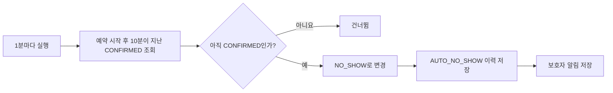

# 자동 노쇼 스케줄러 한눈에 이해하기

## 한 문장 설명

예약 시간이 10분 지났는데도 보호자가 체크인하지 않았다면, 시스템이 그 예약을 자동으로 `NO_SHOW`로 바꾸는 기능이다.

## 언제 자동 노쇼가 될까?

다음 조건을 **모두** 만족해야 한다.

1. 예약 상태가 `CONFIRMED`다.
2. 현재 시각이 `예약 슬롯 시작 시각 + 10분`을 지났다.
3. 아직 체크인·취소·진료 완료 등 다른 처리가 되지 않았다.

예를 들어 예약 시작이 오전 10시라면 오전 10시 10분까지는 체크인 유예로 두고, 그 시각을 지난 뒤부터 자동 노쇼 대상이 된다.

## 전체 흐름

상태 변경·이력 저장·알림 저장은 한 트랜잭션에서 처리한다. 중간에 하나라도 실패하면 전부 취소되어 상태만 바뀌고 이력이나 알림이 빠지는 일을 막는다.

## 직원의 수동 처리와 동시에 실행되면?

자동 처리와 병원 직원의 수동 노쇼 확정이 동시에 들어올 수 있다. 이때 두 작업 모두 `CONFIRMED` 상태일 때만 상태를 바꾸도록 해 실제 상태 변경은 한 번만 성공한다.

| 먼저 끝난 작업 | 최종 상태 | 남는 기록 |
| --- | --- | --- |
| 직원 수동 확정 | `NO_SHOW` | `MANUAL_NO_SHOW` |
| 자동 처리 | `NO_SHOW` | `AUTO_NO_SHOW` 이후 직원 판단 시 `MANUAL_NO_SHOW`도 추가 |
| 체크인 | `CHECKED_IN` | 자동 처리는 상태가 달라져 건너뜀 |

자동 처리가 먼저 끝났더라도 직원이 나중에 수동 확정을 하면 직원의 판단 이력을 추가한다. 따라서 최종 상태가 같아도 누가 어떻게 판단했는지 확인할 수 있다.

## 여러 서버가 동시에 실행되면?

스케줄러 실행 전에 MySQL `GET_LOCK`을 얻는다. 한 서버가 잠금을 가지고 있으면 다른 서버는 이번 실행을 건너뛰므로 같은 예약을 여러 서버가 중복 처리하지 않는다.

개별 예약 처리는 조건부 UPDATE를 한 번 더 사용한다. 잠금이 예상치 못하게 겹치더라도 이미 다른 작업이 상태를 바꿨다면 자동 처리는 실패가 아니라 `SKIPPED`로 끝난다.

## 한 예약의 처리가 실패하면?

- 설정된 횟수만큼 해당 예약을 다시 시도한다.
- 계속 실패하면 실패 횟수와 로그를 남긴다.
- 커서를 다음 예약으로 이동해 뒤 예약은 계속 처리한다.
- 한 번의 실행에서 조회할 최대 건수를 제한해 스케줄러가 끝없이 실행되지 않게 한다.

## 함께 저장되는 정보

| 구분 | 저장 내용 |
| --- | --- |
| 예약 상태 | `CONFIRMED → NO_SHOW` |
| 노쇼 시각 | 실제 자동 처리 시각 |
| 상태 이력 | `AUTO_NO_SHOW` |
| 처리 주체 | `NULL`, 즉 `SYSTEM` |
| 보호자 알림 | 체크인이 확인되지 않아 노쇼 처리됐다는 안내 |
| 예약 슬롯 | 이미 지난 슬롯이므로 `RESERVED` 유지 |

## 운영자가 바꿀 수 있는 설정

실행 주기, 첫 실행 지연, 10분 유예 시간, 페이지 크기, 실행당 최대 조회 수, 재시도 횟수, DB 잠금 대기 시간을 환경 변수로 조정할 수 있다. 시각은 예약 저장과 같은 프로젝트 공용 서울 기준 `Clock`을 사용한다.

## 운영 중 확인할 지표

- 처리 성공 수: `reservation.no.show.processed`
- 이미 처리되어 건너뛴 수: `reservation.no.show.skipped`
- 실패 수: `reservation.no.show.failed`
- 다른 서버가 실행 중이라 건너뛴 수: `reservation.no.show.lock.skipped`
- 처리 지연 시간: `reservation.no.show.delay`
- 배치 실행 시간: `reservation.no.show.batch.duration`

## 테스트로 확인한 것

- 시작 시각 +10분까지는 처리하지 않고, 그 시각을 지난 뒤 처리한다.
- `CONFIRMED` 예약만 처리한다.
- 체크인과 자동 처리가 동시에 실행되어도 한 상태만 남는다.
- 수동 확정과 자동 처리가 동시에 실행되어도 이력 계약을 지킨다.
- 같은 예약을 다시 처리해도 이력과 알림이 중복되지 않는다.
- 한 예약이 실패해도 다음 예약은 계속 처리한다.
- 여러 서버 중 하나만 DB 잠금을 얻는다.
